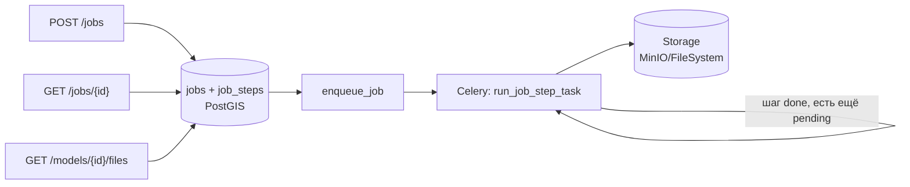

# API и очередь задач (Шаг 1.3)

## Эндпоинты

| Метод | Путь | Назначение |
| --- | --- | --- |
| `POST` | `/jobs` | Поставить задачу: центр, радиус (0.5–3 км), слои, детализация. |
| `GET` | `/jobs/{id}` | Статус задачи, статус/время/ошибка/результат каждого шага (журнал). |
| `GET` | `/models/{id}/files` | Файлы, готовые на текущий момент (по завершённым шагам). |

Реализация: `geo/src/topology_geo/api/app.py` (FastAPI), схемы —
`geo/src/topology_geo/api/schemas.py`.

## Валидация входа (Шаг 1.3, п. 3)

На уровне Pydantic-схемы `JobCreateRequest`, до постановки в очередь:

- `radius_m` — `Field(ge=500, le=3000)`;
- координаты центра — `pick_msk59_zone(lon)` (Шаг 0.4): если участок вне зон
  МСК-59 Пермского края, запрос отклоняется с понятным сообщением ещё на
  этапе валидации, не доходя до воркера.

## Очередь: Redis + Celery (Шаг 1.3, п. 2)

`POST /jobs` создаёт запись в `jobs`/`job_steps` (см. ниже) и ставит в очередь
`topology.run_job_step` (`geo/src/topology_geo/tasks/pipeline_tasks.py`).
Задача выполняет **ровно один** следующий незавершённый шаг и, если задача
ещё не done/failed, сама себя переставляет в очередь — самоперепланирующаяся
цепочка вместо одной длинной задачи на весь конвейер. Это даёт то, что
требует критерий Шага 1.3: упавший шаг перезапускается отдельно
(`jobs.store.retry_failed_step` сбрасывает только его, остальные остаются
`done` и не пересчитываются).

Источник истины для статуса — таблицы `jobs`/`job_steps` в PostGIS, не
результат-бэкенд Celery: статус переживает перезапуск воркера и не зависит от
деталей брокера.

## Пайплайн шагов (Шаг 1.3, `jobs/steps.py`)

В `DEFAULT_PIPELINE` три шага — все реальные, переиспользуют уже реализованные
Шаги 1.1/1.2/1.4, а не заглушки:

1. **`select_osm`** — `topology_geo.osm.queries.count_within_radius` (Шаг 1.1)
   по центру/радиусу задачи; результат — JSON со сводкой по слоям (быстрый
   счётчик для мониторинга), сохранён в Storage. Если таблиц OSM нет (импорт
   не запускался) — ошибка «нет данных OSM для этой области».
2. **`prepare_relief`** — `topology_geo.relief.service.get_dem` (Шаг 1.2) по
   bbox, посчитанному из радиуса через МСК-59 (точнее наивного градусного
   отступа — см. `docs/math-model.md` §2.1); результат — COG-файл в Storage.
   Если нет покрытия — ошибка **«нет данных рельефа в этой области»** (тот же
   пример, что в самом плане, п. 4 Шага 1.3).
3. **`select_and_normalize`** — `topology_geo.selection.service.select_site_data`
   (Шаг 1.4): выборка объектов в буфере, репроекция в МСК-59, обрезка кругом
   радиуса задачи, перевод в локальные координаты, нормализация атрибутов по
   словарю данных с пометкой confidence («факт»/«умолчание») — см.
   `docs/selection.md`. Результат — GeoPackage в Storage (`jobs/{id}/site.gpkg`),
   «чистый набор данных участка, одинаковый для всех дальнейших генераторов»
   (дословно из плана). Не заменяет `select_osm`: тот — быстрая сводка, этот —
   полноценные нормализованные геометрия и атрибуты для Шагов 1.6-1.8.

Дальнейшие шаги конвейера (TIN участка, здания, дороги, сборка IFC,
веб-конвертация — Шаги 1.5–1.9) добавятся в `DEFAULT_PIPELINE` по мере
реализации соответствующих шагов плана, не меняя движок оркестрации
(`jobs/pipeline.py`).

## Хранилище результатов

Протокол `topology_geo.storage.ObjectStorage` (Шаг 1.3, п. 2: «каждая
[подзадача] пишет результат в MinIO»):

- `MinioObjectStorage` — прод;
- `FileSystemObjectStorage` — dev/тесты с воркером в отдельном процессе
  (общий диск делает результат видимым из любого процесса);
- `InMemoryObjectStorage` — модульные тесты и `CELERY_TASK_ALWAYS_EAGER=true`
  (API-тесты без отдельного воркера).

Настоящего MinIO в этой среде разработки нет (нет демона Docker) — переход на
`MinioObjectStorage` в проде не требует изменений в шагах пайплайна, они
работают с любой реализацией протокола.

## Что проверено реально, а не только логически

- **Модель задач** (`jobs/store.py`) — 11 тестов на реальном PostGIS:
  порядок шагов, переходы статусов, `retry_failed_step` не трогает готовые шаги.
- **Движок пайплайна** (`jobs/pipeline.py`) — регрессия именно на критерий
  Шага 1.3: перезапуск упавшего шага не пересчитывает предыдущие (проверено
  счётчиком вызовов), и 10 задач, запущенных параллельно из разных потоков с
  отдельными соединениями к БД, не видят чужие данные.
- **Реальные шаги** (`jobs/steps.py`) — `select_osm`/`prepare_relief`/
  `select_and_normalize` против настоящего `osm2pgsql`-импорта и настоящего
  слияния рельефа; точные сообщения об ошибках подтверждены.
- **Реальная очередь** (`tasks/pipeline_tasks.py`) — отдельный тест поднимает
  настоящий Celery-воркер в **отдельном процессе** с настоящим Redis-брокером
  (не eager-режим) и прогоняет задачу через него целиком.
- **API** (`api/app.py`) — валидация (радиус, регион), 404, полный
  happy-path через `TestClient` с `CELERY_TASK_ALWAYS_EAGER=true` (пайплайн
  выполняется синхронно в процессе теста — стандартный приём тестирования
  Celery-приложений, отдельный воркер для API-тестов не нужен).

Итого по Шагу 1.3 — 34 теста (`test_storage`, `test_jobs_*`, `test_tasks_celery`,
`test_api`); шаг `select_and_normalize` добавлен вместе с Шагом 1.4 (см.
`docs/selection.md`) без изменения движка оркестрации — все тесты пакета
(181/181 на момент Шага 1.4) в общем прогоне.

## Чего не хватает (вне возможностей AI-сессии)

- Настоящего MinIO (нет демона Docker) — интерфейс готов, подключение только
  конфигурационное.
- Нагрузочной проверки на реальных объёмах (существенно больше 10 задач,
  реальные размеры IFC/растров) — имеет смысл после Шагов 1.5-1.9, когда
  пайплайн станет полным, и после выбора пилота (Шаг 0.1).
