# Дерево статусов проекта

Живая карта состояния каждого шага `docs/plan.md` — чтобы в любой момент можно
было вернуться к конкретному шагу, увидеть его статус и где лежит код/документ.
Обновляется в том же коммите, где закрывается или продвигается шаг.

**Легенда:** ✅ закрыт (код+тесты прошли, проверка шага выполнена в объёме,
доступном без внешних сторон) · 🔧 в работе · ⛔ заблокирован — нужны
действия РП/ЮР/ИЗ/организаций/оборудования вне кода · ⬜ не начат.

Отдельно: ✅(частично) означает, что кодовая часть шага сделана и
протестирована, но официальная/полевая проверка (реальные параметры,
реальные точки, ручная сверка в Renga/Pilot-BIM) ещё предстоит — это не
считается полным закрытием шага по критерию плана.

## Визуальная схема

```mermaid
flowchart TD
    subgraph E0["Этап 0 — Подготовка"]
        direction LR
        S01["0.1 Пилот"]:::blocked
        S02["0.2 Тест IFC"]:::partial
        S03["0.3 Запросы в организации"]:::blocked
        S04["0.4 Координаты"]:::partial
        S05["0.5 Юр. оценка"]:::blocked
        S06["0.6 Аудит OSM"]:::partial
        S07["0.7 Инфраструктура"]:::partial
        S08["0.8 Словарь данных"]:::partial
        S09["0.9 Приёмка"]:::notstarted
    end

    subgraph E1["Этап 1 — MVP 500 м"]
        direction LR
        S11["1.1 Импорт OSM"]:::partial
        S12["1.2 Рельеф"]:::partial
        S13["1.3 API/очередь"]:::partial
        S14["1.4 Выборка участка"]:::partial
        S15["1.5 TIN участка"]:::partial
        S16["1.6 Здания"]:::partial
        S17["1.7 Дороги/вода/деревья"]:::partial
        S18["1.8 Сборка IFC"]:::partial
        S19["1.9 Веб-просмотр"]:::partial
        S110["1.10 Приёмка"]:::partial
    end

    subgraph E2["Этап 2 — 3 км + карта города"]
        direction LR
        S21["2.1 Кольца LOD/тайлы"]:::partial
        S22["2.2 Здания LOD2"]:::partial
        S23["2.3 Дороги по полосам"]:::partial
        S24["2.4 Каркасная сеть"]:::partial
        S25["2.5 Мосты/тоннели"]:::partial
        S26["2.6 Ж/д и трамвай"]:::notstarted
        S27["2.7 Электросети"]:::notstarted
        S28["2.8 Библиотека элементов"]:::notstarted
        S29["2.9 Растительность"]:::notstarted
        S210["2.10 Выходные форматы"]:::notstarted
        S211["2.11 Потоковый веб-просмотр"]:::notstarted
        S212["2.12 Публичная карта"]:::notstarted
        S213["2.13 Приёмка этапа 2"]:::notstarted
    end

    E3["Этап 3<br/>ограничения, посадка ЖК, ТУ<br/>(0/13 шагов)"]:::notstarted
    E4["Этап 4<br/>визуализация, кабинет, API<br/>(0/12 шагов)"]:::notstarted
    E5["Этап 5<br/>внедрение<br/>(0/5 шагов)"]:::notstarted

    E0 --> E1 --> E2 --> E3 --> E4 --> E5

    classDef partial fill:#fde68a,stroke:#b45309,color:#111;
    classDef blocked fill:#fecaca,stroke:#b91c1c,color:#111;
    classDef notstarted fill:#e5e7eb,stroke:#6b7280,color:#111;
```

Жёлтый = код готов и протестирован, но шаг не закрыт до конца (нужны реальные
данные/люди/ПО); красный = заблокирован — нечего кодировать, нужно
организационное действие; серый = не начат. Таблицы ниже — то же самое с
подробностями и ссылками на файлы.

## Этап 0. Подготовка и проверка данных

| Шаг | Статус | Где | Примечание |
| --- | --- | --- | --- |
| 0.1 Пилотный участок и тестовый проект | ⛔ | — | Нужен реальный выбор участка в Перми, кадастровый номер, IFC ЖК в Renga — решение РП/BIM. |
| 0.2 Тест приёма IFC в Renga/Pilot-BIM | 🔧 | `geo/src/topology_geo/ifc/generate_test_ifc.py`, `docs/ifc-compatibility.md` | Генератор+валидатор IFC4/IFC4X3 готов и протестирован (`ifcopenshell.validate` — 0 замечаний, 13 тестов); открытие в Renga/Pilot-BIM и заполнение таблицы совместимости — нужен человек с этим ПО (шаблон таблицы готов). |
| 0.3 Запросы данных в организации | ⛔ | — | Письма/заявки в РСО, ИСОГД, фонд изысканий — организационная работа РП/ИЗ. |
| 0.4 Системы координат и высот | ✅(частично) | `geo/src/topology_geo/coords.py`, `docs/coordinate-systems.md` | Параметры МСК-59 — рабочее приближение из открытых справочников, не официальный документ; калибровка высот ждёт реальные контрольные точки (роль ИЗ). |
| 0.5 Юридическая оценка | ⛔ | — | Нужен привлечённый юрист (ODbL, 152-ФЗ, лицензии ПО, доступ к Claude API). |
| 0.6 Аудит полноты открытых данных | 🔧 | `geo/src/topology_geo/osm/audit.py` | Скрипт аудита готов и протестирован (8 тестов на синтетических данных); реальный прогон ждёт выбор пилота (0.1) и выгрузку OSM/TessaDEM. |
| 0.7 Инфраструктура разработки | 🔧 | `infra/docker-compose.yml`, `infra/.env.example`, `geo/Dockerfile`, `geo/docker/entrypoint.py` | Compose-стек описан и проходит `docker compose config` (PostGIS, MinIO, Redis, worker со смоук-тестом связи); реально не поднимался — в этой среде разработки нет демона Docker. Закупка станции (п. 10.1 ТЗ) — вне кода. |
| 0.8 Словарь данных и требования к IFC | 🔧 | `docs/data-dictionary.md`, `schemas/meta.schema.json` | Черновик словаря и JSON-схема `meta.json` (проверена тестами); нужна сверка словаря с BIM-специалистом. |
| 0.9 Приёмка этапа 0 | ⬜ | — | Решение РП после 0.1–0.8. |

## Этап 1. MVP на радиус 500 м

| Шаг | Статус | Где | Примечание |
| --- | --- | --- | --- |
| 1.1 Импорт OSM в PostGIS | ✅(частично) | `geo/osm2pgsql/style.lua`, `geo/src/topology_geo/osm/{import_log,queries,cli}.py`, `geo/scripts/*.sh`, `docs/osm-import.md` | Флекс-стиль (8 таблиц + журнал импорта), скрипты полного импорта и минутных дифов (`osm2pgsql-replication`), запрос выборки в радиусе — всё реально прогнано локальным `osm2pgsql`+PostGIS на синтетическом `.osm` (10/10 интеграционных тестов, тоже в CI). Не хватает реальной выгрузки Приволжского ФО и реального пилота (0.1) — без них нельзя закрыть критерий «≤5 с на 3 км» и «сходится с аудитом 0.6» на настоящих объёмах. |
| 1.2 Подготовка рельефа | ✅(частично) | `geo/src/topology_geo/relief/*.py`, `docs/relief.md` | Репроекция в МСК-59, пересчёт высот (модель Шага 0.4), конвертация в COG (`rio-cogeo`), слияние с плавным переходом (формула §2.4, регрессионный тест на найденный баг непрерывности), индекс покрытия в PostGIS и `get_dem(bbox)` — реально проверены (26 тестов, rasterio/GDAL + локальный PostGIS). Рабочая сетка задачи (`RELIEF_PIXEL_SIZE_M`, `jobs/steps.py`) — 1 м, чтобы не срезать точность точечных источников (топосъёмка) ещё до TIN участка/тайла; на предельном радиусе 3 км (6400×6400 пикс.) шаг измерен реальным прогоном ~15 с, укладывается в критерий «3 км ≤ 15 мин». Не хватает реальной загрузки TessaDEM по краю и реальной топосъёмки пилота (0.1) для проверки критерия «без ступеньки > 0.2 м» на настоящих данных; MinIO не поднимался (нет демона Docker), интерфейс `Storage` в `service.py` подключаемый. |
| 1.3 API и очередь задач | ✅(частично) | `geo/src/topology_geo/api/*.py`, `geo/src/topology_geo/jobs/*.py`, `geo/src/topology_geo/tasks/*.py`, `docs/api.md` | FastAPI (`POST /jobs`, `GET /jobs/{id}`, `GET /models/{id}/files`), модель задач в PostGIS, реальная очередь Celery+Redis (проверена настоящим воркером в отдельном процессе), пайплайн из четырёх реальных шагов (select_osm/prepare_relief/select_and_normalize/assemble_ifc, поверх Шагов 1.1/1.2/1.4-1.8). Оба критерия приёмки шага подтверждены тестами: 10 параллельных задач не мешают друг другу, упавший шаг перезапускается без пересчёта предыдущих. Сквозной прогон (OSM→рельеф→выборка→site.ifc) проверен на реальных сервисах (`test_full_happy_path_creates_downloadable_files`). Не хватает реального MinIO (нет демона Docker — интерфейс подключаемый) и шага 1.9 (веб-конвертация) в пайплайне. |
| 1.4 Выборка и нормализация данных | ✅(частично) | `geo/src/topology_geo/selection/*.py`, `docs/selection.md` | Выборка объектов в буфере, репроекция в МСК-59 (расширен `coords.py`), обрезка кругом + локальные координаты, нормализация тегов по словарю данных (тип/этажность/покрытие/напряжение, confidence факт/умолчание) и сохранение в GeoPackage — всё реально проверено (61 тест: 35 на нормализацию — план требовал 20+ — плюс выборка/обрезка/GeoPackage/оркестрация на реальном osm2pgsql+PostGIS). Подключено как третий шаг пайплайна задач (Шаг 1.3). Не хватает реального пилота (0.1) для проверки на участке со всеми типами объектов раздела 4 ТЗ разом. |
| 1.5 Рельеф участка | ✅(частично) | `geo/src/topology_geo/relief/tin.py` | TIN с фоном по методу квадратных призм (шаг 1 м, не 25 — см. `docs/relief.md`) плюс многоструктурное 2D-сглаживание фона, врезка дорог (сглаженный продольный профиль с исправленным краевым эффектом), урезов воды и площадок зданий (уровень = min по границе, с заполнением внутренности контура — иначе на густом фоне Делоне «перепрыгивает» контур), контроль вырожденных треугольников — реально проверено (13 тестов на точной синтетической плоскости, критерий «≤0.1 м» подтверждён с запасом). Подключено как часть шага `assemble_ifc` пайплайна задач (Шаг 1.8). Измеренное ограничение: несвязанный `Delaunay` на шаге 1 м не тянет весь диапазон радиуса API (500–3000 м) — реальный прогон на 1,5 км уходил за 12 ГБ; функция отказывает явной ошибкой выше ~800 м (`MAX_BACKGROUND_POINTS_UNTILED`), для большего радиуса — тайловый путь Шага 2.1. Реального рельефа пилота (0.1) для проверки на настоящих перепадах нет. |
| 1.6 Здания (упрощённо) | ✅(частично) | `geo/src/topology_geo/geometry/buildings.py` | Экструзия контуров: высота по формуле §2.5 (height → levels×3+1 → дефолт по типу), низ = min рельефа по контуру, исправление геометрии (make_valid, дедупликация точек, единая ориентация кольца) — 19 тестов, включая «100% контуров → корректные тела» на смеси годных и вырожденных входов. Подключено к сборке IFC (Шаг 1.8). «Выборочная сверка 20 высот с реальностью» из критерия шага возможна только на реальном пилоте (0.1). |
| 1.7 Дороги, вода, рельсы, деревья | ✅(частично) | `geo/src/topology_geo/geometry/{roads,water,rail,vegetation}.py` | Ленты дорог (ширина из тега/класса), балласт ж/д, деревья (одиночные с породой/дефолтом + случайная расстановка в массивах по плотности) — точная геометрия (площадь ленты = длина×ширина для прямой). Вода — контур (полигон озера, ось русла) сглажен методом Чайкина (срезание углов, концы русла не трогаются — иначе слияние рек в одном узле разошлось бы), уровень воды — сглаженный продольный профиль вдоль длинной оси для ВЫТЯНУТЫХ водоёмов/рек (не единый `min` по контуру — тот «роет траншею» на склоне для полномасштабных объектов), единый уровень остаётся для компактных (порог соотношения сторон, `docs/water.md`). 21 тест на точную геометрию/сглаживание/уровень. Подключено к сборке IFC (Шаг 1.8). Проверка плана (визуальная приёмка BIM) не автоматизируется — нужен реальный пилот (0.1) и человек с этим опытом. |
| 1.8 Сборка IFC | ✅(частично) | `geo/src/topology_geo/ifc/{assemble,registry}.py`, `geo/sql/004_ifc_globalid_registry.sql` | `IfcProject`→`IfcSite` с `IfcMapConversion`/базовой точкой, каждый слой Шагов 1.5-1.7 → меш (треугольники через `mapbox_earcut`, здания — замкнутая призма с стенами двора, проверено объёмом по теореме о дивергенции) + IFC-класс + Pset по словарю данных (`IfcRoad` нативно в IFC4X3, прокси в IFC4 — тот же приём, что Шаг 0.2), уникальный `GlobalId` в реестре PostGIS (`ifc_globalid_registry`), экспорт в обе схемы, валидация `ifcopenshell.validate` — 0 замечаний. Дорожное покрытие (лента дороги/полоса/тротуар/перекрёсток/разметка) обязательно ВЫШЕ рельефа, не вровень с ним (`PAVEMENT_CLEARANCE_M`/`MARKING_CLEARANCE_M`, `docs/pavement.md`) — заодно нашёлся и исправлен реальный баг: точка вне выпуклой оболочки TIN раньше давала абсолютный Z=0 вместо отметки ближайшей вершины (угол покрытия «падал под землю» на всю высоту рельефа). Подключено как шаг `assemble_ifc` пайплайна задач, сквозной прогон реален (29 тестов). Приёмка «открывается в Renga с верной геопривязкой и свойствами» — нужен реальный пилот (0.1) и человек с этим ПО. |
| 1.9 Веб-просмотр | ✅(частично) | `geo/src/topology_geo/ifc/to_glb.py`, `geo/src/topology_geo/web/viewer/`, `geo/src/topology_geo/api/app.py` | IFC → GLB (`ifcopenshell.geom.iterator` по реальной модели, не пересборка — IFC остаётся источником истины), узлы glTF с `extras` (GlobalId/класс/Pset) сгруппированы по слоям; статическая страница-вьюер (three.js, облёт — OrbitControls, слои — чекбоксы, дерево объектов, панель свойств по клику) отдаётся FastAPI (`/viewer/`), файлы — через `GET /models/{id}/download` (привязан к job_id), ссылка на модель — `viewer_url` в `GET /models/{id}/files` (п. 3 шага). Проверено в настоящем headless Chromium (Playwright): модель грузится за <1 с (критерий — «≤10 с»), дерево/слои/свойства реально работают, без ошибок JS. XKT (xeokit-convert) не реализован — обоснование в докстринге `to_glb.py` (закрытая Node.js-экосистема, GLB общедоступен и достаточен для критерия). 11 новых тестов (конвертер, шаг пайплайна, API, реальный браузер). Критерий «на телефоне» — не проверялся (нет реального устройства), только адаптивная вёрстка (`@media`). |
| 1.10 Тесты и приёмка этапа 1 | ✅(частично) | `geo/tests/test_stage1_acceptance.py`, `docs/stage1-acceptance.md` | Конвейер целиком (реальные `osm2pgsql`+PostGIS+Redis) прогнан на 3 синтетических профилях (центр/спальный район/частный сектор) — все три доходят до `done` со скачиваемыми `site.ifc`+`site.glb`, время каждого шага снято из журнала задачи (п. 1-2 шага). Геометрическая проверка «расхождение с OSM ≤0,5 м» (раздел 14 ТЗ) — сравнение экспортированного контура здания с нормализованными координатами Шага 1.4 по Хаусдорфу, на опорном прогоне 0 м. Протокол приёмки — `docs/stage1-acceptance.md`. Проверка BIM-специалистом в Renga/Pilot-BIM и повторная проверка после замечаний (п. 3-4 шага) — вне возможностей AI-сессии, нужен реальный пилот (0.1) и человек с этим ПО; сама методика переносится на пилот без изменений. |

## Этап 2. Полная модель 3 км и публичная карта

| Шаг | Статус | Где | Примечание |
| --- | --- | --- | --- |
| 2.1 Кольца детализации и тайловый кэш | ✅(частично) | `geo/src/topology_geo/tiling/{grid,cache,terrain}.py`, `geo/src/topology_geo/tasks/tile_tasks.py`, `geo/sql/005_tile_cache.sql` | Кольца LOD2/LOD1/LOD0 по границам плана, тайлы 250×250 м в МИРОВЫХ координатах МСК-59 (не локальных задачи — иначе кеш не переиспользовался бы между задачами на одну и ту же зону), ключ кеша координаты+слой+версия данных+версия генератора, upsert-кеш в PostGIS. Рельеф тайла — тот же метод квадратных призм с шагом 1 м и то же 2D-сглаживание фона, что и Шаг 1.5 (см. `docs/relief.md`); тайл — единственный путь, где полный радиус 3 км при шаге 1 м реально тянется (62,5 тыс. точек/тайл независимо от общего радиуса, в отличие от несвязанного `Delaunay` Шага 1.5). Параллельная генерация — `celery.group` на реальном воркере (`--concurrency=4`, отдельный процесс); повторный запрос того же батча подтверждённо берёт тайлы из кеша (`created_at` не меняется). Стыковка рельефа — граничные точки на глобальной сетке БЕЗ сглаживания (шов должен остаться побитово точным), у соседних тайлов совпадают (0 м расхождения, тест на явной синтетической плоскости и на интерполяции по обе стороны шва). 33 теста. Реального многотайлового профиля на 3 км (не синтетика) и настоящего кластера из нескольких машин (не несколько процессов на одной) не было — недоступно AI-сессии без пилота (0.1) и живой инфраструктуры. |
| 2.2 Здания LOD2 | ✅(частично) | `geo/src/topology_geo/geometry/roofs.py`, `geo/src/topology_geo/geometry/buildings.py`, `geo/osm2pgsql/style.lua` | Формы крыш (gabled/hipped/pyramidal/skillion) по `roof:shape`/`roof:height`/`roof:angle`/`roof:direction`/`roof:orientation`, геометрия по ориентированному минимальному прямоугольнику контура (OBBox) — приём реальных рендереров OSM-3D (OSM2World/Simple3DBuildingsV1), не изобретён. Все объёмы солидов проверены точными замкнутыми формулами (не приближённо) + подсчётом рёбер на замкнутость. Высота — водопад OSM→Overture→тип (п. 2), источник явно в `Pset_Здание.Источник_высоты`; реального доступа к датасету Overture нет (`NullOvertureSource`, обоснование в коде) — водопад настоящий, средний уровень не наполнен данными в этой среде. Составные здания `building:part` (п. 1) — новая таблица `osm_building_parts` в импорте (Шаг 1.1), пространственное сопоставление контур↔части (`shapely.intersects`, ссылки OSM не даёт); контур, покрытый хотя бы одной частью, не экструдируется сам — по прямой цитате вики Key:building:part (реальные 3D-рендереры могут не рисовать его вовсе), каждая часть — отдельный `BuildingSolid` со своей высотой/крышей. Входы `entrance=*` (п. 3) — новая таблица `osm_entrances`, точки сопоставляются зданию/части буфером 1 м, записаны в `Pset_Здание` (Входов_всего/Вход_N_*) без новой геометрии. 62 теста на геометрию/крыши/составные здания/входы (`test_geometry_roofs.py`, `test_geometry_buildings.py`) плюс два сквозных прогона реального конвейера до `site.ifc` (`roof:shape=gabled`, `building:part`+`entrance`). Количественный критерий шага («90% зданий ближнего кольца с крышей, отличной от плоской, где она не плоская в реальности, выборка 30 зданий») — нужен реальный пилот (0.1) для сверки с реальностью, недоступно AI-сессии. |
| 2.3 Дороги по полосам | ✅(частично) | `geo/osm2streets/`, `geo/src/topology_geo/osm/raw_roads.py`, `geo/src/topology_geo/geometry/streets.py` | Подключён реальный osm2streets (п. 1) — единственный существующий инструмент для геометрии по полосам, переписывать не нужно и рискованно; существует только как Rust/WASM (`osm2streets-js`), поэтому вызывается процессом Node.js (`geo/osm2streets/convert.mjs`), как системный `osm2pgsql` в Шаге 1.1. Ключевая проблема — `osm2pgsql` не хранит связность узлов между дорогами: решена доп. колонкой `osm_roads.nodes` (ID узлов way, Шаг 1.1) и восстановлением валидного OSM XML с настоящей топологией прямо из PostGIS (`osm.raw_roads`), без повторного обращения к исходному `.osm`/`.pbf`. Результат — полосы (проезжая часть/тротуар/...) и площадки перекрёстков в локальных координатах участка, подключены в `SiteModel`/`site.ifc` (`Pset_Полоса`, `Pset_Перекрёсток`) честным водопадом (`is_osm2streets_available()` — при отсутствии `node`/пакета участок остаётся с одной лентой на дорогу, Шаг 1.7, не падает). Разметка (п. 3) — центральные линии и стрелки поворота из `turn:lanes` (`toLaneMarkingsGeojson`), тоже готовой геометрией из osm2streets; починка `make_valid` перед обрезкой кругом (у мелких полигонов разметки попадаются самопересекающиеся «бабочки» — та же природа, что у контуров зданий, Шаг 1.6), склейка всех элементов одного вида в один меш/продукт (`_combine_meshes`, `ifc/assemble.py`) — иначе `site.ifc` распухнет от тысяч тривиальных объектов (`add_mesh_representation` и не позволил бы иначе: несколько представлений в одном продукте требуют одинакового числа вершин у всех). Переходы из `crossing` (тоже п. 3) не проверены — нужен более специфичный входной профиль. Бордюр 0,15 м (п. 2) — osm2streets его не отдаёт, синтезирован (`_build_curb_strips`) по общей границе объединённых Driving- и Sidewalk-полос одной дороги (не по константному смещению — точен при любой форме уже готовых полос), без бордюра на грунтовых дорогах (`surface` из `UNPAVED_SURFACES`, вики Key:surface, Unpaved — Шаг 2.3, п. 4, «грунтовые дороги — без бордюров»); на границе с площадками перекрёстков бордюр не строится (упрощение). Разделитель и газон (тоже п. 2) — в отличие от бордюра, osm2streets отдаёт их САМ: `SharedLeftTurn` (полоса разворота/поворота налево, тег `lanes:both_ways=1`+`turn:lanes:both_ways=left`) и `Buffer(Verge)` (газон, тег `cycleway:<сторона>:separation:<сторона>=grass_verge`), оба проверены эмпирически прямым вызовом `osm2streets-js`; проходят через общий код полос без отдельной ветки, кроме покрытия — газону тег `surface=*` дороги не наследуется (`_surface_for_lane`, `Покрытие=grass`), это физически трава, не асфальт. Покрытие (п. 4) — тег `surface=*` дороги переносится на каждую её полосу как есть (`Pset_Полоса.Покрытие`, `_surface_of`/`_surface_for_lane`), тот же принцип, что `Pset_Дорога.Покрытие` (Шаг 1.7); при слиянии нескольких way в одну полосу (узел степени 2, не настоящий перекрёсток — проверено эмпирически) берётся покрытие первого найденного way; «колея» на грунтовых дорогах (тоже п. 4) не реализована — геометрическая деталь профиля, отдельная от посадки на рельеф. Посадка на рельеф с продольным сглаживанием и поперечным уклоном (п. 5) — реализована: своя ось у каждой полосы/штриха разметки (`relief.tin.long_axis_line`), сглаженный продольный профиль вдоль неё (`build_profile_elevation_fn`, та же техника, что у дороги в TIN Шага 1.5 и у уровня вытянутого водоёма Шага 1.7) плюс типовой поперечный уклон 20 ‰ от оси к краям (`ifc/assemble.py`, `lane_pavement_elevation_fn`/`lane_marking_elevation_fn`); компактный фрагмент (почти квадратный, площадка перекрёстка) — обычная плоская посадка без профиля/уклона, директивная ось для него физически бессмысленна. Подробности — `docs/pavement.md`. Все 5 пунктов Шага 2.3 реализованы. 24 теста на связность/геометрию/разметку/бордюр/покрытие/разделитель/газон (`test_osm_raw_roads.py`, `test_geometry_streets.py`) плюс профильные тесты в `test_ifc_assemble.py` (31 тест всего в файле, включая склейку мешей и продольное сглаживание/поперечный уклон полос), плюс сквозной прогон реального перекрёстка через весь конвейер до `site.ifc` (`test_pipeline_streets.py`). Подробности по остальным пунктам — `docs/streets.md`. Осталось не проверенным на приёмку (не блокирует реализацию, но и не закрыто): переходы из `crossing` (нужен более специфичный входной профиль), формальная приёмка «≥ 95% перекрёстков без ошибок геометрии, ручная проверка 10 сложных узлов» по критерию плана — не проводилась (нет реального массива данных Перми в этом окружении). |
| 2.4 Каркасная и внутриквартальная сеть | ✅(частично) | `geo/src/topology_geo/geometry/road_network.py`, `geometry/roads.py`, `geometry/streets.py`, `ifc/assemble.py`, `jobs/steps.py` | Классификация (п. 1) — единая `classify_road_network` (`road_network.py`): каркасная = `motorway…tertiary` вместе с `_link`-съездами (по плану), иначе внутриквартальная (умолчание и для неизвестного класса тоже — безопаснее, чем считать федеральной трассой). У `RoadRibbon`/`LaneRibbon` есть свой `osm_way_ids`/тег `highway` — классификация напрямую по тегу дороги (`_network_of`, `geometry/streets.py`); у `IntersectionArea`/`LaneMarking` своего way нет — классифицируются геометрически, по факту касания уже классифицированной каркасной полосы (`unary_union` + `intersects`, тот же приём, что у синтеза бордюра Шага 2.3). Два файла дорог (п. 4) — `build_site_ifc` получил необязательный `road_network_filter` (None/каркасная/внутриквартальная): фильтрует дороги/полосы/перекрёстки/разметку своей сети, полностью пропускает здания/воду/ж-д/деревья И рельеф (TIN) — рельеф ни к одной сети не относится, а его меш на честном участке (шаг сетки 1 м) самый тяжёлый по памяти в сборке; первая версия этого прохода включала TIN в оба файла на каждую схему («общая привязка») и это реально приводило к OOM на сквозном прогоне (меш пересобирался 6 раз за задачу вместо 2) — воспроизведено и исправлено при разработке, не гипотетическая оптимизация; полосы/дороги уже несут свою абсолютную высоту (Шаг 2.3, п. 5), сам меш им не нужен; `jobs.steps.assemble_ifc` вызывает сборку ещё дважды на каждую IFC-схему и кладёт `jobs/{id}/roads_{backbone,internal}_{ifc4,ifc4x3}.ifc` в Storage — видны в `GET /models/{id}/files` (`docs/api.md`); реестр `GlobalId` для них — под ОТДЕЛЬНЫМ `model_id` (`{job_id}:roads_backbone`/`...:roads_internal`), не под общим, иначе `ON CONFLICT` затёр бы GlobalId комбинированной модели тем же `(layer, osm_id)`, но другим GlobalId из меньшего файла. Каркасная сеть помечена `Pset_Дорога/Полоса.Редактируемый=false`, внутриквартальная — `true` (буквально из плана, не только в документации). Параметрическая внутриквартальная сеть (п. 5) — `RoadRibbon.axis` хранит исходную ось (только для дороги с ОДНИМ цельным сегментом линии, `None` для составной `MultiLineString`); `rebuild_road_ribbon(road, new_axis)` пересобирает ленту по новой оси с тем же профилем (ширина/покрытие/класс), отказывает на каркасной дороге (нередактируема, п. 4) и на дороге без сохранённой оси. Сверка с официальными перечнями федеральных/региональных дорог (п. 2) и импорт красных линий ИСОГД (п. 3) НЕ реализованы — оба требуют внешних данных, которых нет в этой среде (тот же честно незакрытый статус, что у Шага 0.3); изобретать значения без источника было бы менее честно, чем оставить пункт открытым. +12 новых тестов (6 в `test_geometry_environment.py` на классификацию/ось/перестройку, 6 в `test_ifc_assemble.py` на `road_network_filter`) — из них `test_road_network_filter_*` реально валидируют фильтрацию каждого слоя через `ifcopenshell.validate`, не только логику Python; `test_api.py::test_full_happy_path_creates_downloadable_files` обновлён (ожидает новые файлы `roads_backbone`/`roads_internal` в `GET /models/{id}/files`), но сам прогон в этой AI-сессии не подтверждён — этот тест (реальный `osm2pgsql` + рельеф 1 м + сборка IFC + GLB в одном процессе, честный водопад Celery-eager) упирается в потолок памяти контейнера (~15 ГБ, OOM killer) уже на коде ДО этого шага — воспроизведено сравнением: тот же OOM происходит и без изменений Step 2.4 (`git stash` на этот же тест), значит, это не регрессия текущего прохода, а предсуществующее ограничение среды разработки, а не кода. |
| 2.5 Мосты, путепроводы, тоннели | ✅(частично) | `geo/src/topology_geo/geometry/bridges.py`, `geometry/roads.py`, `geometry/rail.py`, `ifc/assemble.py`, `jobs/steps.py` | Обнаружение (п. 1) — `is_bridge` (`geometry/roads.py`, тег `bridge=*`, кроме `no`/пустого); `build_road_ribbons` исключает мостовые участки (строятся отдельно), `build_bridge_ribbons` (`geometry/bridges.py`) собирает их из тех же `SiteFeature`. Пролётное строение по оси (п. 2) — `abutment_elevation_fn`: ЛИНЕЙНАЯ интерполяция между отметками рельефа на двух КОНЦАХ оси (устои), не сглаженный профиль вдоль оси, как у дороги/воды (`relief.tin.build_profile_elevation_fn`) — пролёт жёсткий, его отметка не должна следовать рельефу под ним (тест `test_abutment_elevation_ignores_terrain_dip_between_ends` явно проверяет, что провал/подъём рельефа посередине не влияет). Проверка габарита (п. 3) — не выборка по площади, а точная геометрия: пересечение оси моста с осями УЖЕ построенных немостовых дорог (`RoadRibbon.axis`) и путей (`RailRibbon.axis`, оба поля добавлены в этом проходе по аналогии с Шагом 2.4) даёт точки проверки; норматив свой для дороги (`MIN_CLEARANCE_ROAD_M=5.0`) и пути (`MIN_CLEARANCE_RAIL_M=6.0`, строже из-за контактной сети) — типовые значения по нормам проектирования (СП 34.13330), не расчёт по нагрузке/скорости, честно помечено как упрощение; при нарушении — пролёт поднимается на весь дефицит и получает `Pset_Мост.Статус=расчётный`, иначе `официальный`; без осей других объектов (например, мост через реку/овраг без дороги под ним) проверка не выполняется вовсе — `Габарит_м` в Pset тогда отсутствует, не подставляется наугад. IFC — `IfcBridge` нативно в IFC4X3 (как `IfcRoad`), прокси в IFC4, тот же принцип совместимости, что и в `generate_test_ifc.py` (Шаг 0.2); отметка полотна — `abutment_elevation_fn` через ту же `pavement_elevation_fn` (зазор от z-fighting), что у дороги/полосы; мост подчиняется `road_network_filter` (Шаг 2.4, п. 4) через свою же `classify_road_network`. 27 новых тестов (`test_geometry_bridges.py` — 21, включая линейность интерполяции, разный норматив для дороги/пути, честное отсутствие проверки без осей и без пересечения; `test_ifc_assemble.py` — 6 на нативный/прокси-класс, Pset, зазор, фильтр по сети). Опоры по шагу для типа моста и насыпи подходов (п. 4), тоннели — вырез в рельефе и портал (п. 5) — НЕ реализованы в этом проходе, отдельная задача (`docs/bridges.md`); проверка развязок реальной Перми и приёмка BIM-специалистом (критерий шага) недоступны AI-сессии без пилота (0.1). |
| 2.6 Железная дорога и трамвай | ⬜ | — | |
| 2.7 Электросети с опорами | ⬜ | — | |
| 2.8 Библиотека элементов | ⬜ | — | |
| 2.9 Растительность и благоустройство | ⬜ | — | |
| 2.10 Выходные форматы | ⬜ | — | |
| 2.11 Потоковый веб-просмотр модели 3 км | ⬜ | — | |
| 2.12 Сервис 1 — публичная карта города | ⬜ | — | |
| 2.13 Производительность и приёмка этапа 2 | ⬜ | — | |

## Этап 3. Ограничения, посадка ЖК, сети, ТУ

Все шаги 3.1–3.13 — ⬜ не начаты. Формула огибающей застройки — заготовка в
`docs/math-model.md` §2.6.

## Этап 4. Визуализация, рендер, кабинет, API

Все шаги 4.1–4.12 — ⬜ не начаты.

## Этап 5. Опытная эксплуатация и внедрение

Все шаги 5.1–5.5 — ⬜ не начаты.

## Сквозные процессы

| Процесс | Статус | Примечание |
| --- | --- | --- |
| CI (lint + тесты) | ✅ | `.github/workflows/ci.yml` — ruff + pytest (374 теста, включая интеграционные с сервисами PostGIS + Redis, osm2pgsql, реальный Celery-воркер (включая параллельную генерацию тайлов, `--concurrency=4`), реальный headless Chromium для вьюера, реальный Node.js + osm2streets-js, сквозные прогоны на 3 профилях участка, на здании со скатной крышей и на перекрёстке по полосам) + `docker compose config` на каждый push/PR. CI-раннер должен иметь Chromium (`playwright install chromium` или системный) — иначе браузерные тесты вьюера пропускаются; `node`/`osm2streets-js` (`actions/setup-node` + `npm install` в `geo/osm2streets`) — иначе тесты Шага 2.3 пропускаются. |
| Журнал источников данных | 🔧 | Есть для OSM (`osm_import_log`, Шаг 1.1), рельефа (`dem_coverage`, Шаг 1.2) и связи объектов с IFC (`ifc_globalid_registry`, Шаг 1.8); для остальных появится по мере реализации. |
| Разделение контуров/безопасность | ⬜ | Появится вместе с 0.7 (прод) / Этапом 5. |

## Как этим пользоваться при возврате к шагу

1. Найти шаг в таблице выше → колонка «Где» указывает файл(ы).
2. Открыть соответствующий раздел `docs/plan.md` — там актуальные критерии
   приёмки шага.
3. Если раздел `docs/math-model.md` содержит формулы для этого шага — код
   должен им следовать; расхождение — повод обновить либо код, либо модель.
4. После изменений — обновить статус в этой таблице в том же коммите.
