# Дерево статусов проекта

Живая карта состояния каждого шага `docs/plan.md` — чтобы в любой момент можно
было вернуться к конкретному шагу, увидеть его статус и где лежит код/документ.
Обновляется в том же коммите, где закрывается или продвигается шаг.

**Легенда:** ✅ закрыт (код+тесты прошли, проверка шага выполнена в объёме,
доступном без внешних сторон) · 🔧 в работе · ⛔ заблокирован — нужны
действия РП/ЮР/ИЗ/организаций/оборудования вне кода · ⬜ не начат.

Отдельно: ✅(частично) означает, что кодовая часть шага сделана и
протестирована, но официальная/полевая проверка (реальные параметры,
реальные точки, ручная сверка в Renga/Pilot-BIM) ещё предстоит — это не
считается полным закрытием шага по критерию плана.

## Визуальная схема

```mermaid
flowchart TD
    subgraph E0["Этап 0 — Подготовка"]
        direction LR
        S01["0.1 Пилот"]:::blocked
        S02["0.2 Тест IFC"]:::partial
        S03["0.3 Запросы в организации"]:::blocked
        S04["0.4 Координаты"]:::partial
        S05["0.5 Юр. оценка"]:::blocked
        S06["0.6 Аудит OSM"]:::partial
        S07["0.7 Инфраструктура"]:::partial
        S08["0.8 Словарь данных"]:::partial
        S09["0.9 Приёмка"]:::notstarted
    end

    subgraph E1["Этап 1 — MVP 500 м"]
        direction LR
        S11["1.1 Импорт OSM"]:::partial
        S12["1.2 Рельеф"]:::partial
        S13["1.3 API/очередь"]:::partial
        S14["1.4 Выборка участка"]:::partial
        S15["1.5 TIN участка"]:::notstarted
        S16["1.6 Здания"]:::notstarted
        S17["1.7 Дороги/вода/деревья"]:::notstarted
        S18["1.8 Сборка IFC"]:::notstarted
        S19["1.9 Веб-просмотр"]:::notstarted
        S110["1.10 Приёмка"]:::notstarted
    end

    E2["Этап 2<br/>3 км + карта города<br/>(0/13 шагов)"]:::notstarted
    E3["Этап 3<br/>ограничения, посадка ЖК, ТУ<br/>(0/13 шагов)"]:::notstarted
    E4["Этап 4<br/>визуализация, кабинет, API<br/>(0/12 шагов)"]:::notstarted
    E5["Этап 5<br/>внедрение<br/>(0/5 шагов)"]:::notstarted

    E0 --> E1 --> E2 --> E3 --> E4 --> E5

    classDef partial fill:#fde68a,stroke:#b45309,color:#111;
    classDef blocked fill:#fecaca,stroke:#b91c1c,color:#111;
    classDef notstarted fill:#e5e7eb,stroke:#6b7280,color:#111;
```

Жёлтый = код готов и протестирован, но шаг не закрыт до конца (нужны реальные
данные/люди/ПО); красный = заблокирован — нечего кодировать, нужно
организационное действие; серый = не начат. Таблицы ниже — то же самое с
подробностями и ссылками на файлы.

## Этап 0. Подготовка и проверка данных

| Шаг | Статус | Где | Примечание |
| --- | --- | --- | --- |
| 0.1 Пилотный участок и тестовый проект | ⛔ | — | Нужен реальный выбор участка в Перми, кадастровый номер, IFC ЖК в Renga — решение РП/BIM. |
| 0.2 Тест приёма IFC в Renga/Pilot-BIM | 🔧 | `geo/src/topology_geo/ifc/generate_test_ifc.py`, `docs/ifc-compatibility.md` | Генератор+валидатор IFC4/IFC4X3 готов и протестирован (`ifcopenshell.validate` — 0 замечаний, 13 тестов); открытие в Renga/Pilot-BIM и заполнение таблицы совместимости — нужен человек с этим ПО (шаблон таблицы готов). |
| 0.3 Запросы данных в организации | ⛔ | — | Письма/заявки в РСО, ИСОГД, фонд изысканий — организационная работа РП/ИЗ. |
| 0.4 Системы координат и высот | ✅(частично) | `geo/src/topology_geo/coords.py`, `docs/coordinate-systems.md` | Параметры МСК-59 — рабочее приближение из открытых справочников, не официальный документ; калибровка высот ждёт реальные контрольные точки (роль ИЗ). |
| 0.5 Юридическая оценка | ⛔ | — | Нужен привлечённый юрист (ODbL, 152-ФЗ, лицензии ПО, доступ к Claude API). |
| 0.6 Аудит полноты открытых данных | 🔧 | `geo/src/topology_geo/osm/audit.py` | Скрипт аудита готов и протестирован (8 тестов на синтетических данных); реальный прогон ждёт выбор пилота (0.1) и выгрузку OSM/TessaDEM. |
| 0.7 Инфраструктура разработки | 🔧 | `infra/docker-compose.yml`, `infra/.env.example`, `geo/Dockerfile`, `geo/docker/entrypoint.py` | Compose-стек описан и проходит `docker compose config` (PostGIS, MinIO, Redis, worker со смоук-тестом связи); реально не поднимался — в этой среде разработки нет демона Docker. Закупка станции (п. 10.1 ТЗ) — вне кода. |
| 0.8 Словарь данных и требования к IFC | 🔧 | `docs/data-dictionary.md`, `schemas/meta.schema.json` | Черновик словаря и JSON-схема `meta.json` (проверена тестами); нужна сверка словаря с BIM-специалистом. |
| 0.9 Приёмка этапа 0 | ⬜ | — | Решение РП после 0.1–0.8. |

## Этап 1. MVP на радиус 500 м

| Шаг | Статус | Где | Примечание |
| --- | --- | --- | --- |
| 1.1 Импорт OSM в PostGIS | ✅(частично) | `geo/osm2pgsql/style.lua`, `geo/src/topology_geo/osm/{import_log,queries,cli}.py`, `geo/scripts/*.sh`, `docs/osm-import.md` | Флекс-стиль (8 таблиц + журнал импорта), скрипты полного импорта и минутных дифов (`osm2pgsql-replication`), запрос выборки в радиусе — всё реально прогнано локальным `osm2pgsql`+PostGIS на синтетическом `.osm` (10/10 интеграционных тестов, тоже в CI). Не хватает реальной выгрузки Приволжского ФО и реального пилота (0.1) — без них нельзя закрыть критерий «≤5 с на 3 км» и «сходится с аудитом 0.6» на настоящих объёмах. |
| 1.2 Подготовка рельефа | ✅(частично) | `geo/src/topology_geo/relief/*.py`, `docs/relief.md` | Репроекция в МСК-59, пересчёт высот (модель Шага 0.4), конвертация в COG (`rio-cogeo`), слияние с плавным переходом (формула §2.4, регрессионный тест на найденный баг непрерывности), индекс покрытия в PostGIS и `get_dem(bbox)` — реально проверены (26 тестов, rasterio/GDAL + локальный PostGIS). Не хватает реальной загрузки TessaDEM по краю и реальной топосъёмки пилота (0.1) для проверки критерия «без ступеньки > 0.2 м» на настоящих данных; MinIO не поднимался (нет демона Docker), интерфейс `Storage` в `service.py` подключаемый. |
| 1.3 API и очередь задач | ✅(частично) | `geo/src/topology_geo/api/*.py`, `geo/src/topology_geo/jobs/*.py`, `geo/src/topology_geo/tasks/*.py`, `docs/api.md` | FastAPI (`POST /jobs`, `GET /jobs/{id}`, `GET /models/{id}/files`), модель задач в PostGIS, реальная очередь Celery+Redis (проверена настоящим воркером в отдельном процессе), пайплайн из трёх реальных шагов (select_osm/prepare_relief/select_and_normalize, поверх Шагов 1.1/1.2/1.4). Оба критерия приёмки шага подтверждены тестами: 10 параллельных задач не мешают друг другу, упавший шаг перезапускается без пересчёта предыдущих. Не хватает реального MinIO (нет демона Docker — интерфейс подключаемый) и шагов 1.5-1.9 в самом пайплайне (появятся по мере реализации). |
| 1.4 Выборка и нормализация данных | ✅(частично) | `geo/src/topology_geo/selection/*.py`, `docs/selection.md` | Выборка объектов в буфере, репроекция в МСК-59 (расширен `coords.py`), обрезка кругом + локальные координаты, нормализация тегов по словарю данных (тип/этажность/покрытие/напряжение, confidence факт/умолчание) и сохранение в GeoPackage — всё реально проверено (61 тест: 35 на нормализацию — план требовал 20+ — плюс выборка/обрезка/GeoPackage/оркестрация на реальном osm2pgsql+PostGIS). Подключено как третий шаг пайплайна задач (Шаг 1.3). Не хватает реального пилота (0.1) для проверки на участке со всеми типами объектов раздела 4 ТЗ разом. |
| 1.5 Рельеф участка | ⬜ | — | |
| 1.6 Здания (упрощённо) | ⬜ | — | Формулы высоты — `docs/math-model.md` §2.5. |
| 1.7 Дороги, вода, рельсы, деревья | ⬜ | — | |
| 1.8 Сборка IFC | ⬜ | — | Опирается на 0.2/0.8. |
| 1.9 Веб-просмотр | ⬜ | — | |
| 1.10 Тесты и приёмка этапа 1 | ⬜ | — | |

## Этап 2. Полная модель 3 км и публичная карта

Все шаги 2.1–2.13 — ⬜ не начаты. Формулы колец LOD и тайлов уже зафиксированы
в `docs/math-model.md` §2.2–2.3, чтобы реализация с самого начала была
согласована с Этапом 1.

## Этап 3. Ограничения, посадка ЖК, сети, ТУ

Все шаги 3.1–3.13 — ⬜ не начаты. Формула огибающей застройки — заготовка в
`docs/math-model.md` §2.6.

## Этап 4. Визуализация, рендер, кабинет, API

Все шаги 4.1–4.12 — ⬜ не начаты.

## Этап 5. Опытная эксплуатация и внедрение

Все шаги 5.1–5.5 — ⬜ не начаты.

## Сквозные процессы

| Процесс | Статус | Примечание |
| --- | --- | --- |
| CI (lint + тесты) | ✅ | `.github/workflows/ci.yml` — ruff + pytest (181 тест, включая интеграционные с сервисами PostGIS + Redis, osm2pgsql, реальный Celery-воркер) + `docker compose config` на каждый push/PR. |
| Журнал источников данных | 🔧 | Есть для OSM (`osm_import_log`, Шаг 1.1) и рельефа (`dem_coverage`, Шаг 1.2); для остальных слоёв появится по мере реализации. |
| Разделение контуров/безопасность | ⬜ | Появится вместе с 0.7 (прод) / Этапом 5. |

## Как этим пользоваться при возврате к шагу

1. Найти шаг в таблице выше → колонка «Где» указывает файл(ы).
2. Открыть соответствующий раздел `docs/plan.md` — там актуальные критерии
   приёмки шага.
3. Если раздел `docs/math-model.md` содержит формулы для этого шага — код
   должен им следовать; расхождение — повод обновить либо код, либо модель.
4. После изменений — обновить статус в этой таблице в том же коммите.
