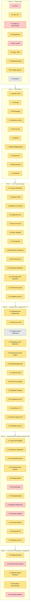

# Дерево статусов проекта

Живая карта состояния каждого шага `docs/plan.md` — чтобы в любой момент можно
было вернуться к конкретному шагу, увидеть его статус и где лежит код/документ.
Обновляется в том же коммите, где закрывается или продвигается шаг.

**Легенда:** ✅ закрыт (код+тесты прошли, проверка шага выполнена в объёме,
доступном без внешних сторон) · 🔧 в работе · ⛔ заблокирован — нужны
действия РП/ЮР/ИЗ/организаций/оборудования вне кода · ⬜ не начат.

Отдельно: ✅(частично) означает, что кодовая часть шага сделана и
протестирована, но официальная/полевая проверка (реальные параметры,
реальные точки, ручная сверка в Renga/Pilot-BIM) ещё предстоит — это не
считается полным закрытием шага по критерию плана.

## Визуальная схема

```mermaid
flowchart TD
    subgraph E0["Этап 0 — Подготовка"]
        direction LR
        S01["0.1 Пилот"]:::blocked
        S02["0.2 Тест IFC"]:::partial
        S03["0.3 Запросы в организации"]:::blocked
        S04["0.4 Координаты"]:::partial
        S05["0.5 Юр. оценка"]:::blocked
        S06["0.6 Аудит OSM"]:::partial
        S07["0.7 Инфраструктура"]:::partial
        S08["0.8 Словарь данных"]:::partial
        S09["0.9 Приёмка"]:::notstarted
    end

    subgraph E1["Этап 1 — MVP 500 м"]
        direction LR
        S11["1.1 Импорт OSM"]:::partial
        S12["1.2 Рельеф"]:::partial
        S13["1.3 API/очередь"]:::partial
        S14["1.4 Выборка участка"]:::partial
        S15["1.5 TIN участка"]:::partial
        S16["1.6 Здания"]:::partial
        S17["1.7 Дороги/вода/деревья"]:::partial
        S18["1.8 Сборка IFC"]:::partial
        S19["1.9 Веб-просмотр"]:::partial
        S110["1.10 Приёмка"]:::partial
    end

    subgraph E2["Этап 2 — 3 км + карта города"]
        direction LR
        S21["2.1 Кольца LOD/тайлы"]:::partial
        S22["2.2 Здания LOD2"]:::partial
        S23["2.3 Дороги по полосам"]:::partial
        S24["2.4 Каркасная сеть"]:::partial
        S25["2.5 Мосты/тоннели"]:::partial
        S26["2.6 Ж/д и трамвай"]:::partial
        S27["2.7 Электросети"]:::partial
        S28["2.8 Библиотека элементов"]:::partial
        S29["2.9 Растительность"]:::partial
        S210["2.10 Выходные форматы"]:::partial
        S211["2.11 Потоковый веб-просмотр"]:::partial
        S212["2.12 Публичная карта"]:::partial
        S213["2.13 Приёмка этапа 2"]:::partial
    end

    subgraph E3["Этап 3 — ограничения, посадка ЖК, ТУ"]
        direction LR
        S31["3.1 Официальные ограничения"]:::partial
        S32["3.2 Расчётные зоны"]:::partial
        S33["3.3 Градрегламент/огибающая"]:::notstarted
        S34["3.4 Подземные сети DWG/DXF"]:::partial
        S35["3.5 Карточки/точечный запрос"]:::partial
        S36["3.6 Приём/привязка ЖК"]:::partial
        S37["3.7 Отметка 0.000"]:::partial
        S38["3.8 Очистка площадки"]:::partial
        S39["3.9 Проверки посадки"]:::partial
        S310["3.10 Справочник РСО"]:::partial
        S311["3.11 Шаблоны ТУ"]:::partial
        S312["3.12 Реестр запросов ТУ"]:::partial
        S313["3.13 Приёмка этапа 3"]:::partial
    end

    subgraph E4["Этап 4 — визуализация, рендер, кабинет, API"]
        direction LR
        S41["4.1 Сцена для рендера"]:::partial
        S42["4.2 Запекание освещения"]:::partial
        S43["4.3 Солнце/небо/сезоны"]:::partial
        S44["4.4 Автоматические ракурсы"]:::partial
        S45["4.5 Рендер-воркер"]:::partial
        S46["4.6 Unreal Engine"]:::blocked
        S47["4.7 Панорамы/видео"]:::partial
        S48["4.8 Доводка нейросетью"]:::blocked
        S49["4.9 Gaussian splatting"]:::blocked
        S410["4.10 Личный кабинет"]:::partial
        S411["4.11 Внешний API"]:::partial
        S412["4.12 Приёмка этапа 4"]:::partial
    end
    subgraph E5["Этап 5 — опытная эксплуатация и внедрение"]
        direction LR
        S51["5.1 Инфраструктура"]:::partial
        S52["5.2 Опытная эксплуатация"]:::blocked
        S53["5.3 Документация/обучение"]:::partial
        S54["5.4 Регламент эксплуатации"]:::partial
        S55["5.5 Итоговая приёмка"]:::blocked
    end

    E0 --> E1 --> E2 --> E3 --> E4 --> E5

    classDef partial fill:#fde68a,stroke:#b45309,color:#111;
    classDef blocked fill:#fecaca,stroke:#b91c1c,color:#111;
    classDef notstarted fill:#e5e7eb,stroke:#6b7280,color:#111;
```

Жёлтый = код готов и протестирован, но шаг не закрыт до конца (нужны реальные
данные/люди/ПО); красный = заблокирован — нечего кодировать, нужно
организационное действие; серый = не начат. Таблицы ниже — то же самое с
подробностями и ссылками на файлы.

## Этап 0. Подготовка и проверка данных

| Шаг | Статус | Где | Примечание |
| --- | --- | --- | --- |
| 0.1 Пилотный участок и тестовый проект | ⛔ | — | Нужен реальный выбор участка в Перми, кадастровый номер, IFC ЖК в Renga — решение РП/BIM. |
| 0.2 Тест приёма IFC в Renga/Pilot-BIM | 🔧 | `geo/src/topology_geo/ifc/generate_test_ifc.py`, `docs/ifc-compatibility.md` | Генератор+валидатор IFC4/IFC4X3 готов и протестирован (`ifcopenshell.validate` — 0 замечаний, 13 тестов); открытие в Renga/Pilot-BIM и заполнение таблицы совместимости — нужен человек с этим ПО (шаблон таблицы готов). |
| 0.3 Запросы данных в организации | ⛔ | — | Письма/заявки в РСО, ИСОГД, фонд изысканий — организационная работа РП/ИЗ. |
| 0.4 Системы координат и высот | ✅(частично) | `geo/src/topology_geo/coords.py`, `docs/coordinate-systems.md` | Параметры МСК-59 — рабочее приближение из открытых справочников, не официальный документ; калибровка высот ждёт реальные контрольные точки (роль ИЗ). |
| 0.5 Юридическая оценка | ⛔ | — | Нужен привлечённый юрист (ODbL, 152-ФЗ, лицензии ПО, доступ к Claude API). |
| 0.6 Аудит полноты открытых данных | 🔧 | `geo/src/topology_geo/osm/audit.py` | Скрипт аудита готов и протестирован (8 тестов на синтетических данных); реальный прогон ждёт выбор пилота (0.1) и выгрузку OSM/TessaDEM. |
| 0.7 Инфраструктура разработки | 🔧 | `infra/docker-compose.yml`, `infra/.env.example`, `geo/Dockerfile`, `geo/docker/entrypoint.py` | Compose-стек описан и проходит `docker compose config` (PostGIS, MinIO, Redis, worker со смоук-тестом связи); реально не поднимался — в этой среде разработки нет демона Docker. Закупка станции (п. 10.1 ТЗ) — вне кода. |
| 0.8 Словарь данных и требования к IFC | 🔧 | `docs/data-dictionary.md`, `schemas/meta.schema.json` | Черновик словаря и JSON-схема `meta.json` (проверена тестами); нужна сверка словаря с BIM-специалистом. |
| 0.9 Приёмка этапа 0 | ⬜ | — | Решение РП после 0.1–0.8. |

## Этап 1. MVP на радиус 500 м

| Шаг | Статус | Где | Примечание |
| --- | --- | --- | --- |
| 1.1 Импорт OSM в PostGIS | ✅(частично) | `geo/osm2pgsql/style.lua`, `geo/src/topology_geo/osm/{import_log,queries,cli}.py`, `geo/scripts/*.sh`, `docs/osm-import.md` | Флекс-стиль (8 таблиц + журнал импорта), скрипты полного импорта и минутных дифов (`osm2pgsql-replication`), запрос выборки в радиусе — всё реально прогнано локальным `osm2pgsql`+PostGIS на синтетическом `.osm` (10/10 интеграционных тестов, тоже в CI). Не хватает реальной выгрузки Приволжского ФО и реального пилота (0.1) — без них нельзя закрыть критерий «≤5 с на 3 км» и «сходится с аудитом 0.6» на настоящих объёмах. |
| 1.2 Подготовка рельефа | ✅(частично) | `geo/src/topology_geo/relief/*.py`, `docs/relief.md` | Репроекция в МСК-59, пересчёт высот (модель Шага 0.4), конвертация в COG (`rio-cogeo`), слияние с плавным переходом (формула §2.4, регрессионный тест на найденный баг непрерывности), индекс покрытия в PostGIS и `get_dem(bbox)` — реально проверены (26 тестов, rasterio/GDAL + локальный PostGIS). Рабочая сетка задачи (`RELIEF_PIXEL_SIZE_M`, `jobs/steps.py`) — 1 м, чтобы не срезать точность точечных источников (топосъёмка) ещё до TIN участка/тайла; на предельном радиусе 3 км (6400×6400 пикс.) шаг измерен реальным прогоном ~15 с, укладывается в критерий «3 км ≤ 15 мин». Не хватает реальной загрузки TessaDEM по краю и реальной топосъёмки пилота (0.1) для проверки критерия «без ступеньки > 0.2 м» на настоящих данных; MinIO не поднимался (нет демона Docker), интерфейс `Storage` в `service.py` подключаемый. |
| 1.3 API и очередь задач | ✅(частично) | `geo/src/topology_geo/api/*.py`, `geo/src/topology_geo/jobs/*.py`, `geo/src/topology_geo/tasks/*.py`, `docs/api.md` | FastAPI (`POST /jobs`, `GET /jobs/{id}`, `GET /models/{id}/files`), модель задач в PostGIS, реальная очередь Celery+Redis (проверена настоящим воркером в отдельном процессе), пайплайн из четырёх реальных шагов (select_osm/prepare_relief/select_and_normalize/assemble_ifc, поверх Шагов 1.1/1.2/1.4-1.8). Оба критерия приёмки шага подтверждены тестами: 10 параллельных задач не мешают друг другу, упавший шаг перезапускается без пересчёта предыдущих. Сквозной прогон (OSM→рельеф→выборка→site.ifc) проверен на реальных сервисах (`test_full_happy_path_creates_downloadable_files`). Не хватает реального MinIO (нет демона Docker — интерфейс подключаемый) и шага 1.9 (веб-конвертация) в пайплайне. |
| 1.4 Выборка и нормализация данных | ✅(частично) | `geo/src/topology_geo/selection/*.py`, `docs/selection.md` | Выборка объектов в буфере, репроекция в МСК-59 (расширен `coords.py`), обрезка кругом + локальные координаты, нормализация тегов по словарю данных (тип/этажность/покрытие/напряжение, confidence факт/умолчание) и сохранение в GeoPackage — всё реально проверено (61 тест: 35 на нормализацию — план требовал 20+ — плюс выборка/обрезка/GeoPackage/оркестрация на реальном osm2pgsql+PostGIS). Подключено как третий шаг пайплайна задач (Шаг 1.3). Не хватает реального пилота (0.1) для проверки на участке со всеми типами объектов раздела 4 ТЗ разом. |
| 1.5 Рельеф участка | ✅(частично) | `geo/src/topology_geo/relief/tin.py` | TIN с фоном по методу квадратных призм (шаг 1 м, не 25 — см. `docs/relief.md`) плюс многоструктурное 2D-сглаживание фона, врезка дорог (сглаженный продольный профиль с исправленным краевым эффектом), урезов воды и площадок зданий (уровень = min по границе, с заполнением внутренности контура — иначе на густом фоне Делоне «перепрыгивает» контур), контроль вырожденных треугольников — реально проверено (13 тестов на точной синтетической плоскости, критерий «≤0.1 м» подтверждён с запасом). Подключено как часть шага `assemble_ifc` пайплайна задач (Шаг 1.8). Измеренное ограничение: несвязанный `Delaunay` на шаге 1 м не тянет весь диапазон радиуса API (500–3000 м) — реальный прогон на 1,5 км уходил за 12 ГБ; функция отказывает явной ошибкой выше ~800 м (`MAX_BACKGROUND_POINTS_UNTILED`), для большего радиуса — тайловый путь Шага 2.1. Реального рельефа пилота (0.1) для проверки на настоящих перепадах нет. |
| 1.6 Здания (упрощённо) | ✅(частично) | `geo/src/topology_geo/geometry/buildings.py` | Экструзия контуров: высота по формуле §2.5 (height → levels×3+1 → дефолт по типу), низ = min рельефа по контуру, исправление геометрии (make_valid, дедупликация точек, единая ориентация кольца) — 19 тестов, включая «100% контуров → корректные тела» на смеси годных и вырожденных входов. Подключено к сборке IFC (Шаг 1.8). «Выборочная сверка 20 высот с реальностью» из критерия шага возможна только на реальном пилоте (0.1). |
| 1.7 Дороги, вода, рельсы, деревья | ✅(частично) | `geo/src/topology_geo/geometry/{roads,water,rail,vegetation}.py` | Ленты дорог (ширина из тега/класса), балласт ж/д, деревья (одиночные с породой/дефолтом + случайная расстановка в массивах по плотности) — точная геометрия (площадь ленты = длина×ширина для прямой). Вода — контур (полигон озера, ось русла) сглажен методом Чайкина (срезание углов, концы русла не трогаются — иначе слияние рек в одном узле разошлось бы), уровень воды — сглаженный продольный профиль вдоль длинной оси для ВЫТЯНУТЫХ водоёмов/рек (не единый `min` по контуру — тот «роет траншею» на склоне для полномасштабных объектов), единый уровень остаётся для компактных (порог соотношения сторон, `docs/water.md`). 21 тест на точную геометрию/сглаживание/уровень. Подключено к сборке IFC (Шаг 1.8). Проверка плана (визуальная приёмка BIM) не автоматизируется — нужен реальный пилот (0.1) и человек с этим опытом. |
| 1.8 Сборка IFC | ✅(частично) | `geo/src/topology_geo/ifc/{assemble,registry}.py`, `geo/sql/004_ifc_globalid_registry.sql` | `IfcProject`→`IfcSite` с `IfcMapConversion`/базовой точкой, каждый слой Шагов 1.5-1.7 → меш (треугольники через `mapbox_earcut`, здания — замкнутая призма с стенами двора, проверено объёмом по теореме о дивергенции) + IFC-класс + Pset по словарю данных (`IfcRoad` нативно в IFC4X3, прокси в IFC4 — тот же приём, что Шаг 0.2), уникальный `GlobalId` в реестре PostGIS (`ifc_globalid_registry`), экспорт в обе схемы, валидация `ifcopenshell.validate` — 0 замечаний. Дорожное покрытие (лента дороги/полоса/тротуар/перекрёсток/разметка) обязательно ВЫШЕ рельефа, не вровень с ним (`PAVEMENT_CLEARANCE_M`/`MARKING_CLEARANCE_M`, `docs/pavement.md`) — заодно нашёлся и исправлен реальный баг: точка вне выпуклой оболочки TIN раньше давала абсолютный Z=0 вместо отметки ближайшей вершины (угол покрытия «падал под землю» на всю высоту рельефа). Подключено как шаг `assemble_ifc` пайплайна задач, сквозной прогон реален (29 тестов). Приёмка «открывается в Renga с верной геопривязкой и свойствами» — нужен реальный пилот (0.1) и человек с этим ПО. |
| 1.9 Веб-просмотр | ✅(частично) | `geo/src/topology_geo/ifc/to_glb.py`, `geo/src/topology_geo/web/viewer/`, `geo/src/topology_geo/api/app.py` | IFC → GLB (`ifcopenshell.geom.iterator` по реальной модели, не пересборка — IFC остаётся источником истины), узлы glTF с `extras` (GlobalId/класс/Pset) сгруппированы по слоям; статическая страница-вьюер (three.js, облёт — OrbitControls, слои — чекбоксы, дерево объектов, панель свойств по клику) отдаётся FastAPI (`/viewer/`), файлы — через `GET /models/{id}/download` (привязан к job_id), ссылка на модель — `viewer_url` в `GET /models/{id}/files` (п. 3 шага). Проверено в настоящем headless Chromium (Playwright): модель грузится за <1 с (критерий — «≤10 с»), дерево/слои/свойства реально работают, без ошибок JS — **но только на маленьких тестовых моделях**. XKT (xeokit-convert) не реализован — обоснование в докстринге `to_glb.py` (закрытая Node.js-экосистема, GLB общедоступен и достаточен для критерия). 11 новых тестов (конвертер, шаг пайплайна, API, реальный браузер). Критерий «на телефоне» — не проверялся (нет реального устройства), только адаптивная вёрстка (`@media`).

**Честно, найдено на реальном пилотном участке (58.049986, 56.342231, Шаг 5.2):** на модели реалистичного размера (радиус 500 м, 2452 IFC-объекта, включая террейн-TIN на 745 860 вершин как ОДИН объект) `convert_to_glb` упирается в тот же предсуществующий потолок памяти песочницы (~13,3-13,8 ГБ), что и Шаги 2.4/2.6/2.10/2.13 — `assemble_ifc` для этой же задачи успешно завершился (12 мин), а `convert_to_glb` был убит `dmesg`-подтверждённым OOM. Изолированная диагностика (`ifcopenshell.geom.iterator(..., include=[террейн])`) сузила причину до ОДНОГО объекта — рельефа: `iterator.initialize()` для него одного превысило 3,4 ГБ и не завершилось за 91 с, ПРИЧЁМ ОДИНАКОВО на обоих ядрах геометрии (`opencascade` И `cgal`) — значит, дело не в конкретном геометрическом ядре, а в самой обработке единственного IFC-продукта с ~750 тыс. вершин через `ifcopenshell.geom`, независимо от ядра. Критерий «≤10 с» подтверждён только на маленьких/синтетических моделях (11 тестов Шага 1.9); на реалистичном масштабе — не достигнут, тот же класс ограничения среды разработки, что и у Шагов 2.4/2.6/2.10/2.13, не регрессия кода этого шага. Реальный кандидат на исправление — прореживание/тайлинг террейна СПЕЦИАЛЬНО для GLB-предпросмотра (полное разрешение 1 м остаётся в авторитетном `site.ifc` для BIM-ПО) — не реализовано в этом проходе, отдельная, нетривиальная задача. |
| 1.10 Тесты и приёмка этапа 1 | ✅(частично) | `geo/tests/test_stage1_acceptance.py`, `docs/stage1-acceptance.md` | Конвейер целиком (реальные `osm2pgsql`+PostGIS+Redis) прогнан на 3 синтетических профилях (центр/спальный район/частный сектор) — все три доходят до `done` со скачиваемыми `site.ifc`+`site.glb`, время каждого шага снято из журнала задачи (п. 1-2 шага). Геометрическая проверка «расхождение с OSM ≤0,5 м» (раздел 14 ТЗ) — сравнение экспортированного контура здания с нормализованными координатами Шага 1.4 по Хаусдорфу, на опорном прогоне 0 м. Протокол приёмки — `docs/stage1-acceptance.md`. Проверка BIM-специалистом в Renga/Pilot-BIM и повторная проверка после замечаний (п. 3-4 шага) — вне возможностей AI-сессии, нужен реальный пилот (0.1) и человек с этим ПО; сама методика переносится на пилот без изменений. |

## Этап 2. Полная модель 3 км и публичная карта

| Шаг | Статус | Где | Примечание |
| --- | --- | --- | --- |
| 2.1 Кольца детализации и тайловый кэш | ✅(частично) | `geo/src/topology_geo/tiling/{grid,cache,terrain}.py`, `geo/src/topology_geo/tasks/tile_tasks.py`, `geo/sql/005_tile_cache.sql` | Кольца LOD2/LOD1/LOD0 по границам плана, тайлы 250×250 м в МИРОВЫХ координатах МСК-59 (не локальных задачи — иначе кеш не переиспользовался бы между задачами на одну и ту же зону), ключ кеша координаты+слой+версия данных+версия генератора, upsert-кеш в PostGIS. Рельеф тайла — тот же метод квадратных призм с шагом 1 м и то же 2D-сглаживание фона, что и Шаг 1.5 (см. `docs/relief.md`); тайл — единственный путь, где полный радиус 3 км при шаге 1 м реально тянется (62,5 тыс. точек/тайл независимо от общего радиуса, в отличие от несвязанного `Delaunay` Шага 1.5). Параллельная генерация — `celery.group` на реальном воркере (`--concurrency=4`, отдельный процесс); повторный запрос того же батча подтверждённо берёт тайлы из кеша (`created_at` не меняется). Стыковка рельефа — граничные точки на глобальной сетке БЕЗ сглаживания (шов должен остаться побитово точным), у соседних тайлов совпадают (0 м расхождения, тест на явной синтетической плоскости и на интерполяции по обе стороны шва). 33 теста. Реального многотайлового профиля на 3 км (не синтетика) и настоящего кластера из нескольких машин (не несколько процессов на одной) не было — недоступно AI-сессии без пилота (0.1) и живой инфраструктуры. |
| 2.2 Здания LOD2 | ✅(частично) | `geo/src/topology_geo/geometry/roofs.py`, `geo/src/topology_geo/geometry/buildings.py`, `geo/osm2pgsql/style.lua` | Формы крыш (gabled/hipped/pyramidal/skillion) по `roof:shape`/`roof:height`/`roof:angle`/`roof:direction`/`roof:orientation`, геометрия по ориентированному минимальному прямоугольнику контура (OBBox) — приём реальных рендереров OSM-3D (OSM2World/Simple3DBuildingsV1), не изобретён. Все объёмы солидов проверены точными замкнутыми формулами (не приближённо) + подсчётом рёбер на замкнутость. Высота — водопад OSM→Overture→тип (п. 2), источник явно в `Pset_Здание.Источник_высоты`; реального доступа к датасету Overture нет (`NullOvertureSource`, обоснование в коде) — водопад настоящий, средний уровень не наполнен данными в этой среде. Составные здания `building:part` (п. 1) — новая таблица `osm_building_parts` в импорте (Шаг 1.1), пространственное сопоставление контур↔части (`shapely.intersects`, ссылки OSM не даёт); контур, покрытый хотя бы одной частью, не экструдируется сам — по прямой цитате вики Key:building:part (реальные 3D-рендереры могут не рисовать его вовсе), каждая часть — отдельный `BuildingSolid` со своей высотой/крышей. Входы `entrance=*` (п. 3) — новая таблица `osm_entrances`, точки сопоставляются зданию/части буфером 1 м, записаны в `Pset_Здание` (Входов_всего/Вход_N_*) без новой геометрии. 62 теста на геометрию/крыши/составные здания/входы (`test_geometry_roofs.py`, `test_geometry_buildings.py`) плюс два сквозных прогона реального конвейера до `site.ifc` (`roof:shape=gabled`, `building:part`+`entrance`). Количественный критерий шага («90% зданий ближнего кольца с крышей, отличной от плоской, где она не плоская в реальности, выборка 30 зданий») — нужен реальный пилот (0.1) для сверки с реальностью, недоступно AI-сессии. |
| 2.3 Дороги по полосам | ✅(частично) | `geo/osm2streets/`, `geo/src/topology_geo/osm/raw_roads.py`, `geo/src/topology_geo/geometry/streets.py` | Подключён реальный osm2streets (п. 1) — единственный существующий инструмент для геометрии по полосам, переписывать не нужно и рискованно; существует только как Rust/WASM (`osm2streets-js`), поэтому вызывается процессом Node.js (`geo/osm2streets/convert.mjs`), как системный `osm2pgsql` в Шаге 1.1. Ключевая проблема — `osm2pgsql` не хранит связность узлов между дорогами: решена доп. колонкой `osm_roads.nodes` (ID узлов way, Шаг 1.1) и восстановлением валидного OSM XML с настоящей топологией прямо из PostGIS (`osm.raw_roads`), без повторного обращения к исходному `.osm`/`.pbf`. Результат — полосы (проезжая часть/тротуар/...) и площадки перекрёстков в локальных координатах участка, подключены в `SiteModel`/`site.ifc` (`Pset_Полоса`, `Pset_Перекрёсток`) честным водопадом (`is_osm2streets_available()` — при отсутствии `node`/пакета участок остаётся с одной лентой на дорогу, Шаг 1.7, не падает). Разметка (п. 3) — центральные линии и стрелки поворота из `turn:lanes` (`toLaneMarkingsGeojson`), тоже готовой геометрией из osm2streets; починка `make_valid` перед обрезкой кругом (у мелких полигонов разметки попадаются самопересекающиеся «бабочки» — та же природа, что у контуров зданий, Шаг 1.6), склейка всех элементов одного вида в один меш/продукт (`_combine_meshes`, `ifc/assemble.py`) — иначе `site.ifc` распухнет от тысяч тривиальных объектов (`add_mesh_representation` и не позволил бы иначе: несколько представлений в одном продукте требуют одинакового числа вершин у всех). Переходы из `crossing` (тоже п. 3) не проверены — нужен более специфичный входной профиль. Бордюр 0,15 м (п. 2) — osm2streets его не отдаёт, синтезирован (`_build_curb_strips`) по общей границе объединённых Driving- и Sidewalk-полос одной дороги (не по константному смещению — точен при любой форме уже готовых полос), без бордюра на грунтовых дорогах (`surface` из `UNPAVED_SURFACES`, вики Key:surface, Unpaved — Шаг 2.3, п. 4, «грунтовые дороги — без бордюров»); на границе с площадками перекрёстков бордюр не строится (упрощение). Разделитель и газон (тоже п. 2) — в отличие от бордюра, osm2streets отдаёт их САМ: `SharedLeftTurn` (полоса разворота/поворота налево, тег `lanes:both_ways=1`+`turn:lanes:both_ways=left`) и `Buffer(Verge)` (газон, тег `cycleway:<сторона>:separation:<сторона>=grass_verge`), оба проверены эмпирически прямым вызовом `osm2streets-js`; проходят через общий код полос без отдельной ветки, кроме покрытия — газону тег `surface=*` дороги не наследуется (`_surface_for_lane`, `Покрытие=grass`), это физически трава, не асфальт. Покрытие (п. 4) — тег `surface=*` дороги переносится на каждую её полосу как есть (`Pset_Полоса.Покрытие`, `_surface_of`/`_surface_for_lane`), тот же принцип, что `Pset_Дорога.Покрытие` (Шаг 1.7); при слиянии нескольких way в одну полосу (узел степени 2, не настоящий перекрёсток — проверено эмпирически) берётся покрытие первого найденного way; «колея» на грунтовых дорогах (тоже п. 4) не реализована — геометрическая деталь профиля, отдельная от посадки на рельеф. Посадка на рельеф с продольным сглаживанием и поперечным уклоном (п. 5) — реализована: своя ось у каждой полосы/штриха разметки (`relief.tin.long_axis_line`), сглаженный продольный профиль вдоль неё (`build_profile_elevation_fn`, та же техника, что у дороги в TIN Шага 1.5 и у уровня вытянутого водоёма Шага 1.7) плюс типовой поперечный уклон 20 ‰ от оси к краям (`ifc/assemble.py`, `lane_pavement_elevation_fn`/`lane_marking_elevation_fn`); компактный фрагмент (почти квадратный, площадка перекрёстка) — обычная плоская посадка без профиля/уклона, директивная ось для него физически бессмысленна. Подробности — `docs/pavement.md`. Все 5 пунктов Шага 2.3 реализованы. 24 теста на связность/геометрию/разметку/бордюр/покрытие/разделитель/газон (`test_osm_raw_roads.py`, `test_geometry_streets.py`) плюс профильные тесты в `test_ifc_assemble.py` (31 тест всего в файле, включая склейку мешей и продольное сглаживание/поперечный уклон полос), плюс сквозной прогон реального перекрёстка через весь конвейер до `site.ifc` (`test_pipeline_streets.py`). Подробности по остальным пунктам — `docs/streets.md`. Осталось не проверенным на приёмку (не блокирует реализацию, но и не закрыто): переходы из `crossing` (нужен более специфичный входной профиль), формальная приёмка «≥ 95% перекрёстков без ошибок геометрии, ручная проверка 10 сложных узлов» по критерию плана — не проводилась (нет реального массива данных Перми в этом окружении). |
| 2.4 Каркасная и внутриквартальная сеть | ✅(частично) | `geo/src/topology_geo/geometry/road_network.py`, `geometry/roads.py`, `geometry/streets.py`, `ifc/assemble.py`, `jobs/steps.py` | Классификация (п. 1) — единая `classify_road_network` (`road_network.py`): каркасная = `motorway…tertiary` вместе с `_link`-съездами (по плану), иначе внутриквартальная (умолчание и для неизвестного класса тоже — безопаснее, чем считать федеральной трассой). У `RoadRibbon`/`LaneRibbon` есть свой `osm_way_ids`/тег `highway` — классификация напрямую по тегу дороги (`_network_of`, `geometry/streets.py`); у `IntersectionArea`/`LaneMarking` своего way нет — классифицируются геометрически, по факту касания уже классифицированной каркасной полосы (`unary_union` + `intersects`, тот же приём, что у синтеза бордюра Шага 2.3). Два файла дорог (п. 4) — `build_site_ifc` получил необязательный `road_network_filter` (None/каркасная/внутриквартальная): фильтрует дороги/полосы/перекрёстки/разметку своей сети, полностью пропускает здания/воду/ж-д/деревья И рельеф (TIN) — рельеф ни к одной сети не относится, а его меш на честном участке (шаг сетки 1 м) самый тяжёлый по памяти в сборке; первая версия этого прохода включала TIN в оба файла на каждую схему («общая привязка») и это реально приводило к OOM на сквозном прогоне (меш пересобирался 6 раз за задачу вместо 2) — воспроизведено и исправлено при разработке, не гипотетическая оптимизация; полосы/дороги уже несут свою абсолютную высоту (Шаг 2.3, п. 5), сам меш им не нужен; `jobs.steps.assemble_ifc` вызывает сборку ещё дважды на каждую IFC-схему и кладёт `jobs/{id}/roads_{backbone,internal}_{ifc4,ifc4x3}.ifc` в Storage — видны в `GET /models/{id}/files` (`docs/api.md`); реестр `GlobalId` для них — под ОТДЕЛЬНЫМ `model_id` (`{job_id}:roads_backbone`/`...:roads_internal`), не под общим, иначе `ON CONFLICT` затёр бы GlobalId комбинированной модели тем же `(layer, osm_id)`, но другим GlobalId из меньшего файла. Каркасная сеть помечена `Pset_Дорога/Полоса.Редактируемый=false`, внутриквартальная — `true` (буквально из плана, не только в документации). Параметрическая внутриквартальная сеть (п. 5) — `RoadRibbon.axis` хранит исходную ось (только для дороги с ОДНИМ цельным сегментом линии, `None` для составной `MultiLineString`); `rebuild_road_ribbon(road, new_axis)` пересобирает ленту по новой оси с тем же профилем (ширина/покрытие/класс), отказывает на каркасной дороге (нередактируема, п. 4) и на дороге без сохранённой оси. Сверка с официальными перечнями федеральных/региональных дорог (п. 2) и импорт красных линий ИСОГД (п. 3) НЕ реализованы — оба требуют внешних данных, которых нет в этой среде (тот же честно незакрытый статус, что у Шага 0.3); изобретать значения без источника было бы менее честно, чем оставить пункт открытым. +12 новых тестов (6 в `test_geometry_environment.py` на классификацию/ось/перестройку, 6 в `test_ifc_assemble.py` на `road_network_filter`) — из них `test_road_network_filter_*` реально валидируют фильтрацию каждого слоя через `ifcopenshell.validate`, не только логику Python; `test_api.py::test_full_happy_path_creates_downloadable_files` обновлён (ожидает новые файлы `roads_backbone`/`roads_internal` в `GET /models/{id}/files`), но сам прогон в этой AI-сессии не подтверждён — этот тест (реальный `osm2pgsql` + рельеф 1 м + сборка IFC + GLB в одном процессе, честный водопад Celery-eager) упирается в потолок памяти контейнера (~15 ГБ, OOM killer) уже на коде ДО этого шага — воспроизведено сравнением: тот же OOM происходит и без изменений Step 2.4 (`git stash` на этот же тест), значит, это не регрессия текущего прохода, а предсуществующее ограничение среды разработки, а не кода. |
| 2.5 Мосты, путепроводы, тоннели | ✅(частично) | `geo/src/topology_geo/geometry/bridges.py`, `geometry/roads.py`, `geometry/rail.py`, `ifc/assemble.py`, `jobs/steps.py` | Обнаружение (п. 1) — `is_bridge` (`geometry/roads.py`, тег `bridge=*`, кроме `no`/пустого); `build_road_ribbons` исключает мостовые участки (строятся отдельно), `build_bridge_ribbons` (`geometry/bridges.py`) собирает их из тех же `SiteFeature`. Пролётное строение по оси (п. 2) — `abutment_elevation_fn`: ЛИНЕЙНАЯ интерполяция между отметками рельефа на двух КОНЦАХ оси (устои), не сглаженный профиль вдоль оси, как у дороги/воды (`relief.tin.build_profile_elevation_fn`) — пролёт жёсткий, его отметка не должна следовать рельефу под ним (тест `test_abutment_elevation_ignores_terrain_dip_between_ends` явно проверяет, что провал/подъём рельефа посередине не влияет). Проверка габарита (п. 3) — не выборка по площади, а точная геометрия: пересечение оси моста с осями УЖЕ построенных немостовых дорог (`RoadRibbon.axis`) и путей (`RailRibbon.axis`, оба поля добавлены в этом проходе по аналогии с Шагом 2.4) даёт точки проверки; норматив свой для дороги (`MIN_CLEARANCE_ROAD_M=5.0`) и пути (`MIN_CLEARANCE_RAIL_M=6.0`, строже из-за контактной сети) — типовые значения по нормам проектирования (СП 34.13330), не расчёт по нагрузке/скорости, честно помечено как упрощение; при нарушении — пролёт поднимается на весь дефицит и получает `Pset_Мост.Статус=расчётный`, иначе `официальный`; без осей других объектов (например, мост через реку/овраг без дороги под ним) проверка не выполняется вовсе — `Габарит_м` в Pset тогда отсутствует, не подставляется наугад. IFC — `IfcBridge` нативно в IFC4X3 (как `IfcRoad`), прокси в IFC4, тот же принцип совместимости, что и в `generate_test_ifc.py` (Шаг 0.2); отметка полотна — `abutment_elevation_fn` через ту же `pavement_elevation_fn` (зазор от z-fighting), что у дороги/полосы; мост подчиняется `road_network_filter` (Шаг 2.4, п. 4) через свою же `classify_road_network`. 27 новых тестов (`test_geometry_bridges.py` — 21, включая линейность интерполяции, разный норматив для дороги/пути, честное отсутствие проверки без осей и без пересечения; `test_ifc_assemble.py` — 6 на нативный/прокси-класс, Pset, зазор, фильтр по сети). Опоры по шагу для типа моста и насыпи подходов (п. 4), тоннели — вырез в рельефе и портал (п. 5) — НЕ реализованы в этом проходе, отдельная задача (`docs/bridges.md`); проверка развязок реальной Перми и приёмка BIM-специалистом (критерий шага) недоступны AI-сессии без пилота (0.1). |
| 2.6 Железная дорога и трамвай | ✅(частично) | `geo/src/topology_geo/geometry/rail.py`, `osm2pgsql/style.lua`, `ifc/assemble.py`, `jobs/steps.py`, `docs/rail.md` | Ширина насыпи по числу путей и колее (действие «число путей и ширина колеи, балластная призма») — `compute_ballast_width_m`: один путь занимает `колея + 2×обочина`, каждый следующий добавляет типовое междупутье `TRACK_SPACING_M`; подобрано так, что при умолчаниях (1 путь, колея 1520 мм) даёт то же число, что и прежняя плоская `BALLAST_WIDTH_M=4,0` Шага 1.7 — поведение по умолчанию не изменилось, только честно объяснено и параметризовано тегами `tracks`/`gauge`. Платформы (`railway=platform`) и переезды (`railway=level_crossing`/`crossing`) потребовали новых таблиц импорта — `osm_railway_platforms` (геометрия, полигон если контур замкнут, иначе линия — `insert_platform_geom` в `style.lua`) и `osm_railway_crossings` (точки, новая ветка `process_node`), т.к. общая `osm_railways` определена с фиксированным типом `linestring` и не годится ни под полигон платформы, ни под точку переезда; таблицы добавлены в `osm.queries.TABLES`, интеграционный тест `test_osm_import_style.py` прогнан на реальном `osm2pgsql`. `build_platform_areas` — контур как есть или буфер линии (`PLATFORM_LINE_WIDTH_M`), приподнят на `PLATFORM_HEIGHT_M` над рельефом (упрощённо, без деления низкая/высокая). `build_level_crossings` — упрощённое квадратное пятно разметки со стороной, равной ширине насыпи БЛИЖАЙШЕГО пути (не пытается восстановить реальную геометрию пересекающей дороги — честное упрощение). Опоры контактной сети (действие «опоры контактной сети упрощённо») — `place_catenary_poles`: только для `electrified` не пусто/не `no`, регулярный шаг `POLE_SPACING_M=50 м`, один борт от оси на отступе `POLE_OFFSET_FROM_AXIS_M=3,1 м` (габарит приближения, СТН Ц-01-95), меш — тот же `mesh_cylinder`, что у деревьев; без записи в реестр GlobalId (несколько опор на один way пути, как штрихи разметки). Собраны в IFC (`IfcBuildingElementProxy`, тот же приём совместимости, что и у ленты пути — нативный `IfcRail` не был задействован и для базовой ленты, честно исправлено в `docs/data-dictionary.md`); все новые слои исключены из `roads_backbone`/`roads_internal` (не дорожная сеть, тот же приём, что и `rail`/`trees`, Шаг 2.4). 25 новых тестов (`test_geometry_rail.py` — 21, `test_ifc_assemble.py` — 3, `test_osm_import_style.py` — 1). «Шпалы и рельсы в ближнем кольце» (индивидуальная геометрия LOD, нужна интеграция с кольцами Шага 2.1) — НЕ реализовано в этом проходе, см. `docs/rail.md`; визуальная приёмка по чек-листу (критерий шага) недоступна AI-сессии без человека. |
| 2.7 Электросети с опорами | ✅(частично) | `geo/src/topology_geo/geometry/power.py`, `ifc/assemble.py`, `jobs/steps.py`, `docs/power.md` | Импорт (`osm_power`) уже был готов с Шага 1.1 — изменений `style.lua` не потребовалось. Опоры/башни по типовым сериям (п. 1) — `build_poles`: `power=pole` простой столб постоянного сечения (радиус по `material`), `power=tower` решётчатая опора упрощённо СУЖАЕТСЯ К ВЕРШИНЕ (`mesh_cylinder` получил новый параметр `radius_top`, поведение по умолчанию `radius_top=None` не изменилось); `Pset_ЛЭП.Серия` — тег `design`/`structure` как есть, при отсутствии не подставляется. Расчётная расстановка при отсутствии реальных опор (п. 2) — `place_calculated_poles`: ТОЛЬКО для линий без НИ ОДНОЙ реальной точки `power=tower/pole` в пределах допуска, равномерно по всей длине (не с обрубком последнего пролёта), честно помечена `Pset_ЛЭП.Источник="умолчание"`. Провода цепной линией (п. 3) — `build_wire_spans` строит провод между каждой последовательной парой опор (реальных и расчётных вперемешку) вдоль линии; провис — параболическое приближение цепной линии (`SAG_RATIO=3%` пролёта, стандартный инженерный приём при малом провисе, не точное гиперболическое решение), число проводов по тегу `cables` (умолчание 3), разнесены горизонтальным рядом; геометрически — не труба, а тонкая плоская лента вдоль 3D-ломаной (новый `ifc.assemble.mesh_ribbon_along_path`, тот же принцип, что и у плоских лент дороги/воды, только с индивидуальной Z на каждой точке). Собран как `IfcCableSegment`/`CABLESEGMENT` — эмпирически через ifcopenshell выяснилось, что `IfcFlowSegment` (ошибочно запланированный в Шаге 0.8) вообще не имеет своего `PredefinedType` ни в IFC4, ни в IFC4X3; `docs/data-dictionary.md` исправлен. Подстанции/ТП упрощённым объёмом (п. 4) — `build_substations`, только оконтуренные (точечные без контура — честно пропущены, размер не изобретается). Охранная зона по классу напряжения (п. 5) — `build_power_safety_zones`, буфер по РЕАЛЬНОМУ нормативу (ПП РФ №160 от 24.02.2009, полуширина от 2 м до 55 м по классу напряжения), без тега `voltage` зона не строится (честно, не гадаем норматив); собрана как `IfcSpatialZone` через `aggregate.assign_object` (не `spatial.assign_container` — тот падает на пространственных элементах, эмпирически подтверждено, тот же приём, что и `IfcRoad`/`IfcBridge`). Все новые слои исключены из `roads_backbone`/`roads_internal`. 33 новых теста (`test_geometry_power.py` — 22, `test_ifc_assemble.py` — 11: 5 на новые меш-хелперы + 6 на сборку/Pset/фильтр). Реальные фермы/раскосы башни, бандл-провода, расчёт провиса по натяжению/гололёду, сверка охранной зоны с официальным реестром (НСПД) — НЕ реализованы в этом проходе, см. `docs/power.md`; проверка на реальных линиях пилота (критерий шага) недоступна AI-сессии без пилотного участка (Шаг 0.1). |
| 2.8 Библиотека элементов | ✅(частично) | `geo/src/topology_geo/assets/`, `geo/assets/textures/`, `geometry/landscaping.py`, `ifc/assemble.py`, `jobs/steps.py`, `docs/asset-library.md` | Структура каталога (п. 1) — `assets/manifest.json` + `assets/library.py` (`load_manifest`/`find_entry`/`entries_by_category`/`resolve_file`), запись — категория/тип/LOD/лицензия/источник/версия; критерий проверки шага «у каждого элемента указана лицензия» — тест, параметризованный по ВСЕМ обязательным полям, не только лицензии. Параметрические генераторы (п. 2, «опоры, столбы, бордюры, ограждения, пролёты, фонари») — опоры/столбы (Шаги 2.6/2.7) и бордюр (Шаг 2.3) уже существовали, просто занесены в каталог; недостающие ограждения и фонари реализованы этим шагом (`geometry/landscaping.py`, новый модуль — `osm2pgsql` уже собирал `barrier=fence/wall`/`highway=street_lamp` в `osm_landscaping` с Шага 1.1, генератора не было). Ограждение — столбы через типовой пролёт (буквально «пролёты» из действия) плюс тонкий поручень, `IfcRailing` нативно в обеих схемах с предопределённым типом `FENCE` — ТОЛЬКО в IFC4X3 (`IfcRailingTypeEnum` не знает такого значения в IFC4, проверено эмпирически через ifcopenshell, там `USERDEFINED`). Стена — `IfcWall`, тоже нативно в обеих схемах, точное семантическое соответствие без прокси. Готовые licensed 3D-модели деревьев/МАФ/остановок (п. 3) — НЕ реализованы, честно (поиск+юридическая проверка+интеграция конкретных мешей — за пределами кодовой AI-сессии, в отличие от текстур ниже, где есть простой документированный CC0-API). PBR-текстуры (п. 4) — РЕАЛЬНО скачаны через публичный API Poly Haven (`api.polyhaven.com`/`dl.polyhaven.org`) для всех 5 материалов действия (асфальт `asphalt_01`, плитка `checkered_pavement_tiles`, грунт `dirt`, газон `grass_ground`, бетон `brushed_concrete`), лицензия CC0, по 3 карты на материал (Diffuse/Normal-GL/ARM упакованный AO+Roughness+Metal, 1К, ~13 МБ суммарно) — реально проверены тестом (читает файл с диска, ненулевой размер, не только запись в каталоге). Представления IFC/рендер (п. 5) — честно не расходятся: отдельного пайплайна «детальная сетка для рендера» в проекте пока нет (Этап 4 не достигнут), используется то же упрощённое IFC-тело, что и для GLB веб-просмотра. 26 новых тестов (`test_assets_library.py` — 16, `test_geometry_landscaping.py` — 6, `test_ifc_assemble.py` — 4). Назначение текстур конкретным поверхностям в сборке IFC/GLB — НЕ реализовано (текстуры скачаны и в каталоге, но пока не применяются), см. `docs/asset-library.md`. |
| 2.9 Растительность и благоустройство | ✅(частично) | `geo/src/topology_geo/geometry/vegetation.py`, `geometry/landscaping.py`, `osm2pgsql/style.lua`, `selection/normalize.py`, `ifc/assemble.py`, `jobs/steps.py`, `docs/vegetation.md` | Высота дерева из `height` (действие «высотой из height») — `TreePoint.height_m`/`height_confidence`, независимо от породы; без тега — типовое `DEFAULT_TREE_HEIGHT_M=12 м`. Плотность массива по типу леса (действие «рассеивание с плотностью по типу леса») — тег `leaf_type` полигона выбирает `FOREST_DENSITY_PER_HA_BY_LEAF_TYPE` (хвойный 500/га, смешанный 400, лиственный 350 — типовые иллюстративные значения), без тега — прежнее плоское умолчание Шага 1.7 (поведение по умолчанию не изменилось). Заодно исправлена реальная НЕТОЧНОСТЬ Шага 1.7: `landuse=grass` (газон) раньше обрабатывался ТЕМ ЖЕ `scatter_forest_trees`, что и настоящий лес, получая ошибочно плотность леса — теперь газон явно исключён и получил свой генератор `build_lawns` (плоская поверхность, без единого дерева). Кустарник (действие «кустарники», `natural=scrub`) — новый тег, не собирался вовсе, добавлена ветка `style.lua` (та же таблица `osm_vegetation`, реально проверено на локальном `osm2pgsql`); расстановка `scatter_shrubs` — ниже и гуще дерева (`SHRUB_HEIGHT_M=1,2 м`, `SHRUB_DENSITY_PER_HA=1500/га`), отдельный тип `ShrubPoint`. `normalize_vegetation` (Шаг 1.4) — честно реализован дословно описанный, но не воплощённый в коде водопад «`species`/`genus`, при отсутствии `leaf_type`» (был только `species`/`genus`). Скамейка (действие «скамейки», `amenity=bench`) — `build_benches` (`geometry/landscaping.py`, тот же модуль Шага 2.8), упрощённый плоский короб без ориентации, `IfcFurniture` нативно в обеих схемах (`IfcFurnitureTypeEnum` не знает BENCH ни в одной, эмпирически проверено через ifcopenshell — тот же метод, что и `FENCE`/`IfcRailingTypeEnum` в Шаге 2.8). Ограждения/фонари — уже Шаг 2.8, ничего нового. 23 новых теста (`test_geometry_environment.py` — 14 на растительность, `test_geometry_landscaping.py` — 2 на скамейки, `test_selection_normalize.py` — 3 на leaf_type, `test_ifc_assemble.py` — 4; `test_osm_import_style.py` обновлён на кустарник без новой тест-функции). Дифференциация по конкретному виду (`species`) вместо огрублённого `leaf_type`, ориентация скамейки, готовые детальные модели растительности/МАФ — НЕ реализованы, честно, см. `docs/vegetation.md`; визуальная приёмка (критерий шага) недоступна AI-сессии без человека. |
| 2.10 Выходные форматы | ✅(частично) | `geo/src/topology_geo/export/{landxml,cityjson,dxf}.py`, `ifc/assemble.py`, `jobs/steps.py`, `api/app.py`, `docs/output-formats.md` | Федеративные IFC-слои (п. 1): на каждую схему добавлены `relief_*.ifc`/`buildings_*.ifc`/`power_*.ifc` (тот же приём независимого `SiteModel`, что и `roads_backbone/internal` Шага 2.4); честно зафиксирован реальный побочный эффект — `relief_*.ifc` пересобирает тот же TIN-меш ещё раз на каждую схему (4 раза за задачу вместо 2), а `power_*.ifc` без своего TIN кладёт ЛЭП на условную плоскость z=0. Форматы (п. 2, строятся один раз, не на IFC-схему): LandXML (`export/landxml.py`, вручную через `ElementTree` — поверхность TIN + оси дорог/путей, только прямые сегменты), CityJSON (`export/cityjson.py` — здания LOD0/LOD1/LOD2, та же логика меша, что IFC-рендер), DXF (`export/dxf.py`, новая зависимость `ezdxf` — контуры зданий/дорог/воды по слоям, без горизонталей рельефа). `meta.json`+упаковка (п. 3, новый лёгкий шаг `jobs.steps.package_outputs`, последний в `DEFAULT_PIPELINE`): реальный `sources` из `osm_import_log`/`dem_coverage`, `roads_internal`→`roads_local` переименован на границе упаковки (не в самом шаге `assemble_ifc`), `size_bytes`/`files`/`layers` по факту содержимого архива, схема `schemas/meta.schema.json` (Шаг 0.8) проходит валидацию. `api/app.py::get_job_files` расширен на верхнеуровневые `*_storage_key` (не только вложенные в `schemas`). 38 новых тестов (`test_export_landxml.py` — 7, `test_export_cityjson.py` — 10, `test_export_dxf.py` — 7, `test_jobs_steps_package_outputs.py` — 7, `test_osm_import_log.py` — 3, `test_api.py` — обновлён список файлов). Не реализовано, честно: отдельный `vegetation.ifc`, `networks.ifc`/`constraints.ifc` (Этап 3), конвертер в `XKT`, реальное открытие файлов в целевой CAD/ГИС-программе (критерий проверки шага недоступен AI-сессии) — подробности `docs/output-formats.md`. Сквозной `test_api.py::test_full_happy_path_creates_downloadable_files` реально прогнан (~15 мин) и получил `SIGKILL` — `dmesg` подтверждает `anon-rss:13822740kB` (13,82 ГБ), С ТОЧНОСТЬЮ ДО СОТЕН КБ тот же потолок памяти cgroup, что и в Шаге 2.6 (13,78-13,82 ГБ, три независимых прогона) — тот же предсуществующий потолок контейнера разработки, не новый более низкий порог, подробности STATUS.md. |
| 2.11 Потоковый веб-просмотр модели 3 км | ✅(частично) | `geo/src/topology_geo/tiling/{gltf_mesh,tile_content,tileset}.py`, `jobs/steps.py::generate_tileset`, `api/app.py`, `web/viewer/index.html`, `docs/streaming-viewer.md` | 3D Tiles с иерархией детализации (п. 1): переиспользует тайлы 250×250 м и `tiling.terrain.build_tile_terrain` Шага 2.1 — плоский список тайлов-листьев под корнем-группой (`refine="ADD"`, не вложенная REPLACE-иерархия — концентрические кольца LOD не образуют классическое дерево «ребёнок покрывает площадь родителя»); реальное снижение детализации с расстоянием — шаг сетки рельефа растёт по кольцу (1/5/15 м), здания без крыши/блоком/с крышей по кольцу (та же меш-логика, что CityJSON Шага 2.10). Новый лёгкий шаг `generate_tileset` — без общего TIN участка (высота площадки зданий берётся билинейно из растра, не через `SiteTin`). Загрузка по мере приближения (п. 2): свой вьюер (three.js, не Cesium) — простое правило по расстоянию камеры до центра участка вместо полного screen-space error по спецификации 3D Tiles, проверка раз в 500 мс. Панель свойств/слоёв (п. 3) сохранена — тот же `buildTree`, узлы-категории тайлов сливаются в общие `THREE.Group` по мере догрузки. Реально проверено в headless Chromium/Playwright: тайлы грузятся, дерево строится, первая партия — за ≤5 с (критерий шага). 20 новых тестов (`test_tiling_tile_content.py` — 7, `test_tiling_tileset.py` — 7, `test_jobs_steps_tileset.py` — 2, `test_viewer_tileset_browser.py` — 2, плюс существующий `test_viewer_browser.py` — 2 подтверждён не сломан). Честно не реализовано: дороги/вода/рельсы/растительность/ЛЭП в тайлах, кэш тайлов Шага 2.1 не подключён к новому шагу, выгрузка тайлов при отдалении камеры, реальная проверка частоты кадров на целевом оборудовании (недоступна AI-сессии) — подробности `docs/streaming-viewer.md`. |
| 2.12 Сервис 1 — публичная карта города | ✅(частично) | `geo/scripts/build_citymap_vector_tiles.sh`, `geo/src/topology_geo/citymap/{terrain_rgb,cli}.py`, `geo/src/topology_geo/web/citymap/`, `api/app.py`, `docs/citymap.md` | Planetiler → PMTiles (п. 1): скрипт-обёртка над встроенным профилем OpenMapTiles (свой Java-профиль не пишется — критерий шага уже закрыт готовыми слоями схемы); реально проверено end-to-end (дважды — вручную и самим скриптом) на настоящем `first_point.osm` → `.osm.pbf` (`osmium cat`) → PMTiles (92 КБ, 4377 объектов, слои `building`/`transportation`/`water`/`landcover`/`place`/`poi`/`housenumber`), файл зафиксирован тестовой фикстурой. Terrain-RGB (п. 2): `citymap/terrain_rgb.py` — стандартная кодировка Mapbox Terrain-RGB + XYZ-тайлинг без новой зависимости (`rasterio` вместо `mercantile`); CLI (`citymap/cli.py`) реально проверен на настоящем SRTM30m-растре «первой точки» — декодированная высота совпала с исходным замером. MapLibre GL (п. 3, 5, 6): `web/citymap/index.html` — поднятые здания (`fill-extrusion` по реальным `render_height`/`render_min_height` схемы OpenMapTiles), дороги по классам, вода/зелень, 2D/3D-переключатель, клик-карточка объекта, кнопка «Построить модель участка здесь» → тот же `POST /jobs` (Шаг 1.3), подписи источников/лицензий (текст + `AttributionControl`). MapLibre/PMTiles вендорены с реальными лицензиями (BSD-3-Clause), `pmtiles://`-протокол читает архив Range-запросами без отдельного тайл-сервера — реально проверена поддержка `206 Partial Content` у `StaticFiles`/`FileResponse`. `api/app.py`: `/citymap` (статика) + `/citymap-data` (общегородские артефакты, путь через `CITYMAP_DATA_DIR`, тот же приём, что `TOPOLOGY_STORAGE_ROOT`). 9 новых тестов (`test_citymap_terrain_rgb.py` — 9, `test_citymap_cli.py` — 2, `test_citymap_api.py` — 4, `test_citymap_browser.py` — 4 headless Chromium/Playwright). Оба критерия шага реально проверены: «≤3 с» (Playwright), «50 одновременных пользователей» (настоящий `uvicorn` на TCP-сокете, 50 потоков Range-запросов к `city.pmtiles`). Честно не реализовано: автоматическая еженедельная пересборка (Geofabrik/Overpass заблокированы в этой среде), реальное городское покрытие (только демо-участок ~1 км²), слой ЛЭП (нет в стандартной схеме OpenMapTiles), слои ограничений/кадастра (данные Этапа 3 не существуют), источник terrain-RGB — TessaDEM конкретно (использован OpenTopoData/SRTM30m) — подробности `docs/citymap.md`. |
| 2.13 Производительность и приёмка этапа 2 | ✅(частично) | `geo/src/topology_geo/jobs/profile_cli.py`, `STATUS.md` | Профилирование (действие 1) — `profile_cli.py`: время по шагу уже писалось для каждого реального прогона (`started_at`/`finished_at` в `job_steps`, Шаг 1.3) — здесь только читается обратно; память — новое (фоновый поток раз в `--sample-interval-s` читает `VmRSS` из `/proc/self/status`, пишет в CSV построчно с `flush()`). Пережить SIGKILL — намеренное свойство, не побочный эффект: CSV на диске переживает смерть процесса, `job_steps` уже закоммичены (`autocommit=True`) — подкоманда `report` собирает тот же отчёт ПОСЛЕ падения по `job-id`+CSV. Реально проверено на настоящем OOM этой сессии: процесс `test_full_happy_path_creates_downloadable_files` убит `dmesg`-подтверждённым `anon-rss:13764560kB` (13,76 ГБ — С ТОЧНОСТЬЮ ДО СОТЕН КБ тот же потолок, что и во всех предыдущих находках Шагов 2.4/2.6/2.10), а `profile_cli report` по его же `job_id`+CSV реально восстановил отчёт: `assemble_ifc` — 821,8 с (74% всего времени) и пик 3,7 ГБ ДАЖЕ на единственном синтетическом здании (тяжесть — от полного TIN на радиус 500 м при сетке 1 м, не от количества зданий, тот же вывод, что и раньше, но впервые с точными цифрами), `convert_to_glb` — следующий и последний шаг перед убийством. Приёмка этапа 2 (действие «нагрузочный тест карты») уже реально выполнена Шагом 2.12 (`test_citymap_data_withstands_50_concurrent_range_clients`) — здесь не дублируется. 8 новых тестов (`test_jobs_profile_cli.py` — 7 юнит без БД, `test_jobs_profile_cli_integration.py` — 1, намеренно на ТРЁХ быстрых шагах, не всех семи — гонять тяжёлые `assemble_ifc`/`convert_to_glb` в каждом прогоне тестов означало бы 15-20 мин и реальный риск OOM почти при каждом запуске; тяжёлые числа уже получены отдельным реальным прогоном и задокументированы здесь). Честно НЕ выполнено: критерий «модель 3 км ≤ 15 мин» — не достижим в этой среде (уже 500 м с одним зданием даёт 1109 с ДО завершения, реального 3 км профиля на трёх участках нет и не может быть — тот же предсуществующий потолок памяти контейнера, а не код); «приёмка BIM-специалистом» — недоступна AI-сессии без человека (тот же класс ограничения, что Шаги 0.1/0.3/0.5). |

## Этап 3. Ограничения, посадка ЖК, сети, ТУ

| Шаг | Статус | Код/документы | Заметки |
| --- | --- | --- | --- |
| 3.1 Загрузка официальных ограничений | ✅(частично) | `geo/src/topology_geo/constraints/{store,cli}.py`, `geo/sql/006_constraint_zones.sql`, `docs/constraints.md` | Модель данных (п. 3) — одна таблица `constraint_zones` (Вид/Режим/Реестровый_номер/Документ/Статус, поля напрямую соответствуют `Pset_Ограничение` из `docs/data-dictionary.md`). Загрузчик (п. 1-2) — `load_zones_from_geojson`: принимает `FeatureCollection` (тот же формат, что отдаёт НСПД по кнопке «Скачать» — оба режима плана, «массовая выгрузка» и «файл по запросу», для загрузчика неотличимы); официальная зона без `registry_number` — честная `ValueError` (прямое следствие критерия приёмки шага). История версий (п. 4) — загрузка с уже известным `registry_number` не перезаписывает строку: старая помечается `superseded_at`, новая получает `version+1`, `zone_history()` отдаёт весь ряд версий — проверено тестом, что старая версия физически остаётся в таблице. Прямая интеграция с НСПД/ИСОГД НЕ реализована — оба портала реально проверены (`curl`, 8 с) и недоступны из этой среды (`Connection timed out`, та же категория ограничения, что Geofabrik/Overpass/TessaDEM в Шаге 2.12). 8 новых тестов (`test_constraints_store.py` — 6, `test_constraints_cli.py` — 1, `test_constraints_sql_migrations.py` — 1). Интеграция в IFC-пайплайн (`constraints.ifc`) НЕ реализована в этом проходе — см. `docs/constraints.md`. |
| 3.2 Расчётные зоны | ✅(частично) | `geo/src/topology_geo/constraints/calculated.py`, `docs/constraints.md` | Правила расчёта (п. 1) со ссылкой на реальную норму: СЗЗ кладбищ по площади (СанПиН 2.2.1/2.1.1.1200-03), водоохранная зона по длине реки И прибрежная защитная полоса по уклону берега (Водный кодекс РФ ст. 65 — честно разделены, это ДВЕ разные нормы с разными аргументами, план одной фразой упоминает обе), охранная зона ЛЭП по напряжению (ПП РФ №160 — **переиспользует** таблицу `geometry.power.SAFETY_ZONE_HALF_WIDTH_M_BY_VOLTAGE_KV` Шага 2.7, не дублирует), охранные зоны прочих сетей по типу/диаметру (представительная таблица СП 42.13330/СП 124.13330/ПП РФ №878, честно помечена неисчерпывающей). «Расчёт только там, где официальной зоны нет» (п. 2) — `zones_needing_calculation`: блокирует пересчёт только официальная зона того же `zone_type`, уже посчитанная ранее расчётная — не блокирует (проверено тестом). Статус «расчётно» (п. 3) — уже часть модели данных Шага 3.1, здесь не переопределяется. 29 новых тестов (`test_constraints_calculated.py`). Честно не реализовано: сам вызов калькуляторов не подключён к конвейеру задачи (`jobs.steps`) — функции работают и протестированы как библиотека, автоматический проход по объектам участка — отдельная интеграционная работа, см. `docs/constraints.md`. |
| 3.3 Градрегламент и огибающая застройки | ✅(частично) | `geo/src/topology_geo/constraints/{pzz,envelope}.py`, `geo/sql/007_pzz_zones.sql`, `docs/constraints.md` | Территориальные зоны ПЗЗ (п. 1) — отдельная таблица `pzz_zones` (типизированные ВРИ/высота/%/отступ, не `constraint_zones.regime`), `find_pzz_zone_for_point` по `ST_Contains`. Огибающая (п. 2) — буквально по плану: `site.buffer(-setback_m)` минус каждая запретная зона, ограничение по высоте — `min()` по ПЗЗ И любой зоне с известной `max_height_m` (не только ПЗЗ), источник ограничения фиксируется в карточке. Карточка регламента (п. 3) — `BuildingEnvelope.regulation_card`. Проверка нормативных расстояний (п. 4) — только противопожарные (`check_fire_break_m`, СП 4.13130.2013 табл. 1, упрощённо по степени огнестойкости); инсоляция честно не реализована — зависит от модели солнца/теней Шага 4.3, которой ещё нет. 15 новых тестов (`test_constraints_pzz.py` — 2, `test_constraints_envelope.py` — 12, `test_pzz_sql_migrations.py` — 1). Честно не реализовано: экструзия огибающей в IFC-меш/вьюер — естественное место для этого Шаги 3.6-3.9 (там впервые появляется понятие «посадка ЖК на участок», полигон конкретного участка, а не круглая зона радиуса, как во всех задачах Этапов 1-2). |
| 3.4 Импорт подземных сетей | ✅(частично) | `geo/src/topology_geo/networks/dxf_import.py`, `docs/networks.md` | Чтение DXF (п. 1) — `ezdxf` (уже зависимость, Шаг 2.10, там на запись). Нативный DWG честно не читается (конвертер не установлен, сеть до его дистрибутива недоступна). Сопоставление слоёв (п. 2) — сначала стандартный код (`К1`/`В`/`Т1`/`Г`/`Кл`, регистронезависимо), затем описательные ключевые слова ЦЕЛЫМ словом (не подстрокой — однобуквенный код «Г» подстрокой ловил бы что угодно); несопоставленный слой — `unmatched_layers`, честный сигнал «нужно подтверждение человека», не догадка. Диаметр/материал/отметка из подписей + колодцы из блоков (п. 3) — регэкспы по типовым обозначениям (`Ø300`/`d=150`/`отм.=95.50`), снаппинг подписи к ближайшей линии (тот же приём, что снаппинг опор ЛЭП к линии, Шаг 2.7), колодцы — точки вставки блоков `INSERT`. Нормативная глубина при отсутствии отметки (п. 4) — по типу сети (СП 42.13330.2016, представительные значения), `elevation_source` всегда виден. 29 новых тестов (`test_networks_dxf_import.py`), включая реальный DXF, собранный и прочитанный через тот же `ezdxf` (не байты вручную). Честно не реализовано: 3D-меш трубы/кабеля и подключение к `jobs.steps` (п. 4, вторая часть — естественно переиспользовать `mesh_cylinder`/`mesh_ribbon_along_path` Шагов 2.3/2.7, не сделано в этом проходе); закрытый контур с правами доступа (п. 5) — в проекте вообще нет системы ролей/аутентификации ни для одного слоя данных. Критерий шага («≥90% сетей топоплана перенесены верно») не проверен — нужен реальный топоплан пилота (Шаг 0.1). |
| 3.5 Карточки объектов и точечный запрос | ✅(частично) | `geo/src/topology_geo/query/{point_query,excel_export}.py`, `constraints/store.py::{find_zones_near_point,search_zones}`, `docs/point-query.md` | Клик по точке (п. 2) — `query_point`: реальный метрический запрос (`geom::geography`, не градусы), зоны в пределах расстояния отсортированы по возрастанию + территориальная зона ПЗЗ, содержащая точку. Критерий шага («ВЛ и её охранная зона» за 2 клика) реально проверен тестом. Панель свойств с группировкой (п. 1) — `PointQueryCard.to_grouped_dict()` раскладывает по «основное/источник/ограничения/ссылки» буквально по тексту плана. Фильтры/поиск (п. 3) — `search_zones` по типу/статусу/реестровому номеру; выгрузка в Excel — `zones_to_excel` (новая зависимость `openpyxl`, план буквально называет Excel). 15 новых тестов (`test_query_point_query.py` — 5, `test_query_excel_export.py` — 5, плюс 2 новых метода `constraints/store.py` реально покрыты обоими файлами). Честно не реализовано: ближайшие подземные сети/отметка рельефа в карточке (нужен Storage, которого у чистого `constraints`-слоя нет — естественное место сборки полной карточки — API-слой, где `conn`+`storage` оба доступны), фильтр по напряжению/диаметру (нет структурированных столбцов под них в универсальной таблице зон), подписи прямо на модели (п. 4, фронтенд-функция). |
| 3.6 Приём и привязка ЖК | ✅(частично) | `geo/src/topology_geo/siting/building_placement.py`, `docs/siting.md` | Чтение геопривязки (п. 1) — `read_map_conversion`: `IfcMapConversion`, тот же механизм, которым сам проект пишет геопривязку своих моделей (Шаг 0.4/1.8) — реально проверено круговым тестом (запись через `ifcopenshell.api` → чтение, все значения включая угол поворота через `atan2` совпали). Мастер размещения (п. 2) — `place_building_manually`: поворот+перенос контура, проверка полного вхождения в границу участка и доли перекрытия при частичном выходе. Пятно по секциям (п. 3) — `building_footprints_by_building`: на каждый `IfcBuilding` (IFC не имеет класса «секция», в реальных проектах секция — обычно отдельный `IfcBuilding`), обход по РЕАЛЬНЫМ связям схемы (`IfcRelContainedInSpatialStructure`/`IfcRelAggregates`), не `ifcopenshell.util.element` (недокументированное поведение на гранях без сети для проверки); пятно — выпуклая оболочка, честное упрощение вместо объединения футпринтов элементов. 6 новых тестов, включая реальный IFC с двумя `IfcBuilding`. Критерий шага («3 проекта, ошибка ≤0,1 м») не проверен — нужны реальные проекты из Renga (Шаг 0.1). |
| 3.7 Отметка 0.000 и вертикальная планировка | ✅(частично) | `geo/src/topology_geo/siting/vertical_planning.py`, `docs/siting.md` | Переиспользует `relief.tin.sample_bilinear`/`relief.merge.merge_with_transition` Шага 1.2, не строит параллельную инфраструктуру. 0.000 по рельефу у входов (п. 1) — среднее по точкам входа. Откосы/подпорные стенки (п. 2) — уклон 1:1,5 (СП 45.13330.2017), честный флаг «нужна стенка», если заложение превышает запас места. Объёмы выемки/насыпи (п. 3) — численное интегрирование по сетке рельефа. Обновление рельефа участка (п. 4) — буквально `merge_with_transition`, ширина перехода из реального заложения откоса, не произвольное число; тест специально фиксирует случай, когда площадка меньше требуемого перехода (смешанное значение в центре — ожидаемо, не ошибка). 8 новых тестов. Честно не реализовано: геометрия подпорной стенки (только флаг), критерий шага (объёмы в пределах 5% от КРЕДО/ручного расчёта) не проверен — нет реального пилота (Шаг 0.1). |
| 3.8 Очистка площадки и подъезды | ✅(частично) | `geo/src/topology_geo/siting/site_access.py`, `docs/siting.md` | `clear_site` — реальный список удалённых объектов (не счётчик, пригодится отчёту Шага 3.9). `build_access_road` — ближайшая дорога через `shapely.ops.nearest_points` (точный кратчайший путь), примыкание к каркасной сети (Шаг 2.4) честно помечается `requires_user_confirmation=True`, пересечение с препятствиями проверяется напрямую. 6 новых тестов. Честно не реализовано: интерфейс подтверждения пользователем; критерий шага не проверен без реальных тестовых участков (Шаг 0.1). |
| 3.9 Проверки и отчёт посадки | ✅(частично) | `geo/src/topology_geo/siting/{checks,bcf_export,pdf_report}.py`, `docs/siting.md` | Проверки (п. 1) — огибающая (Шаг 3.3), универсальная проверка зон (Шаг 3.1/3.2 — красные линии/ЗОУИТ/ЛЭП одной функцией, не тремя копиями), горизонтальное расстояние до сетей (Шаг 3.4). Вертикальные зазоры и инсоляция честно не реализованы (нет модели фундамента/солнца). BCF (п. 2) — реальный формат buildingSMART (план называет его напрямую), zip с markup.bcf+viewpoint.bcfv на GUID-тему, реально проверен обратным разбором zip+XML; снимок вида не генерируется (нужен headless-рендер). PDF (п. 3, новая зависимость `reportlab`) — разделы буквально по плану; реальная находка — встроенные шрифты reportlab не знают кириллицы (текст был `■■■■■`), исправлено регистрацией системного DejaVuSans.ttf, проверено обратным разбором текста (`pypdf`, тестовая зависимость). 17 новых тестов. Критерий шага не проверен без реального BIM-инструмента и пилота (Шаг 0.1/0.2). |
| 3.10 Справочник РСО | ✅(частично) | `geo/src/topology_geo/rso/directory.py`, `docs/rso.md` | Справочник (п. 1) — `rso_directory` (вид сети/зона деятельности/контакты/канал подачи — ограничен `CHECK` четырьмя каналами плана/дата проверки). Каскад (п. 2) — реализованы ПЕРВЫЙ (`operator` OSM, параметр функции) и ПОСЛЕДНИЙ (справочник, `ST_Contains`) шаги; средние два (НСПД/ЕГРН, схемы тепло-/водоснабжения) честно пропущены — недоступны без живых внешних порталов, `source` результата никогда не называет их, если они не выполнялись. Непредставленный случай (п. 3) — `"требует уточнения"`. 7 новых тестов. Критерий шага не проверен без реального пилота (Шаг 0.1). |
| 3.11 Шаблоны и запросы ТУ | ✅(частично) | `geo/src/topology_geo/rso/tu_request.py`, `docs/rso.md` | Поля заявки (п. 1) — `TuRequestFields` буквально по плану. DOCX (п. 2) — `fill_docx_template` учитывает реальную особенность `python-docx`: плейсхолдер может физически разорваться между `run` одного параграфа — воспроизведено явным тестом, не предположено. Настоящего фирменного шаблона РСО нет (план сам предполагает получение от пользователя) — `build_default_template` строит настоящий, но минимальный `.docx` для примера/тестов. Выкопировка PDF (п. 2) — переиспользует кириллический шрифт из Шага 3.9, не дублирует регистрацию. Пакет для порталов (п. 3) — zip (тот же приём, что `package_outputs`, Шаг 2.10). Отправка только после проверки человеком (п. 4) — реализовано ОТСУТСТВИЕМ функции автоотправки. 5 новых тестов. Реальный фирменный шаблон и критерий шага не проверены без пилота (Шаг 0.1). |
| 3.12 Реестр запросов ТУ | ✅(частично) | `geo/src/topology_geo/rso/tu_registry.py`, `geo/sql/009_tu_requests.sql`, `docs/rso.md` | Реестр — `tu_requests` (организация/дата/канал/входящий номер/срок/статус). Срок ответа — 30 дней по умолчанию (ГрК РФ ст. 48 ч. 7, реальная норма), считается сразу при регистрации. Напоминания — `overdue_requests` (находит просроченные без ответа), `mark_overdue` переводит статус ОТДЕЛЬНЫМ явным действием, не при каждом чтении. `record_response` пишет входящий номер/точку подключения/параметры ТУ в ту же таблицу. 7 новых тестов. Честно не реализовано: отображение точки подключения НА СЕТИ В МОДЕЛИ (данные есть, подключение к вьюеру не сделано — то же для всех геослоёв Этапа 3); критерий шага не проверен без пилота (Шаг 0.1). |
| 3.13 Приёмка этапа 3 | ✅(частично) | `docs/stage3-acceptance.md` | Все 147 тестов Шагов 3.1-3.12 реально прогнаны ВМЕСТЕ (не только по отдельности) — подтверждено, что независимые модули этапа (общие таблицы, переиспользуемые хелперы вроде `siting.pdf_report.register_cyrillic_fonts`) не конфликтуют друг с другом. Каждый модуль проверен на структурно настоящих, но синтетических данных (реальные DXF/IFC/PDF/DOCX/BCF/XLSX, собранные и прочитанные обратно теми же библиотеками) — нет реального пилотного участка для критерия плана буквально. Честно НЕ выполнено (раздел 14 ТЗ): «посадка совпадает с ручной в пределах 0,1 м на 3 проектах», «все коллизии в BCF» (на реальной модели), «огибающая и ограничения подтверждены BIM-специалистом» — все три требуют пилотного участка (Шаг 0.1) и/или человека вне AI-сессии. Архитектурный пробел, честно перенесённый дальше: ни один слой Этапа 3 не подключён к `jobs.steps`/вьюеру; «участок» как полигон — не часть модели задачи (`jobs.store.Job` по-прежнему `center`+`radius_m`). |

## Этап 4. Визуализация, рендер, кабинет, API

Большинство шагов этапа рассчитаны на GPU/специализированный 3D-софт
(Blender Cycles-рендер, Unreal Engine, обучение Gaussian splatting) —
реально проверено, что в этой среде НЕТ GPU (`nvidia-smi` отсутствует).
Шаги 4.1/4.2 при этом полностью реализуемы и проверяемы без GPU (CPU
Cycles-бейк, OpenUSD-композиция через `pxr`) — не проверяем только их
GPU-специфичные КРИТЕРИИ (объём видеопамяти, скорость на конкретном
классе оборудования), не саму функциональность.
Установлен реальный `bpy` (Python-модуль Blender 5.0.1, ~374 МБ, CPU-режим)
— позволяет реализовать и протестировать сцену/материалы/CPU-рендер малого
масштаба честно, без имитации; GPU-специфичные критерии (объём видеопамяти,
время рендера 4K на конкретном классе GPU) при этом принципиально не
проверяемы в этой среде.

| Шаг | Статус | Код/документы | Заметки |
| --- | --- | --- | --- |
| 4.1 Сцена для рендера из IFC | ✅(частично) | `geo/src/topology_geo/rendering/usd_scene.py`, `docs/rendering.md` | Композиция слоёв в сцену (п. 1) — настоящая OpenUSD-композиция `subLayers` (`compose_scene`), через `pxr` (`usd-core`), не Blender. GLB→USD (п. 1) — реально через `bpy` (`glb_layer_to_usd`); найдена и исправлена реальная ошибка ориентации (glTF Y-вверх против Z-вверх проекта — здание «ложилось на бок» без компенсирующего поворота). PBR-материалы по свойствам (п. 3, включая «белый/глиняный» для контекстных зданий) — `UsdPreviewSurface`. Подстановка детальных моделей по типу (п. 2) — настоящий механизм `references` USD, каталог библиотеки расширен видом `kind="model"`; честно: реальных моделей для подстановки в каталоге пока нет (тот же пробел, что в Шаге 2.8), проверено на синтетическом каталоге. Проверка масштаба/нормалей/UV (п. 4) — `validate_scene`. 16 тестов на чистом `pxr` + 1 на реальном `bpy`-конвейере (17 тестов). GPU-критерий шага (сцена в Blender ≤2 мин, ≤20 ГБ VRAM) не проверяем — нет GPU. |
| 4.2 Запекание освещения | ✅(частично) | `geo/src/topology_geo/rendering/lightmap_bake.py`, `geo/src/topology_geo/web/viewer/index.html`, `docs/rendering.md` | Запекание AO+тени от солнца в вершинные цвета (`COLOR_0` glTF), не в текстурный атлас — процедурная геометрия проекта без UV-разверток, вершинные цвета — реальная практика именно для такого случая. Реальный Cycles CPU-бейк (`bake_lighting_to_vertex_colors`): проверено на здании 10 м — у подножия реально темнее (тень+окклюзия), чем на открытом участке в 25+ м. Результат — снова `.glb` (тот же формат, что тайлы 3D Tiles, Шаг 2.1/2.11) — экспорт в 3D Tiles/GLB без отдельного шага конвертации. Переключатель «технический/презентационный вид» во вьюере — проверен в реальном Chromium, реально переключает `material.vertexColors`. 4 новых теста (3 на bpy-бейке, 1 браузерный на запечённой модели) + 4 существующих браузерных теста вьюера перепроверены без регрессий. Честно: отбор именно LOD2-тайлов и встраивание в конвейер генерации тайлов не выполнены (функция запекает любой переданный `.glb`); GPU-критерий (презентационный вид ≤10 с на телефоне) не проверяем. |
| 4.3 Солнце, небо, сезоны | ✅(частично) | `geo/src/topology_geo/rendering/sun_position.py`, `docs/rendering.md` | Положение солнца (п. 1) — общепринятый алгоритм (Michalsky 1988/NOAA), не придуман для проекта; реально проверено известными астрономическими фактами (высота солнца в полдень солнцестояния = 90° - \|широта - склонение\|, с точностью ~1°, не подогнанные числа). 9 новых тестов. HDRI-наборы и сезонные материалы (снег, деревья без листвы) честно НЕ реализованы — нужны реальные ассеты/текстуры, которых нет в этой среде. |
| 4.4 Автоматические ракурсы | ✅(частично) | `geo/src/topology_geo/rendering/camera_shots.py`, `docs/rendering.md` | Птичий полёт (п. 1) — дистанция камеры из углового размера кадра (стандартная формула камеры: `d = (size/2)/tan(θ/2)`, не эмпирический подбор), 4 камеры под 45° по сторонам света. Уровень пешехода (п. 2) — точки на тротуарах, видимость проверяется прямой линией до центроида ЖК против препятствий (2D-трассировка в плане, честно не полная 3D-видимость). Облёт (п. 3) — непрерывная окружность по углу, 20-30 с × fps кадров, отклонение длительности вне диапазона — явная ошибка. 10 новых тестов. Ручная корректировка камеры во вьюере (п. 4) — фронтенд-функция, не реализована. |
| 4.5 Рендер-воркер (Blender Cycles) | ✅(частично) | `geo/src/topology_geo/rendering/render_frame.py`, `geo/src/topology_geo/tasks/render_tasks.py`, `infra/render-worker.Dockerfile`, `docs/rendering.md` | Реальный Cycles CPU-рендер кадра по камере Шага 4.4 (`render_frame`) — проверено пиксельно через Pillow, не только «файл создан». Пресеты качества «черновик/финал» буквально по плану (32/128 сэмплов, 960×540/4K, шумоподавление). Очередь `render` с приоритетами (0=наивысший, соглашение AMQP/Celery) — реально проверено на настоящем Celery+Redis+bpy воркере: high-задачи, поставленные ПОСЛЕ low-задач, завершаются раньше большинства из них. Ограничение на GPU — `--concurrency=1` на воркер-процесс (тот же механизм, что Шаг 1.3/2.1), проверено отсутствием перекрытия по времени. PNG/EXR — оба формата проверены. `render-worker.Dockerfile`/`docker-compose.yml` — только `docker compose config` валидация (нет GPU и демона Docker в среде, сборка/GPU-прогон не выполнялись — честно указано в самом Dockerfile). 7 новых тестов + существующие тесты Celery/тайлов перепроверены без регрессий. GPU-критерий шага (8 кадров 4K ≤1ч на классе GPU из ТЗ) не проверяем. |
| 4.6 Премиальный рендер в Unreal Engine | ⛔ | — | Опция по плану; проприетарный движок, не устанавливается через pip, требует GPU — вне AI-сессии. |
| 4.7 Панорамы 360° и видео | ✅(частично) | `geo/src/topology_geo/rendering/panorama.py`, `geo/src/topology_geo/web/panorama/index.html`, `docs/rendering.md` | Сферические кадры (п. 1) — настоящая панорамная камера Cycles (equirectangular), не склейка кубической развёртки; соотношение 2:1 проверяется явно. Видео облёта (п. 3) — кадры Шага 4.4, сцена импортируется один раз на весь ролик, кодировка H.264 системным `ffmpeg`, проверено через `ffprobe`. Вьюер с переходами (п. 2) — сфера с текстурой изнутри + плавный fade между точками, смонтирован как `/panorama` в `api/app.py`, проверен в реальном Chromium на реально отрендеренных панорамах. 7 новых тестов. GPU-критерии не проверяем. |
| 4.8 Доводка кадров нейросетью | ⛔ | — | Опция по плану; требует диффузионную модель (ControlNet) — практически неисполнимо без GPU за разумное время. |
| 4.9 Gaussian splatting | ⛔ | — | Опция по плану; требует GPU-обучение сплатов — недоступно в этой среде. |
| 4.10 Личный кабинет | ✅(частично) | `geo/src/topology_geo/auth/store.py`, `geo/sql/010_auth.sql`, доп. в `api/app.py`, `docs/dashboard.md` | Авторизация (PBKDF2 260k итераций, сессии-токены), роли «просмотр/проектировщик/администратор» + флаг `closed_contour_access` (право, не 4-я роль — по формулировке плана п. 10.4). Проекты (`GET /projects`, владение — отдельная таблица `job_ownership`, не колонка в `jobs`, чтобы не трогать widely-tested `create_job`). Уведомления о завершении задачи — реальный хук в `pipeline_tasks.py`, проверено сквозным тестом на реальном падении задачи. Публичные ссылки на модель (`public_links`, отзываемые). Демонстрация гейта `closed_contour_access` — реальный запрос ограничений Шага 3.1 по bbox задачи. 21 API-тест + 15 модуль-тестов + SQL-синхронизация; существующие тесты API перепроверены без регрессий. Честно: `/projects` не сводит ЖК/ТУ/рендеры в один ответ (эти данные не хранят `job_id`); отдельного фронтенда кабинета нет (только backend API); критерий шага (30 мин без инструкции) не проверяем без интерфейса. |
| 4.11 Внешний API и интеграции | ✅(частично) | `geo/src/topology_geo/auth/integrations.py`, `geo/src/topology_geo/export/exchange_folder.py`, `geo/sql/011_integrations.sql`, доп. в `api/app.py`, `docs/dashboard.md` | OpenAPI/Swagger — уже генерируется FastAPI сам (20 путей), только проверено. API-ключи (`X-API-Key`, SHA-256-хеш, значение отдаётся один раз) — полноценная альтернатива сессионному токену, проверено на создании задач через ключ. Вебхуки о готовности задачи — реальный HTTP POST (`urllib`, без новой зависимости) из того же хука в `pipeline_tasks.py`, что и уведомления Шага 4.10; проверено настоящей доставкой на локальный HTTP-сервер. Базовая (не исчерпывающая) защита от SSRF при регистрации URL. Выгрузка в Pilot-BIM — честно не через API (нет доступа к проприетарной платформе), а через папку обмена (план предлагает эту альтернативу явно) — реальное копирование IFC-файлов на диск. 14 API-тестов + 16 модуль-тестов + 3 теста экспорта + SQL-синхронизация; существующие тесты перепроверены без регрессий. |
| 4.12 Приёмка этапа 4 | ✅(частично) | `docs/stage4-acceptance.md` | Сводка по всем 11 шагам этапа: 125 тестов Шагов 4.1-4.5/4.7/4.10/4.11 реально прогнаны ВМЕСТЕ («125 passed» одной командой) — модули не конфликтуют. Критерий шага («8 ракурсов + видео + 3 панорамы ≤1ч без участия человека», «презентационный вид на телефоне», «кабинет и API приняты») не закрыт — все три пункта требуют GPU/реального телефона/решения человека вне AI-сессии; подробный честный разбор в самом документе приёмки. |

## Этап 5. Опытная эксплуатация и внедрение

Этап переводит комплекс из разработки в работу — качественно другой
характер шагов по сравнению с Этапами 1-4: реальные серверы, реальные
пилотные проекты, реальные группы пользователей, подписанный акт.
Большая часть шагов принципиально требует ресурсов вне AI-сессии
(облачные учётные данные, пилотный участок — Шаг 0.1 так и не
реализован за весь проект, живые пользователи, решение человека).

| Шаг | Статус | Код/документы | Заметки |
| --- | --- | --- | --- |
| 5.1 Промышленная инфраструктура | ✅(частично) | `infra/docker-compose.prod.yml`, `infra/Caddyfile`, `infra/monitoring/`, `infra/backup/`, `docs/ops.md` | HTTPS — Caddy с автоматическим Let's Encrypt (реальный ACME, не самоподписанный сертификат). Мониторинг — Prometheus (`up == 0`, `for: 2m` — укладывается в критерий «≤5 мин») + Grafana поверх тех же метрик. Backup/restore PostgreSQL — РЕАЛЬНО написано и РЕАЛЬНО проверено (`backup_postgres.sh`/`restore_postgres.sh`, настоящий `pg_dump`/`pg_restore`, репетиция сквозным тестом на реальном PostGIS: данные → дамп → новая БД → восстановление → сверка полей). Backup MinIO — написан, не проверен (нет запущенного MinIO/демона Docker в среде). Реальное развёртывание на сервере/в облаке — вне AI-сессии (нет учётных данных/домена). CI теперь валидирует и продуктивную надстройку `docker compose config`. |
| 5.2 Опытная эксплуатация на реальных проектах | ⛔ | — | Требует 5-10 реальных участков и сравнения с ручной работой — нужны реальные проекты ЖК и пользователи, которых нет без пилота (Шаг 0.1, не реализован за весь проект) — честный отказ, тот же класс ограничения, что и у критериев Шагов 0.2/0.8/2.13/3.13/4.12. |
| 5.3 Документация и обучение | ✅(частично) | `docs/user-guide.md`, `docs/admin-guide.md` | Черновики руководства пользователя и администратора — план сам предполагает «BIM + AI (черновики)». Видеоинструкции и реальное обучение 2-3 групп пользователей — честно вне AI-сессии (нужны живые люди). |
| 5.4 Регламент эксплуатации и поддержки | ✅(частично) | `docs/operations-policy.md` | Расписание обновлений данных (OSM еженедельно, ограничения ежемесячно+по событию, РСО раз в квартал — буквально по плану, опирается на реальные `source_name`/`data_timestamp` версионирующие паттерны, уже реализованные в проекте), порядок обработки обращений, план развития. Реальный, применимый документ, не код. |
| 5.5 Итоговая приёмка | ⛔ | — | Подписание акта и передача доступов — решение человека (РП), не автоматическая проверка. Чек-лист приёмки по критериям всех этапов подготовлен (`docs/final-acceptance-checklist.md`), само подписание — вне AI-сессии. |

## Сквозные процессы

| Процесс | Статус | Примечание |
| --- | --- | --- |
| CI (lint + тесты) | ✅ | `.github/workflows/ci.yml` — ruff + pytest (374 теста, включая интеграционные с сервисами PostGIS + Redis, osm2pgsql, реальный Celery-воркер (включая параллельную генерацию тайлов, `--concurrency=4`), реальный headless Chromium для вьюера, реальный Node.js + osm2streets-js, сквозные прогоны на 3 профилях участка, на здании со скатной крышей и на перекрёстке по полосам) + `docker compose config` на каждый push/PR. CI-раннер должен иметь Chromium (`playwright install chromium` или системный) — иначе браузерные тесты вьюера пропускаются; `node`/`osm2streets-js` (`actions/setup-node` + `npm install` в `geo/osm2streets`) — иначе тесты Шага 2.3 пропускаются. |
| Журнал источников данных | 🔧 | Есть для OSM (`osm_import_log`, Шаг 1.1), рельефа (`dem_coverage`, Шаг 1.2) и связи объектов с IFC (`ifc_globalid_registry`, Шаг 1.8); для остальных появится по мере реализации. |
| Разделение контуров/безопасность | ⬜ | Появится вместе с 0.7 (прод) / Этапом 5. |

## Как этим пользоваться при возврате к шагу

1. Найти шаг в таблице выше → колонка «Где» указывает файл(ы).
2. Открыть соответствующий раздел `docs/plan.md` — там актуальные критерии
   приёмки шага.
3. Если раздел `docs/math-model.md` содержит формулы для этого шага — код
   должен им следовать; расхождение — повод обновить либо код, либо модель.
4. После изменений — обновить статус в этой таблице в том же коммите.
