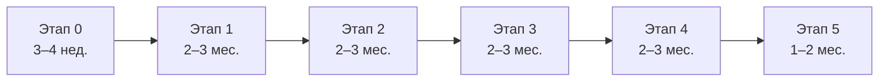

# Пошаговый план реализации

Каждый этап разбит на шаги в порядке выполнения; шаг считается закрытым, только когда его проверка пройдена.

## Как читать план

План содержит 6 этапов и около 50 шагов; сроки указаны в рабочих днях (р.д.) для команды из 3 разработчиков и оцениваются заново после этапа 0.

**Структура каждого шага:** цель → действия по порядку → входные данные → результат → проверка (критерий закрытия) → исполнитель и срок. Шаг без пройденной проверки не закрывается, следующий этап не начинается без приёмки предыдущего.

**Роли:**

| Код | Роль | Зона ответственности |
| --- | --- | --- |
| РП | Руководитель проекта / заказчик | Решения, приёмка, взаимодействие с организациями |
| BIM | BIM-специалист | Требования к IFC, проверка в Renga и Pilot-BIM, шаблоны свойств |
| GEO | Разработчик геоданных (Python) | PostGIS, импорт, обработка, генерация IFC |
| WEB | Веб-разработчик (TypeScript) | Карта, вьюер, личный кабинет |
| 3D | 3D-разработчик / визуализатор | Библиотека элементов, Blender, Unreal, рендер |
| OPS | Инженер инфраструктуры | Серверы, Docker, резервирование, безопасность |
| ЮР | Юрист (привлекаемый) | Лицензии, персональные данные, режим доступа |
| ИЗ | Изыскатель (подрядчик) | Топосъёмка, контрольные точки |
| AI | Claude | Код, тесты, разбор данных, документация — под контролем разработчика |

**Сводный график:**

Этапы 3 и 4 частично параллельны, если в команде есть отдельный 3D-разработчик: тогда общий срок сокращается примерно на 1,5 месяца.

## Этап 0. Подготовка и проверка данных (3–4 недели)

Этап отвечает на вопрос «можно ли вообще это сделать с доступными данными и программами» до вложений в разработку. Итог — решение о продолжении и уточнённые сроки.

### Шаг 0.1. Пилотный участок и тестовый проект

**Цель:** зафиксировать реальную территорию и реальную модель, на которых проверяется всё остальное.

**Действия:**

1. Выбрать участок в Перми со сложным окружением: перепад рельефа (овраг или лог), магистраль и дворовые проезды, ЛЭП, трамвай или ж/д, известные ЗОУИТ.
2. Получить кадастровый номер и границы участка (НСПД).
3. Подобрать проект ЖК в Renga, который будет сажаться на участок (реальный или учебный).
4. Зафиксировать центр и радиусы тестов: 500 м, 1,5 км, 3 км.

**Результат:** паспорт пилота — координаты, кадастровый номер, IFC ЖК, список ожидаемых объектов окружения.

**Проверка:** на участке есть все типы объектов из раздела 4 основного ТЗ, кроме недоступных.

**Кто / срок:** РП, BIM — 2 р.д.

### Шаг 0.2. Тест приёма IFC в Renga и Pilot-BIM

**Цель:** узнать заранее, что принимающие программы реально читают.

**Действия:**

1. Сгенерировать скриптом (IfcOpenShell) тестовые файлы IFC 4.3 и IFC4: рельеф (TIN), `IfcRoad`, `IfcBridge`, `IfcBuildingElementProxy`, `IfcGeographicElement`, `IfcSpatialZone`, трубу `IfcPipeSegment`.
2. Добавить к каждому элементу пользовательские наборы свойств (`Pset_Контекст`, `Pset_Источник`, `Pset_Ограничение`) с кириллицей.
3. Задать геопривязку через `IfcMapConversion` в больших координатах.
4. Открыть в Renga (импорт и связь), загрузить в Pilot-BIM, открыть в бесплатном вьюере для сравнения.
5. Нагрузочный тест: IFC на 50, 200 и 1000 МБ — время открытия, отзывчивость.

**Результат:** таблица совместимости «класс IFC × программа × читается / как прокси / не читается», предел размера файла.

**Проверка:** выбран формат выгрузки для Renga (IFC 4.3 или IFC4 с упрощением) и максимальный размер одного файла.

**Кто / срок:** GEO + AI (генерация), BIM (проверка) — 5 р.д.

### Шаг 0.3. Запросы данных в организации

**Цель:** понять, какие закрытые данные реально можно получить и в каком виде.

**Действия:**

1. Запрос в фонд инженерных изысканий: наличие и условия выдачи топосъёмки 1:500 с сетями на пилот.
2. Запросы в РСО (электро, газ, вода, канализация, тепло, связь): форма предоставления сведений о сетях, форматы (DWG, PDF, скан), стоимость, сроки.
3. Запрос в ИСОГД Перми: возможность выгрузки красных линий, ПЗЗ, ДПТ в векторе (DXF, SHP, GeoJSON).
4. Параллельно — заказ топосъёмки пилотного участка у изыскателя как эталон для проверки точности.

**Результат:** реестр источников: организация, что даёт, формат, срок, цена, ограничения.

**Проверка:** по каждому слою из раздела 3 ТЗ известен реальный путь получения или зафиксировано «недоступно».

**Кто / срок:** РП, ИЗ — 15–20 р.д. (ответы идут параллельно с шагами 0.4–0.8).

### Шаг 0.4. Системы координат и высот

**Цель:** исключить сдвиги модели на метры и сотни метров.

**Действия:**

1. Получить официальные параметры МСК-59 для зоны пилота.
2. Определить высотную систему топосъёмок (Балтийская) и порядок пересчёта из EGM96 (TessaDEM) и WGS-84 (OSM).
3. Проверить пересчёт на 5–10 контрольных точках с известными координатами (пункты ГГС, углы зданий из топосъёмки).
4. Зафиксировать правило: где хранится базовая точка, как она передаётся в IFC и Renga.

**Результат:** документ «Системы координат проекта» и проверенная функция пересчёта.

**Проверка:** расхождение на контрольных точках ≤ 0,1 м в плане и ≤ 0,05 м по высоте (кроме TessaDEM, для которого фиксируется фактическая ошибка).

**Кто / срок:** GEO, ИЗ — 3 р.д.

### Шаг 0.5. Юридическая оценка

**Цель:** не построить сервис, который нельзя законно эксплуатировать.

**Действия:**

1. ODbL (OSM, TessaDEM): что считается производной базой, что должно раскрываться при публичном сервисе.
2. Режим доступа к сведениям о сетях и материалам изысканий: что нельзя публиковать открыто.
3. Персональные данные в модуле ТУ (152-ФЗ): контакты должностных лиц, согласия, хранение.
4. Лицензии ПО: xeokit (AGPL или коммерческая), MinIO (AGPL), Unreal Engine (условия Epic).
5. Доступ к Claude API для организации в России.

**Результат:** заключение с перечнем разрешённого и запрещённого, требования к закрытому контуру.

**Проверка:** по каждому риску из раздела 12 ТЗ есть решение юриста.

**Кто / срок:** ЮР, РП — 10 р.д.

### Шаг 0.6. Аудит полноты открытых данных

**Цель:** измерить, насколько OSM и НСПД покрывают пилот.

**Действия:**

1. Скачать выгрузку OSM Приволжского ФО (Geofabrik), вырезать пилот 3 км.
2. Скриптом посчитать долю зданий с этажностью, дорог с `surface` и `lanes`, наличие дворовых проездов, опор ЛЭП, деревьев.
3. Сравнить с эталоном (топосъёмка, ортофото, выезд на место): пропущенные дома, проезды, линии.
4. Скачать TessaDEM по пилоту и сравнить с отметками топосъёмки.

**Результат:** отчёт полноты по слоям в процентах и карта пропусков; фактическая ошибка рельефа.

**Проверка:** по каждому слою принято решение — «достаточно», «дополнить вручную», «нужен другой источник».

**Кто / срок:** GEO + AI — 4 р.д.

### Шаг 0.7. Инфраструктура разработки

**Цель:** рабочая среда, в которой команда начинает этап 1 без простоев.

**Действия:**

1. Закупить или арендовать станцию по п. 10.1 ТЗ.
2. Развернуть Git-репозиторий (GitLab / Gitea), CI, реестр Docker-образов.
3. Базовый Docker Compose: PostGIS, MinIO, Redis, Python-воркер.
4. Настроить Claude Code для команды, правила ревью кода от AI.

**Результат:** пустой, но работающий проект: `docker compose up` поднимает все сервисы.

**Проверка:** новый разработчик разворачивает среду по инструкции за 1 час.

**Кто / срок:** OPS, GEO — 5 р.д.

### Шаг 0.8. Словарь данных и требования к IFC

**Цель:** единый язык между генератором, BIM-программами и вьюером.

**Действия:**

1. Для каждого типа объекта определить класс IFC, предопределённый тип, наборы и имена свойств, единицы.
2. Правила соответствия тегов OSM → свойств (например, `voltage=15000` → `Напряжение_кВ = 15`).
3. Цвета и стили слоёв для вьюера, правила подписей.
4. Структура файлов федеративной модели: какие слои в каких IFC.

**Результат:** «Словарь данных» (таблица) и шаблон `meta.json`.

**Проверка:** BIM подтверждает, что словарь покрывает задачи проектирования; тестовый IFC из шага 0.2 соответствует словарю.

**Кто / срок:** BIM, GEO + AI — 5 р.д.

### Шаг 0.9. Приёмка этапа 0

**Действия:** сводка результатов 0.1–0.8, пересмотр сроков и состава этапов, решение «продолжаем / меняем объём / останавливаемся».

**Результат:** протокол решения, уточнённый план этапов 1–5.

**Кто / срок:** РП — 1 р.д.

## Этап 1. MVP на радиус 500 м (2–3 месяца)

Цель этапа — сквозной конвейер «координаты → IFC → просмотр в браузере и Renga» на простой геометрии. Все последующие этапы наращивают этот конвейер, а не переписывают его.

### Шаг 1.1. Импорт OSM в PostGIS

**Действия:**

1. Написать стиль osm2pgsql (flex, Lua): отдельные таблицы зданий, дорог, ж/д, воды, растительности, ЛЭП, благоустройства; все теги — в поле `tags` (jsonb).
2. Загрузить выгрузку Приволжского ФО, создать пространственные индексы.
3. Настроить обновление: еженедельно новая выгрузка или минутные дифы (osm2pgsql-replication).
4. Записывать дату данных в служебную таблицу.

**Результат:** актуальная база OSM края с датой.

**Проверка:** выборка всех объектов в круге 3 км выполняется за ≤ 5 с; число объектов сходится с аудитом шага 0.6.

**Кто / срок:** GEO + AI — 5 р.д.

### Шаг 1.2. Подготовка рельефа

**Действия:**

1. Получить TessaDEM по краю (API или сырые тайлы), конвертировать в Cloud Optimized GeoTIFF.
2. Пересчитать высоты EGM96 → Балтийская система по правилу шага 0.4.
3. Функция слияния: если на участок есть топосъёмка или облако точек, они имеют приоритет; граница сшивается плавным переходом шириной 30–50 м.
4. Сохранить в MinIO, индекс покрытия — в PostGIS.

**Результат:** сервис `get_dem(bbox)` отдаёт лучший доступный рельеф по области.

**Проверка:** на пилоте отклонение от топосъёмки в зоне сшивки без ступеньки больше 0,2 м.

**Кто / срок:** GEO — 5 р.д.

### Шаг 1.3. API и очередь задач

**Действия:**

1. FastAPI: `POST /jobs` (центр, радиус, слои, детализация), `GET /jobs/{id}` (статус, прогресс, журнал), `GET /models/{id}/files`.
2. Очередь Redis + Celery: задача разбивается на шаги-подзадачи, каждая пишет результат в MinIO и может перезапускаться отдельно.
3. Валидация входа: координаты внутри поддерживаемого региона, радиус 0,5–3 км.
4. Журнал ошибок с понятными сообщениями («нет данных рельефа в этой области»).

**Результат:** задача ставится, выполняется, выдаёт файлы.

**Проверка:** 10 параллельных задач не мешают друг другу; упавший шаг перезапускается без пересчёта предыдущих.

**Кто / срок:** GEO + AI — 5 р.д.

### Шаг 1.4. Выборка и нормализация данных

**Действия:**

1. По центру и радиусу построить буфер в МСК-59, выбрать объекты из PostGIS с запасом 50 м.
2. Обрезать по кругу, перевести в локальные координаты от центра.
3. Привести атрибуты по словарю данных (шаг 0.8): тип, этажность, покрытие, напряжение; отметить `confidence` (факт / умолчание).
4. Сохранить промежуточный GeoPackage задачи.

**Результат:** чистый набор данных участка, одинаковый для всех дальнейших генераторов.

**Проверка:** модульные тесты на 20 типичных случаях тегов, включая ошибочные.

**Кто / срок:** GEO + AI — 5 р.д.

### Шаг 1.5. Рельеф участка

**Действия:**

1. Вырезать рельеф по кругу, построить TIN с адаптивной плотностью: чаще у дорог и перегибов, реже на ровных местах.
2. Врезать в рельеф корыта дорог (поперечный уклон, продольный — сглаживание по оси), урезы воды, площадки зданий по отметке земли у стен.
3. Контроль треугольников: без самопересечений и вырожденных граней.

**Результат:** сетка рельефа, согласованная с дорогами и зданиями.

**Проверка:** ни одна дорога не «висит» над рельефом и не уходит под него больше чем на 0,1 м.

**Кто / срок:** GEO — 8 р.д.

### Шаг 1.6. Здания (упрощённо)

**Действия:**

1. Контуры зданий → призмы. Высота: `height` → `building:levels` × 3 м + 1 м → значение по типу здания (с пометкой «умолчание»).
2. Низ здания — минимальная отметка рельефа под контуром, цоколь до неё.
3. Исправление геометрии: самопересечения, дубли, разворот контуров.

**Результат:** массы зданий с высотами.

**Проверка:** 100% контуров превращаются в корректные тела; выборочная сверка 20 высот с реальностью.

**Кто / срок:** GEO — 4 р.д.

### Шаг 1.7. Дороги, вода, рельсовые пути, деревья

**Действия:**

1. Дороги — ленты по оси с шириной из `width` или по классу; покрытие из `surface`.
2. Вода — полигоны на отметке уреза; реки и ручьи — ленты по `waterway`.
3. Ж/д и трамвай — ленты с балластом, рельсы упрощённо.
4. Деревья — точки с породой или типом по умолчанию; в массивах — случайная расстановка с заданной плотностью.

**Результат:** базовый набор объектов окружения.

**Проверка:** визуальная проверка на пилоте BIM-специалистом по чек-листу.

**Кто / срок:** GEO + 3D — 8 р.д.

### Шаг 1.8. Сборка IFC

**Действия:**

1. Скелет: `IfcProject` → `IfcSite` (участок) с `IfcMapConversion` и базовой точкой.
2. Каждый объект — класс и наборы свойств по словарю; уникальный `GlobalId`, сохранённый в PostGIS для связи.
3. Экспорт в формат, выбранный на шаге 0.2 (IFC 4.3 и/или IFC4).
4. Валидация: IfcOpenShell validate, проверка схемы.

**Результат:** `site.ifc` участка 500 м.

**Проверка:** файл проходит валидацию; открывается в Renga с правильной привязкой и свойствами.

**Кто / срок:** GEO + AI, BIM — 8 р.д.

### Шаг 1.9. Веб-просмотр

**Действия:**

1. Конвертация IFC → XKT (xeokit-convert) и GLB.
2. Страница-вьюер: облёт, слои, дерево объектов, панель свойств по клику.
3. Ссылка на модель из журнала задачи.

**Результат:** модель в браузере с карточками объектов.

**Проверка:** модель 500 м открывается за ≤ 10 с на обычном ноутбуке и на телефоне.

**Кто / срок:** WEB — 8 р.д.

### Шаг 1.10. Тесты и приёмка этапа 1

**Действия:**

1. Автотесты конвейера на 3 разных участках (центр, спальный район, частный сектор).
2. Замер времени каждого шага.
3. Проверка BIM-специалистом в Renga и Pilot-BIM, протокол замечаний.
4. Исправление замечаний, повторная проверка.

**Результат:** протокол приёмки этапа 1.

**Проверка:** критерии раздела 14 ТЗ: модель ≤ 5 мин, открывается в Renga, плановое расхождение с OSM ≤ 0,5 м.

**Кто / срок:** все — 5 р.д.

## Этап 2. Полная модель 3 км и публичная карта (2–3 месяца)

Этап доводит модель до полного радиуса и полной детализации объектов окружения, а также запускает публичную карту города (сервис 1).

### Шаг 2.1. Кольца детализации и тайловый кэш

**Действия:**

1. Разделить круг на кольца LOD2 (0–500 м), LOD1 (0,5–1,5 км), LOD0 (1,5–3 км) по таблице п. 4.3 ТЗ.
2. Разбить территорию на тайлы 250 × 250 м с ключом «координаты + версия данных + версия генератора».
3. Генерировать тайлы параллельно на нескольких воркерах; готовые брать из кэша.
4. Сшивка тайлов: общие рёбра рельефа и дорог без щелей.

**Результат:** модель 3 км, собираемая из переиспользуемых тайлов.

**Проверка:** повторный запрос по той же зоне ≤ 30 с; щелей на стыках нет.

**Кто / срок:** GEO — 8 р.д.

### Шаг 2.2. Здания LOD2

**Действия:**

1. Формы крыш по `roof:shape`, `roof:height`, `roof:direction`; части зданий `building:part` с разной высотой.
2. Высоты: OSM → Overture → по типу; отметка источника в свойствах.
3. Упрощённые цоколи и входы (где есть `entrance`).

**Результат:** узнаваемый силуэт застройки в ближнем кольце.

**Проверка:** 90% зданий ближнего кольца с крышей, отличной от плоской, где она не плоская в реальности (выборка 30 зданий).

**Кто / срок:** GEO + AI — 6 р.д.

### Шаг 2.3. Дороги по полосам

**Действия:**

1. Подключить osm2streets: получить геометрию полос, бордюров, тротуаров и перекрёстков.
2. Поперечные профили по классу дороги: проезжая часть, разделитель, бордюр 0,15 м, тротуар, газон.
3. Разметка и стрелки из `turn:lanes`, пешеходные переходы из `crossing`.
4. Материалы по `surface`; грунтовые дороги — без бордюров, с колеёй.
5. Посадка на рельеф с продольным сглаживанием и поперечным уклоном.

**Результат:** дорожная сеть на уровне полос с перекрёстками.

**Проверка:** ≥ 95% перекрёстков без ошибок геометрии; ручная проверка 10 сложных узлов.

**Кто / срок:** GEO + AI — 15 р.д.

### Шаг 2.4. Каркасная и внутриквартальная сеть

**Действия:**

1. Классифицировать дороги: каркасные (`motorway`–`tertiary`) и внутриквартальные (`residential`, `service`, `living_street`, `footway` и т. д.).
2. Сверить статус федеральных и региональных дорог с официальными перечнями; результат — в свойства.
3. Импортировать красные линии из ИСОГД (по результатам шага 0.3), привязать к ним границы каркасной сети.
4. Выгружать две сети в отдельные файлы; каркасная помечается как нередактируемая.
5. Внутриквартальная сеть — параметрическая: ось + профиль, перестраивается при изменении оси.

**Результат:** два независимых файла дорог.

**Проверка:** BIM-специалист передвигает дворовый проезд в тестовой среде — сеть корректно перестраивается.

**Кто / срок:** GEO, BIM — 8 р.д.

### Шаг 2.5. Мосты, путепроводы, тоннели

**Действия:**

1. Найти мостовые участки (`bridge`, `layer`, `man_made=bridge`).
2. Построить пролётное строение по оси с интерполяцией отметок между устоями.
3. Проверить габарит над нижележащей дорогой или путями; при нарушении — поднять пролёт и пометить «расчётно».
4. Расставить опоры по шагу для типа моста, насыпи подходов.
5. Тоннели — вырез в рельефе, портал.

**Результат:** мосты и развязки без «проваливания» дорог.

**Проверка:** все мосты пилота и 2 развязки Перми проверены вручную.

**Кто / срок:** GEO + 3D — 10 р.д.

### Шаг 2.6. Железная дорога и трамвай

**Действия:** пути по `railway`, число путей и ширина колеи, балластная призма, шпалы и рельсы в ближнем кольце, опоры контактной сети упрощённо, платформы и переезды.

**Результат:** рельсовый транспорт в модели.

**Проверка:** визуальная приёмка по чек-листу.

**Кто / срок:** GEO + 3D — 5 р.д.

### Шаг 2.7. Электросети с опорами

**Действия:**

1. Параметрические генераторы опор по типовым сериям (металлические, железобетонные, деревянные столбы) — выбор по напряжению и `design`/`structure`.
2. Опоры по точкам `power=tower/pole`; при их отсутствии — расчётная расстановка по шагу с пометкой.
3. Провода — цепная линия между точками подвеса, число фаз и цепей по тегам.
4. Подстанции и ТП — упрощённые объёмы.
5. Охранная зона по классу напряжения — объём вокруг линии.

**Результат:** ЛЭП с опорами, проводами и зонами.

**Проверка:** все линии пилота с верным напряжением в свойствах; зоны совпадают с НСПД там, где они есть.

**Кто / срок:** 3D + GEO — 10 р.д.

### Шаг 2.8. Библиотека элементов

**Действия:**

1. Структура Asset Library: категория, тип, LOD, лицензия, источник, версия.
2. Параметрические генераторы: опоры, столбы, бордюры, ограждения, пролёты, фонари.
3. Готовые модели с чистыми лицензиями: деревья основных пород средней полосы, МАФ, остановки.
4. Текстуры PBR (Poly Haven, CC0): асфальт, плитка, грунт, газон, бетон.
5. Для каждого элемента — представления в IFC (упрощённое тело) и для рендера (детальная сетка).

**Результат:** версионируемая библиотека, общая для всех сцен.

**Проверка:** у каждого элемента указана лицензия; сцена 3 км использует элементы только ссылками.

**Кто / срок:** 3D — 15 р.д. (параллельно с 2.3–2.7)

### Шаг 2.9. Растительность и благоустройство

**Действия:** отдельные деревья с породой из `species`/`leaf_type`, высотой из `height`; массивы — рассеивание с плотностью по типу леса; газоны, кустарники, фонари, ограждения, скамейки.

**Результат:** озеленение и благоустройство ближнего кольца.

**Проверка:** визуальная приёмка.

**Кто / срок:** 3D — 5 р.д.

### Шаг 2.10. Выходные форматы

**Действия:**

1. Федеративная структура IFC: отдельные файлы по слоям и кольцам (рельеф, каркасные дороги, дворовые дороги, здания, ЛЭП, ограничения…).
2. LandXML (рельеф, оси дорог), DXF (топоплан), CityJSON (LOD0–2), GeoPackage (исходники).
3. Пакет выгрузки: архив + `meta.json`.

**Результат:** полный комплект файлов по задаче.

**Проверка:** каждый формат открывается в целевой программе из раздела 7 ТЗ.

**Кто / срок:** GEO + AI — 6 р.д.

### Шаг 2.11. Потоковый веб-просмотр модели 3 км

**Действия:** генерация 3D Tiles с иерархией детализации, загрузка во вьюер по мере приближения, сохранение панели свойств и слоёв из этапа 1.

**Результат:** модель 3 км плавно открывается в браузере.

**Проверка:** первый кадр ≤ 5 с, ≥ 30 кадров/с на ноутбуке со встроенной графикой.

**Кто / срок:** WEB — 8 р.д.

### Шаг 2.12. Сервис 1 — публичная карта города

**Действия:**

1. Planetiler: векторные тайлы OSM края в PMTiles, еженедельная пересборка.
2. Тайлы рельефа terrain-RGB из TessaDEM.
3. MapLibre GL: поднятые здания, стили дорог по классам, ЛЭП, вода, зелень; переключатель 2D/3D.
4. Слои ограничений и кадастра, клик по объекту — карточка.
5. Кнопка «Построить модель участка здесь» → задача сервиса 2.
6. Подписи источников и лицензий.

**Результат:** публичная карта города онлайн.

**Проверка:** карта открывается ≤ 3 с, выдерживает 50 одновременных пользователей.

**Кто / срок:** WEB + GEO — 12 р.д.

### Шаг 2.13. Производительность и приёмка этапа 2

**Действия:** замер времени по шагам на 3 участках 3 км, профилирование узких мест, нагрузочный тест карты, приёмка BIM-специалистом.

**Проверка:** модель 3 км ≤ 15 мин; ≥ 95% дорог без ошибок геометрии; карта города работает онлайн.

**Кто / срок:** все — 5 р.д.

## Этап 3. Ограничения, посадка ЖК, сети и запросы ТУ (2–3 месяца)

Этап превращает модель окружения в инструмент предпроектного анализа: что можно строить, как сажается ЖК, какие сети рядом и к кому идти за ТУ.

### Шаг 3.1. Загрузка официальных ограничений

**Действия:**

1. Загрузчик слоёв с фиксацией источника и даты: ЗОУИТ (НСПД), ПЗЗ и территориальные зоны, красные линии, ДПТ, КРТ (ИСОГД), ОКН и зоны охраны, ООПТ, приаэродромная территория.
2. Для слоёв без массовой выгрузки — полуавтоматический режим: загрузка по кадастровым номерам участка и соседей или файлом, полученным по запросу.
3. Каждая зона хранит: вид, режим (запреты и разрешения), реестровый номер, документ-основание, статус «официально».
4. История версий: при обновлении старая версия сохраняется.

**Результат:** слой официальных ограничений пилота.

**Проверка:** все ЗОУИТ пилота из НСПД присутствуют в модели с реестровыми номерами.

**Кто / срок:** GEO + AI, BIM — 10 р.д.

### Шаг 3.2. Расчётные зоны

**Действия:**

1. Правила расчёта в отдельном конфигурационном файле с ссылкой на норму: СЗЗ кладбищ по площади, водоохранные зоны и прибрежные полосы по длине реки, охранные зоны ЛЭП по напряжению, охранные зоны прочих сетей по типу и диаметру.
2. Расчёт зон только там, где официальной зоны нет.
3. Статус «расчётно» и отличный цвет.

**Результат:** полный слой ограничений с разделением на официальные и расчётные.

**Проверка:** на пилоте расчётные зоны сверены с официальными там, где есть обе; расхождение объяснено.

**Кто / срок:** GEO — 5 р.д.

### Шаг 3.3. Градрегламент и огибающая допустимой застройки

**Действия:**

1. Для участка определить территориальную зону ПЗЗ и её параметры: ВРИ, предельная высота или этажность, процент застройки, отступы.
2. Построить огибающую: участок → минус отступы → минус охранные и иные запретные зоны → ограничение по высоте (минимум из ПЗЗ, приаэродромной территории, зон охраны ОКН).
3. Карточка регламента с перечнем ВРИ и ссылками на документы.
4. Проверки нормативных расстояний (пожарные разрывы, инсоляция) — как правила, применяемые при посадке.

**Результат:** объём допустимой застройки в IFC и во вьюере.

**Проверка:** на 3 участках огибающая совпадает с ручным расчётом BIM-специалиста по ГПЗУ.

**Кто / срок:** GEO, BIM — 8 р.д.

### Шаг 3.4. Импорт подземных сетей

**Действия:**

1. Загрузка DWG/DXF топопланов: чтение слоёв, блоков, подписей (ezdxf).
2. Сопоставление слоёв со словарём (К1, В1, Т1, Г…) — автоматически по названиям, для нестандартных — предложение соответствия (Claude) с подтверждением человеком.
3. Извлечение диаметров, материалов, отметок из подписей; колодцы из блоков.
4. Построение трубопроводов и кабелей в 3D; где отметки неизвестны — нормативная глубина с пометкой.
5. Хранение в закрытом контуре с правами доступа.

**Результат:** подземные сети из официальных материалов в модели.

**Проверка:** на пилоте ≥ 90% сетей топоплана перенесены с верным типом и диаметром.

**Кто / срок:** GEO + AI, BIM — 12 р.д.

### Шаг 3.5. Карточки объектов и точечный запрос

**Действия:**

1. Панель свойств с группировкой: основное, источник, ограничения, ссылки.
2. Клик по любой точке → запрос в PostGIS: зоны, регламент, участок, ближайшие сети с расстояниями, отметка рельефа.
3. Фильтры и поиск с подсветкой: по типу, напряжению, диаметру, расстоянию до ЖК; выгрузка результата в Excel.
4. Подписи линий и зон прямо на модели.

**Результат:** функции п. 4.12 ТЗ.

**Проверка:** сценарий «где проходит ВЛ и её охранная зона» выполняется в 2 клика.

**Кто / срок:** WEB + GEO — 10 р.д.

### Шаг 3.6. Приём и привязка ЖК

**Действия:**

1. Загрузка IFC из Renga, чтение геопривязки.
2. Если привязки нет — мастер размещения на карте: точка, угол, проверка по контуру участка.
3. Построение пятна застройки по секциям.

**Результат:** ЖК в координатах модели.

**Проверка:** 3 тестовых проекта размещаются с ошибкой ≤ 0,1 м относительно ручной посадки.

**Кто / срок:** GEO, BIM — 5 р.д.

### Шаг 3.7. Отметка 0.000 и вертикальная планировка

**Действия:**

1. Определить 0.000 — из проекта или расчётом по рельефу у входов.
2. Сформировать площадку под пятном и отмосткой, откосы с заданным уклоном, подпорные стенки при превышении перепада.
3. Посчитать объёмы выемки и насыпи.
4. Обновить рельеф модели в зоне участка.

**Результат:** проектный рельеф участка и ведомость земляных работ.

**Проверка:** объёмы сходятся с расчётом в КРЕДО или ручным расчётом в пределах 5%.

**Кто / срок:** GEO — 8 р.д.

### Шаг 3.8. Очистка площадки и подъезды

**Действия:** удаление существующих объектов в границах участка со списком удалённого; построение подъезда к ближайшему внутриквартальному проезду по кратчайшему пути; примыкание к каркасной сети — только с подтверждением пользователя.

**Результат:** площадка, связанная с дорожной сетью.

**Проверка:** на 3 тестах подъезд построен без пересечения зданий и зон запрета.

**Кто / срок:** GEO — 5 р.д.

### Шаг 3.9. Проверки и отчёт посадки

**Действия:**

1. Проверки: огибающая застройки, красные линии, ЗОУИТ, сети (горизонтальные и вертикальные расстояния), ЛЭП, упрощённая инсоляция соседних домов.
2. Каждая коллизия — запись BCF со снимком вида и ссылкой на объекты.
3. Отчёт PDF: схема посадки, отметки, объёмы, таблица коллизий, перечень источников и их дат.

**Результат:** отчёт PDF + файл BCF.

**Проверка:** BCF открывается в Renga или Pilot-BIM с переходом к объектам; все заранее внесённые тестовые коллизии найдены.

**Кто / срок:** GEO + AI, BIM — 8 р.д.

### Шаг 3.10. Справочник РСО и определение владельцев сетей

**Действия:**

1. Справочник организаций: вид сети, зона деятельности, официальные контакты, канал подачи заявки (письмо, личный кабинет, Госуслуги, МФЦ), дата проверки.
2. Определение владельца сети рядом с участком: `operator` в OSM → правообладатель по НСПД/ЕГРН → зоны ЕТО и гарантирующих организаций по схемам тепло- и водоснабжения → справочник.
3. Непредставленные случаи — статус «требует уточнения».

**Результат:** для участка — список сетей, владельцев и каналов подачи.

**Проверка:** на пилоте владельцы совпадают с проверенными вручную.

**Кто / срок:** РП, GEO — 6 р.д.

### Шаг 3.11. Шаблоны и формирование запросов ТУ

**Действия:**

1. Разобрать формы запросов пользователя на поля (заявитель, кадастровый номер, адрес, назначение объекта, нагрузки, сроки).
2. Заполнение DOCX в стиле шаблона; приложение — выкопировка из модели со схемой сетей и участка (PDF).
3. Для порталов — комплект данных и вложений для ручной подачи.
4. Отправка только после проверки человеком.

**Результат:** пакет запросов ТУ по участку в один клик.

**Проверка:** пакет по пилоту проверен РП и принят без правок в данных.

**Кто / срок:** GEO + AI, РП — 6 р.д. (после получения форм от пользователя)

### Шаг 3.12. Реестр запросов и привязка ТУ

**Действия:** реестр (организация, дата, канал, входящий номер, срок, статус), напоминания о сроках ответа, загрузка полученных ТУ; точка подключения и параметры из ТУ отображаются на сети в модели.

**Результат:** управление запросами ТУ внутри комплекса.

**Проверка:** полный цикл «запрос → ответ → точка подключения в модели» пройден на пилоте.

**Кто / срок:** WEB + GEO — 6 р.д.

### Шаг 3.13. Приёмка этапа 3

**Проверка:** критерии раздела 14 ТЗ: посадка совпадает с ручной в пределах 0,1 м по отметке на 3 проектах; все коллизии в BCF; огибающая и ограничения подтверждены BIM-специалистом.

**Кто / срок:** все — 5 р.д.

## Этап 4. Визуализация, рендер, личный кабинет и API (2–3 месяца)

Этап даёт «красивую» сторону комплекса: онлайн-вид с запечённым светом, автоматические фотореалистичные кадры с посаженным ЖК и удобный кабинет пользователя.

### Шаг 4.1. Сцена для рендера из IFC

**Действия:**

1. Конвертация федеративной модели и ЖК в OpenUSD: слои как отдельные USD-файлы, собранные в одну сцену.
2. Подстановка: упрощённые тела IFC (дерево, опора, фонарь) заменяются детальными моделями из библиотеки по типу.
3. Назначение PBR-материалов по свойствам (покрытие, материал фасада); контекстные здания — «белый» или «глиняный» материал.
4. Проверка масштаба, нормалей, UV-развёрток.

**Результат:** готовая к рендеру сцена участка.

**Проверка:** сцена 3 км открывается в Blender ≤ 2 мин и занимает ≤ 20 ГБ видеопамяти при рендере.

**Кто / срок:** 3D + AI — 10 р.д.

### Шаг 4.2. Запекание освещения для веб-режима

**Действия:** запекание теней и окклюзии в текстуры ближнего кольца (Blender), экспорт в 3D Tiles/GLB, переключатель во вьюере «технический / презентационный вид».

**Результат:** упрощённая модель, выглядящая как рендер, в браузере и на телефоне.

**Проверка:** презентационный вид открывается ≤ 10 с на телефоне среднего класса.

**Кто / срок:** 3D + WEB — 8 р.д.

### Шаг 4.3. Солнце, небо, сезоны

**Действия:** положение солнца по координатам, дате и времени; набор HDRI (ясно, облачно, вечер); летний и зимний комплекты материалов (снег на земле и крышах, деревья без листвы).

**Результат:** пользователь выбирает дату, время и сезон кадра.

**Проверка:** тени на кадре совпадают с расчётными для заданного времени.

**Кто / срок:** 3D — 5 р.д.

### Шаг 4.4. Автоматические ракурсы

**Действия:**

1. Птичий полёт: 4 камеры под 45° с расстояния, при котором ЖК занимает ~40% кадра.
2. Уровень пешехода: точки на ближайших тротуарах, откуда ЖК виден без перекрытия (проверка лучом), высота 1,6 м.
3. Облёт: круговая траектория 20–30 с.
4. Ручная корректировка камеры во вьюере с сохранением в набор ракурсов.

**Результат:** набор камер генерируется без участия человека.

**Проверка:** на 3 проектах ≥ 6 из 8 автоматических ракурсов признаны пригодными без правок.

**Кто / срок:** 3D + AI — 8 р.д.

### Шаг 4.5. Рендер-воркер (Blender Cycles)

**Действия:**

1. Docker-образ Blender с GPU, запуск без интерфейса по заданию из очереди.
2. Настройки качества: черновик (быстро), финал (4K, шумоподавление).
3. Очередь с приоритетами и ограничением одновременных задач на GPU.
4. Выдача PNG/EXR, превью в кабинете.

**Результат:** автоматический рендер кадров.

**Проверка:** комплект 8 кадров 4K ≤ 1 ч на одной GPU класса п. 10.1.

**Кто / срок:** 3D + OPS — 8 р.д.

### Шаг 4.6. Премиальный рендер в Unreal Engine (опция)

**Действия:** импорт USD или Datasmith, освещение Lumen, финальные кадры Path Tracer, пакетная выдача через Movie Render Queue из командной строки.

**Результат:** кадры и видео уровня архвиза для маркетинга.

**Проверка:** сравнительная оценка с Blender на одном проекте; решение, нужен ли UE в штатном конвейере.

**Кто / срок:** 3D — 10 р.д.

### Шаг 4.7. Панорамы 360° и видео

**Действия:** сферические кадры из точек пешехода и с высоты, вьюер панорам с переходами между точками, видео облёта MP4.

**Результат:** интерактивный фотореалистичный тур по участку.

**Проверка:** 3 панорамы + видео формируются автоматически по одной кнопке.

**Кто / срок:** 3D + WEB — 6 р.д.

### Шаг 4.8. Доводка кадров нейросетью (опция)

**Действия:** img2img с ControlNet по глубине и контурам из рендера — люди, машины, живость; обязательное сохранение геометрии ЖК; маркировка кадра как обработанного.

**Проверка:** геометрия ЖК на обработанном кадре не отличается от исходного рендера.

**Кто / срок:** 3D — 5 р.д.

### Шаг 4.9. Gaussian splatting (опция)

**Действия:** рендер 200–400 ракурсов сцены, обучение сплатов на GPU, просмотр в браузере (PlayCanvas / SuperSplat).

**Проверка:** модель ближнего кольца ≤ 200 МБ, плавный облёт в браузере.

**Кто / срок:** 3D — 8 р.д.

### Шаг 4.10. Личный кабинет

**Действия:**

1. Авторизация, роли (просмотр, проектировщик, администратор, доступ к закрытому контуру).
2. Проекты: участки, модели, версии, ЖК, запросы ТУ, рендеры.
3. Статусы задач с прогрессом и уведомлениями.
4. Скачивание комплектов файлов, публичные ссылки на просмотр модели.

**Результат:** единое рабочее место пользователя.

**Проверка:** новый пользователь проходит путь «точка на карте → модель → посадка ЖК → кадры» без инструкции за 30 мин.

**Кто / срок:** WEB — 15 р.д.

### Шаг 4.11. Внешний API и интеграции

**Действия:** документированный REST API (OpenAPI), ключи доступа, выгрузка моделей в Pilot-BIM (через его API или папку обмена), вебхуки о готовности задачи.

**Результат:** комплекс встраивается в процессы организации.

**Проверка:** модель попадает в Pilot-BIM автоматически после завершения задачи.

**Кто / срок:** GEO + AI — 6 р.д.

### Шаг 4.12. Приёмка этапа 4

**Проверка:** комплект 8 ракурсов + видео + 3 панорамы ≤ 1 ч без участия человека; презентационный вид работает на телефоне; кабинет и API приняты.

**Кто / срок:** все — 5 р.д.

## Этап 5. Опытная эксплуатация и внедрение (1–2 месяца)

Этап переводит комплекс из разработки в работу: реальные проекты, реальные пользователи, промышленная инфраструктура и поддержка.

### Шаг 5.1. Промышленная инфраструктура

**Действия:**

1. Развернуть серверы по п. 10.2 ТЗ (или облачные аналоги), разделить открытый и закрытый контуры.
2. HTTPS, резервное копирование по регламенту п. 9, мониторинг (Prometheus + Grafana) и оповещения.
3. Перенос данных пилота, проверка восстановления из резервной копии.

**Результат:** рабочая среда, отделённая от разработки.

**Проверка:** учебное восстановление из копии за ≤ 4 ч; мониторинг сообщает о падении сервиса ≤ 5 мин.

**Кто / срок:** OPS — 8 р.д.

### Шаг 5.2. Опытная эксплуатация на реальных проектах

**Действия:**

1. Прогнать 5–10 реальных участков разных типов (центр, окраина, частный сектор, промзона).
2. Для каждого — модель, посадка, ограничения, пакет ТУ, кадры.
3. Сравнить с результатами ручной работы: время, точность, ошибки.
4. Журнал замечаний с приоритетами, исправление критичных.

**Результат:** отчёт опытной эксплуатации: экономия времени, выявленные ограничения.

**Проверка:** нет критичных замечаний; время подготовки подосновы сокращено относительно ручной работы (целевое значение фиксируется на этапе 0).

**Кто / срок:** BIM, РП, разработчики — 20 р.д.

### Шаг 5.3. Документация и обучение

**Действия:** руководство пользователя (с видеоинструкциями), руководство администратора, описание API, регламенты обновления данных и доступа к закрытому контуру; обучение 2–3 групп пользователей.

**Результат:** комплект эксплуатационной документации.

**Проверка:** обученный пользователь самостоятельно выполняет полный сценарий.

**Кто / срок:** BIM + AI (черновики), РП — 8 р.д.

### Шаг 5.4. Регламент эксплуатации и поддержки

**Действия:**

1. Расписание обновлений: OSM — еженедельно, ограничения — ежемесячно и по событию, справочник РСО — раз в квартал.
2. Порядок обработки обращений пользователей и ошибок в данных.
3. План развития: подключение других городов края, новые слои, доработки по замечаниям.

**Результат:** комплекс работает без участия разработчиков в штатном режиме.

**Проверка:** месяц работы без ручного вмешательства в конвейер.

**Кто / срок:** РП, OPS — 5 р.д.

### Шаг 5.5. Итоговая приёмка

**Действия:** проверка всех критериев разделов 14 основного ТЗ и этапов 0–4, подписание акта, передача кода, документации и доступов.

**Кто / срок:** РП — 2 р.д.

## Сквозные процессы (на всех этапах)

Эти процессы идут непрерывно; без них этапы формально сдаются, но комплекс не будет надёжным.

**Управление проектом**

- Спринты по 2 недели: планирование, демонстрация результата, ретроспектива.
- Доска задач, привязанная к шагам этого плана; каждый шаг — отдельная задача с критерием проверки.
- Ежемесячный пересмотр рисков из раздела 12 ТЗ.
- Изменение объёма — только через запись изменения в ТЗ с оценкой срока.

**Качество и тестирование**

- Модульные тесты для каждой функции обработки; набор эталонных участков, на которых конвейер прогоняется при каждом изменении.
- Сравнение выходных IFC с эталонными (число объектов, классы, свойства, габариты).
- Автоматическая валидация IFC и геометрии в CI.
- Ревью кода: всё, что написано Claude, проверяет разработчик до слияния.

**Данные**

- Журнал источников: что, откуда, когда загружено, лицензия.
- Отчёт полноты при каждом обновлении OSM по пилотным участкам.
- Правки данных, найденные командой, по возможности вносятся обратно в OSM.

**Безопасность**

- Разделение открытого и закрытого контуров, доступ к сетям и изысканиям — только по ролям.
- Журнал доступа к закрытым данным.
- Закрытые данные не передаются во внешние сервисы, включая Claude API.
- Обновления безопасности ОС и библиотек — ежемесячно.

**Документация**

- Техническое описание модулей ведётся рядом с кодом и обновляется в том же изменении.
- Словарь данных и это ТЗ — живые документы; каждое изменение с датой и причиной.

**Итоговый срок и трудоёмкость (оценка):** 9–12 месяцев, около 450–550 человеко-дней разработки плюс изыскания и юридические услуги. Уточняется по итогам этапа 0.
