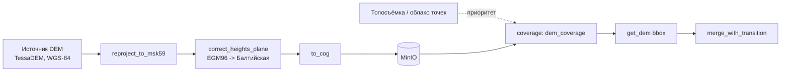

# Подготовка рельефа (Шаг 1.2)

## Конвейер

Модули (`geo/src/topology_geo/relief/`):

| Модуль | Назначение | Шаг 1.2, п. |
| --- | --- | --- |
| `reproject.py` | репроекция источника (обычно WGS-84) в МСК-59 зоны участка | 1 |
| `heights.py` | пересчёт EGM96 → Балтийская система по плоскости, откалиброванной на Шаге 0.4 | 2 |
| `cog.py` | конвертация в Cloud Optimized GeoTIFF (обёртка над `rio-cogeo`) | 1 |
| `merge.py` | приоритетное слияние источников с плавным переходом | 3 |
| `coverage.py` | индекс покрытия в PostGIS (`dem_coverage`) | 4 |
| `service.py` | `get_dem(bbox)` — оркестрация: найти покрытия → скачать → выровнять на сетку → слить | 4 |

## Почему в таком порядке (репроекция → высоты → COG)

`heights.correct_heights_plane` векторизует поправку через numpy, используя
аффинную сетку растра как координаты `(x, y)` напрямую — это работает только
если растр уже в проекции МСК-59 (метры), иначе плоскость, откалиброванная в
метрах, применялась бы к градусам. Поэтому репроекция всегда идёт первым
шагом; конвертация в COG — последним (после того как данные окончательно
готовы), чтобы не перегенерировать оверы на каждом промежуточном шаге.

## Слияние источников (`merge.merge_with_transition`)

Формула — `docs/math-model.md` §2.4: точка глубоко внутри более точного
источника (топосъёмка) получает его значение полностью, точка далеко снаружи —
значение общего DEM (TessaDEM), а в полосе шириной `transition_width_m` вокруг
границы (symmetрично, `w/2` в каждую сторону) — линейная смесь по знаковому
расстоянию до границы, так что ровно на границе вес — 0.5. Symметричность
важна: несимметричная реализация (посчитанная отдельно "внутри"/"снаружи")
даёт разрыв веса прямо на границе — на это отдельный регрессионный тест
(`geo/tests/test_relief_merge.py::test_transition_is_continuous_across_boundary`),
поймавший именно такой баг при разработке.

`merge.max_adjacent_step` — числовой прокси критерия Шага 1.2 «без ступеньки
больше 0.2 м»: наибольший перепад между соседними пикселями. На реальном
пилоте (после Шага 0.1) это стоит прогонять на настоящей паре
топосъёмка/TessaDEM и сравнивать с порогом 0.2 м; на синтетических данных
тесты проверяют только то, что сглаживание уменьшает перепад относительно
«жёсткого» слияния без переходной полосы, а не конкретное пороговое значение.

## Индекс покрытия и `get_dem`

`dem_coverage` хранит footprint (WGS-84), приоритет, ключ в объектном
хранилище, разрешение и дату данных для каждого загруженного растра.
`get_dem(conn, storage, bbox, grid)`:

1. `coverage.find_coverage` — все покрытия, пересекающие `bbox`, от высокого
   приоритета к низкому.
2. Скачивает их через `Storage.download(key)` (протокол — в проде это MinIO,
   `topology_geo.devcheck.MinioConfig`; в тестах — фейк в памяти, реального
   MinIO в этой среде разработки нет, нет демона Docker).
3. Выравнивает каждый растр на общую метрическую сетку `Grid` (МСК-59)
   через `rasterio.warp.reproject`.
4. Сливает от низкого приоритета к высокому через `merge.merge_with_transition`.

`Grid.crs` должен быть проекционным (метры) — geografическая CRS даёт неверный
масштаб полосы перехода (см. docstring `Grid` и историю разработки: первая
версия smoke-теста использовала WGS-84 сетку и давала везде вес ≈0.5 вместо
корректного слияния, потому что метровая ширина перехода интерпретировалась
как ширина в градусах).

## Шаг рабочей сетки задачи (`RELIEF_PIXEL_SIZE_M`, `jobs/steps.py`)

`prepare_relief` строит `Grid`, на которую `get_dem` выравнивает все
источники, с шагом **1 м** (`RELIEF_PIXEL_SIZE_M`). Это верхняя граница
точности: TIN участка (Шаг 1.5, `relief/tin.py`) и рельеф тайла (Шаг 2.1,
`tiling/terrain.py`) читают отметки из этого растра билинейно
(`sample_bilinear`) — сетка крупнее реальной точности точечного источника
(например, топосъёмки с `resolution_m` в `dem_coverage` около 1 м) обрезала
бы её ещё до TIN, независимо от того, насколько хорош сам источник. Шаг
сетки не заменяет разрешение источника: там, где покрытие даёт только
TessaDEM (`resolution_m` порядка 30 м), 1-метровая сетка лишь интерполирует
исходные данные, не добавляя точности сверх исходной — реальная точность
на таком участке ограничена источником, а не шагом.

Раствор всей рабочей сетки — `2*(radius_m + RELIEF_MARGIN_M) / 1 м` пикселей
на сторону; на предельном радиусе задачи (3 км, `docs/plan.md`) это
6400×6400 ≈ 41 млн пикселей. Измерено реальным прогоном `get_dem` + `to_cog`
на этом размере: ~4,3 с на слияние источника, ~2,8 с на сборку GeoTIFF,
~7,7 с на COG-конвертацию — около 15 с на шаг целиком, что укладывается с
большим запасом в критерий «модель 3 км ≤ 15 мин» (`docs/plan.md`) для всего
конвейера.

## Рельеф участка/тайла: метод квадратных призм + сглаживание (Шаги 1.5, 2.1)

Фон TIN участка (`relief/tin.py`) и рельеф тайла (`tiling/terrain.py`)
строятся регулярной квадратной сеткой с шагом **1 м**
(`background_step_m`/`BACKGROUND_STEP_M`) — «метод квадратных призм»
инженерной геодезии (та же техника, которой в плане отведён Шаг 3.7
«вертикальная планировка», только здесь она применена к базовому рельефу
окружения, а не к площадке под ЖК): каждая ячейка сетки — квадрат в плане,
Делоне делит его по диагонали на два треугольника — развёртка призмы.
Дороги/вода/здания по-прежнему врезаны точно (§2.4 `docs/math-model.md`) —
метод описывает только ФОН между ними.

После сэмплирования сетки — «многоструктурное сглаживание»
(`smooth_grid_elevations`): 2D-скользящее среднее по фону убирает
высокочастотный шум/ступеньки источника (например, интерполяцию грубого
TessaDEM на мелкую сетку), не искажая наклон рельефа (среднее линейной
функции по симметричному окну равно её значению в центре). Дорога/вода/
здание в это сглаживание НЕ попадают — у дороги своё продольное 1D-сглаживание
вдоль оси (уже было, Шаг 1.5 п. 2), а вода/здание обязаны остаться ТОЧНО
плоскими (это единственное, что гарантирует критерий «≤0.1 м» и ровную
площадку — сглаживание их испортило бы).

**Найденная при переходе на шаг 1 м проблема и её решение** (реальные
прогоны, не предположение):

1. *Здание/вода «протекают».* При густом фоне вокруг небольшого контура
   несвязанная (не constrained) триангуляция Делоне может «перепрыгнуть»
   пустую внутренность контура треугольником из соседних фоновых точек
   снаружи — старый шаг 25 м был реже типичного здания и такой треугольник
   не строился, поэтому раньше это не проявлялось. Исправлено —
   `_fill_polygon_flat` заполняет внутренность контура точками на той же
   плоской отметке, не только границу.
2. *Фоновая точка на самой границе контура.* Проверка «не строить фон
   внутри контура» на шаге 1 м обязана включать саму границу (`intersects`),
   не только внутренность (`contains`) — иначе точка ровно на ребре контура
   получает «сырую» (не плоскую) отметку рельефа и портит плоскостность.
3. *Краевой эффект сглаживания.* У края участка/тайла 2D-скользящее среднее
   с повтором крайнего пикселя (`mode="nearest"`) даёт систематическое
   смещение на наклонной плоскости (тот же класс бага, что несимметричное
   окно у сглаживания дороги). Решено не экстраполяцией, а реальным запасом:
   сетка для сглаживания строится шире нужной области на половину окна и
   обрезается обратно — запас всегда есть (`RELIEF_MARGIN_M` вокруг задачи,
   соседняя часть растра у тайла), это надёжнее приближения.
4. *Память.* Хранить фон как список объектов Python (`TinPoint`) и гонять
   по нему словарную дедупликацию перестаёт работать на масштабе в
   миллионы точек — реальный прогон был убит OOM. Фон теперь — сырые numpy-
   массивы, дедуп не применяется к фону вовсе (геометрическое исключение
   зон дорог/воды/зданий уже не даёт точных совпадений координат).

**Ограничение масштаба (измерено, не оценка).** `relief/tin.py` строит ОДИН
несвязанный `Delaunay` на все точки участка сразу. При шаге фона 1 м это
нормально на радиусе MVP Этапа 1 (500 м: ~784 тыс. точек, ~14 с, ~1,5 ГБ
пиковой памяти в реальном прогоне), но не масштабируется на весь диапазон,
разрешённый валидацией API (`radius_m` 500–3000 м, `api/schemas.py`): на
1,5 км (~7 млн точек) реальный прогон уже потреблял больше 12 ГБ и продолжал
расти — пришлось прервать вручную, чтобы не уронить среду; на 3 км (~28 млн
точек) это заведомо хуже. Поэтому `build_site_tin` теперь явно отказывает
(`ValueError`, предел `MAX_BACKGROUND_POINTS_UNTILED` ≈ радиус 800 м при шаге
1 м) вместо того, чтобы падать по памяти где-то в середине — важно для
Celery-воркера: OOM в процессе воркера может увести с собой другие,
не связанные с этой задачей джобы, если воркер общий, а понятная ошибка —
это просто зафиксированный неудачный шаг задачи (Шаг 1.3).

Для радиуса больше ~800 м готовое масштабируемое решение уже есть —
Шаг 2.1 (`tiling/terrain.py`): тот же метод призм и то же сглаживание, но по
тайлам 250×250 м (~62,5 тыс. точек на тайл независимо от общего радиуса
модели, реально параллелится Celery, `--concurrency=4`). Возможный следующий
шаг вне этого прохода — научить `assemble_ifc` (Шаг 1.3) переключаться на
тайловый путь при радиусе выше безопасного предела, а не просто отказывать;
не сделано здесь, т.к. это меняет границу между Этапом 1 (один `site.ifc`) и
Этапом 2 (тайлы), а не только шаг сетки.

## Чего не хватает (вне возможностей AI-сессии)

- Реальная загрузка TessaDEM по Пермскому краю (нужен доступ к API/тайлам
  TessaDEM и выбранный пилотный участок, Шаг 0.1).
- Реальная топосъёмка/облако точек пилота для проверки критерия «без
  ступеньки > 0.2 м» на настоящих данных (роль ИЗ).
- Реальный MinIO в проде (эта среда без демона Docker); интерфейс `Storage`
  в `service.py` сделан так, чтобы подключить реальный клиент без изменения
  остальной логики.

Все перечисленные модули проверены реальными инструментами (rasterio, GDAL
через `rio-cogeo`, локальный Postgres+PostGIS) на синтетических данных — 26
тестов в `geo/tests/test_relief_*.py`.
