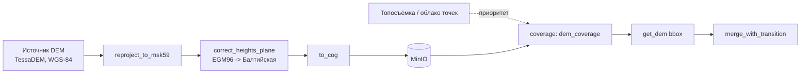

# Подготовка рельефа (Шаг 1.2)

## Конвейер

Модули (`geo/src/topology_geo/relief/`):

| Модуль | Назначение | Шаг 1.2, п. |
| --- | --- | --- |
| `reproject.py` | репроекция источника (обычно WGS-84) в МСК-59 зоны участка | 1 |
| `heights.py` | пересчёт EGM96 → Балтийская система по плоскости, откалиброванной на Шаге 0.4 | 2 |
| `cog.py` | конвертация в Cloud Optimized GeoTIFF (обёртка над `rio-cogeo`) | 1 |
| `merge.py` | приоритетное слияние источников с плавным переходом | 3 |
| `coverage.py` | индекс покрытия в PostGIS (`dem_coverage`) | 4 |
| `service.py` | `get_dem(bbox)` — оркестрация: найти покрытия → скачать → выровнять на сетку → слить | 4 |

## Почему в таком порядке (репроекция → высоты → COG)

`heights.correct_heights_plane` векторизует поправку через numpy, используя
аффинную сетку растра как координаты `(x, y)` напрямую — это работает только
если растр уже в проекции МСК-59 (метры), иначе плоскость, откалиброванная в
метрах, применялась бы к градусам. Поэтому репроекция всегда идёт первым
шагом; конвертация в COG — последним (после того как данные окончательно
готовы), чтобы не перегенерировать оверы на каждом промежуточном шаге.

## Слияние источников (`merge.merge_with_transition`)

Формула — `docs/math-model.md` §2.4: точка глубоко внутри более точного
источника (топосъёмка) получает его значение полностью, точка далеко снаружи —
значение общего DEM (TessaDEM), а в полосе шириной `transition_width_m` вокруг
границы (symmetрично, `w/2` в каждую сторону) — линейная смесь по знаковому
расстоянию до границы, так что ровно на границе вес — 0.5. Symметричность
важна: несимметричная реализация (посчитанная отдельно "внутри"/"снаружи")
даёт разрыв веса прямо на границе — на это отдельный регрессионный тест
(`geo/tests/test_relief_merge.py::test_transition_is_continuous_across_boundary`),
поймавший именно такой баг при разработке.

`merge.max_adjacent_step` — числовой прокси критерия Шага 1.2 «без ступеньки
больше 0.2 м»: наибольший перепад между соседними пикселями. На реальном
пилоте (после Шага 0.1) это стоит прогонять на настоящей паре
топосъёмка/TessaDEM и сравнивать с порогом 0.2 м; на синтетических данных
тесты проверяют только то, что сглаживание уменьшает перепад относительно
«жёсткого» слияния без переходной полосы, а не конкретное пороговое значение.

## Индекс покрытия и `get_dem`

`dem_coverage` хранит footprint (WGS-84), приоритет, ключ в объектном
хранилище, разрешение и дату данных для каждого загруженного растра.
`get_dem(conn, storage, bbox, grid)`:

1. `coverage.find_coverage` — все покрытия, пересекающие `bbox`, от высокого
   приоритета к низкому.
2. Скачивает их через `Storage.download(key)` (протокол — в проде это MinIO,
   `topology_geo.devcheck.MinioConfig`; в тестах — фейк в памяти, реального
   MinIO в этой среде разработки нет, нет демона Docker).
3. Выравнивает каждый растр на общую метрическую сетку `Grid` (МСК-59)
   через `rasterio.warp.reproject`.
4. Сливает от низкого приоритета к высокому через `merge.merge_with_transition`.

`Grid.crs` должен быть проекционным (метры) — geografическая CRS даёт неверный
масштаб полосы перехода (см. docstring `Grid` и историю разработки: первая
версия smoke-теста использовала WGS-84 сетку и давала везде вес ≈0.5 вместо
корректного слияния, потому что метровая ширина перехода интерпретировалась
как ширина в градусах).

## Чего не хватает (вне возможностей AI-сессии)

- Реальная загрузка TessaDEM по Пермскому краю (нужен доступ к API/тайлам
  TessaDEM и выбранный пилотный участок, Шаг 0.1).
- Реальная топосъёмка/облако точек пилота для проверки критерия «без
  ступеньки > 0.2 м» на настоящих данных (роль ИЗ).
- Реальный MinIO в проде (эта среда без демона Docker); интерфейс `Storage`
  в `service.py` сделан так, чтобы подключить реальный клиент без изменения
  остальной логики.

Все перечисленные модули проверены реальными инструментами (rasterio, GDAL
через `rio-cogeo`, локальный Postgres+PostGIS) на синтетических данных — 26
тестов в `geo/tests/test_relief_*.py`.
