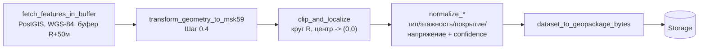

# Выборка и нормализация данных участка (Шаг 1.4)

## Конвейер

Модули (`geo/src/topology_geo/selection/`):

| Модуль | Назначение |
| --- | --- |
| `query.py` | `fetch_features_in_buffer` — реальные объекты (геометрия + теги) из 8 таблиц OSM в буфере вокруг центра (та же формула буфера, что в Шаге 1.1) |
| `clip.py` | `clip_and_localize` — пересечение с кругом радиуса R, перенос в локальные координаты участка |
| `normalize.py` | `normalize_building/road/power/vegetation` — теги → типизированные поля с `confidence` («факт»/«умолчание») |
| `geopackage.py` | `dataset_to_geopackage_bytes` — один слой на тип объекта |
| `service.py` | `select_site_data` — оркестрация всего конвейера, `SiteDataset`/`SiteFeature` |

## Почему в таком порядке (выборка → репроекция → обрезка → нормализация)

Геометрия в таблицах OSM хранится в WGS-84 (флекс-стиль Шага 1.1). Репроекция
в МСК-59 нужна **до** обрезки кругом и перевода в локальные координаты —
обрезка кругом радиуса `R` метров и вычитание координат центра осмысленны
только в проекционной (метрической) системе, не в градусах. Нормализация
тегов не зависит от порядка и могла бы идти в любой момент — оставлена
последней, чтобы не тратить время на объекты, отброшенные при обрезке.

## Нормализация (Шаг 1.4, п. 3)

Дословный список плана — тип и этажность зданий, покрытие дорог, напряжение
ЛЭП; словарь соответствий — `docs/data-dictionary.md` §2. Каждое значение
получает `confidence`:

- **«факт»** — тег присутствовал и разобрался;
- **«умолчание»** — тег отсутствовал, был пуст или не разобрался (нечисловое
  значение, отрицательное число там, где это бессмысленно и т. п.).

Разбор устойчив к «плохим» тегам по конструкции: числовой парсинг
(`_parse_positive_int`/`_parse_positive_float`) ловит `TypeError`/`ValueError`
и трактует некорректное значение как отсутствующее, а не падает с
исключением. Дефолтные **значения** (не только confidence) не подставляются
там, где формула ещё не определена дальнейшим шагом (покрытие/полосы дороги —
дефолт по классу считает Шаг 1.7; высота здания в метрах — по формуле Шага
1.6, `docs/math-model.md` §2.5); здесь нормализуется только то, что прямо
входит в Шаг 1.4.

Критерий приёмки шага («модульные тесты на 20 типичных случаев тегов, включая
ошибочные») перевыполнен — 35 тестов в `geo/tests/test_selection_normalize.py`.

## GeoPackage: почему без CRS

Геометрия сохраняется в локальных координатах участка (центр = (0,0), метры) —
как и геопривязка тестового генератора IFC (Шаг 0.2, `IfcMapConversion`),
реальная точка отсчёта (`center_lon`, `center_lat`, `zone`) хранится отдельно
от геометрии (в `SiteDataset` / результате шага пайплайна задачи), а не
кодируется в CRS самого файла — так дальнейшие генераторы (Шаги 1.6-1.8)
работают с одними и теми же простыми локальными координатами, из которых при
необходимости всегда можно восстановить мировые через ту же тройку
параметров.

## В пайплайне задач (Шаг 1.3)

Шаг `select_and_normalize` в `geo/src/topology_geo/jobs/steps.py` — третий
шаг `DEFAULT_PIPELINE`, добавлен после `select_osm`/`prepare_relief` (не
взамен `select_osm`: тот считает только быструю сводку по слоям для
мониторинга, этот — полноценный нормализованный набор данных для дальнейших
генераторов). Результат — GeoPackage в Storage, ключ
`jobs/{id}/site.gpkg`, доступный через `GET /models/{id}/files`.

## Что проверено реально

- **Выборка** (`query.py`) — против настоящего `osm2pgsql`-импорта: объект в
  буфере находится с геометрией и тегами, объект вне буфера — нет.
- **Обрезка/локализация** (`clip.py`) — чистая геометрия (точки, линии,
  полигоны, пересекающие границу круга).
- **Нормализация** (`normalize.py`) — 35 тестов на типичные и ошибочные теги.
- **Оркестрация** (`service.py`) — сквозной тест на реальных данных: здание
  рядом остаётся, здание за 1+ км отсекается, дорога через границу круга
  обрезается, дерево без `species` помечается «умолчание».
- **GeoPackage** (`geopackage.py`) — многослойная запись/чтение через
  `geopandas`/`pyogrio`.
- **В пайплайне задач** — реальный прогон через FastAPI + Celery-воркер (см.
  `docs/api.md`).

## Чего не хватает

Реальных данных пилота (Шаг 0.1) для проверки на настоящем участке со всеми
типами объектов из раздела 4 ТЗ разом — до выбора пилота есть только
синтетические/локально загруженные тестовые данные.
